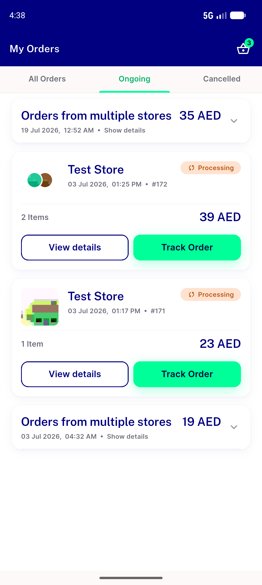
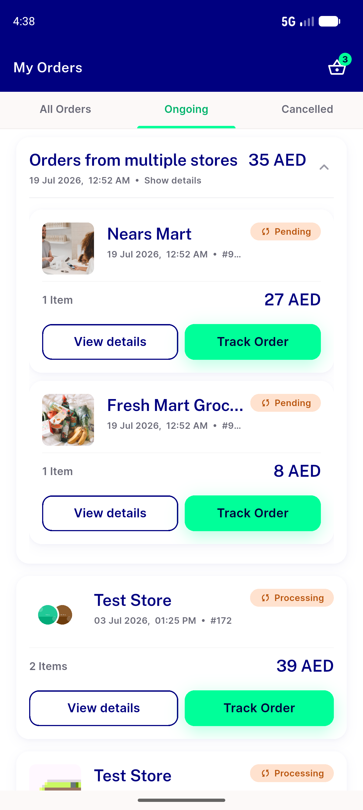

# QA Evidence — NEARS-1351

**PASS — NAccordion grouped-order accordion expand/collapse verified live (emulator-5554)**

**2 screenshot(s).** Click any thumbnail for full resolution.

<table>
<tr>
<td align="center" width="33%"> ac1 group collapsed</td>
<td align="center" width="33%"> ac1 group expanded</td>
</tr>
</table>

---
*From `nears/docs/qa-evidence/NEARS-1351/` · public-repo scrub policy (no live secrets; verified clean).*
