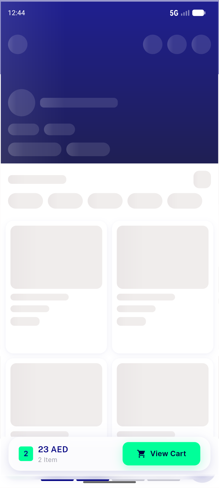
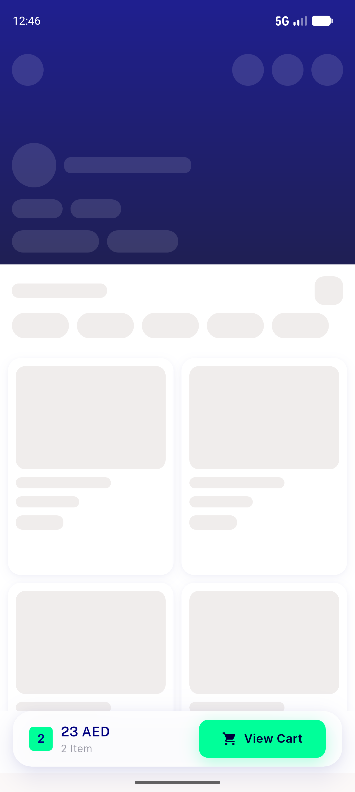
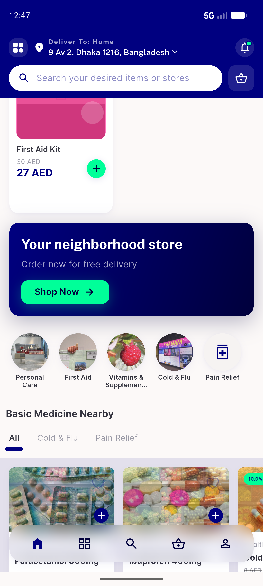

# QA Evidence — NEARS-1352

**PASS — NSkeleton (F4 wave 2): shimmer, .onNavy ghost, .circle shape, reduced-motion static fill all demonstrated live; unit 18/18, goldens deterministic x2, UserApp DLS golden pass**

**4 screenshot(s).** Click any thumbnail for full resolution.

<table>
<tr>
<td align="center" width="33%"> ac1 2 3 shimmer onnavy circle</td>
<td align="center" width="33%"> ac4 reduced motion static</td>
<td align="center" width="33%"> home loaded clean</td>
</tr>
<tr>
<td align="center" width="33%"> regression ninput searchbar</td>
</tr>
</table>

---
*From `nears/docs/qa-evidence/NEARS-1352/` · public-repo scrub policy (no live secrets; verified clean).*
