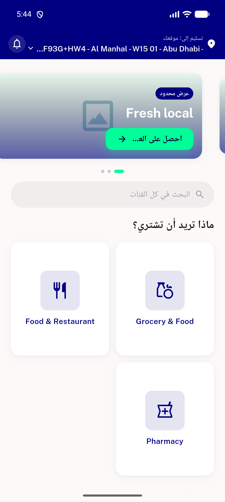
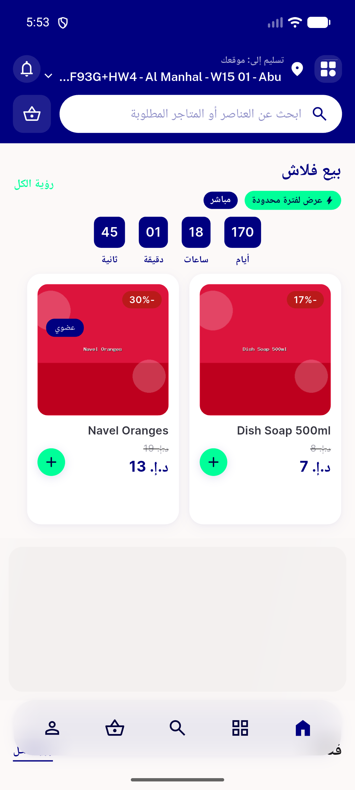

# QA Evidence — NEARS-1353

**PASS — NCountBadge: ring badge live-verified (style/reactive/RTL/empty), pill via golden+tests, CR-1 a11y single-label, clean boot**

**5 screenshot(s).** Click any thumbnail for full resolution.

<table>
<tr>
<td align="center" width="33%"> empty cart rtl</td>
<td align="center" width="33%"> cart 1 store rtl</td>
<td align="center" width="33%"> cart 3 ring increment rtl</td>
</tr>
<tr>
<td align="center" width="33%"> empty cart ring hidden rtl</td>
<td align="center" width="33%"> golden pill ring styles ltr</td>
</tr>
</table>

### Other artifacts
- [`progress.md`](progress.md)

---
*From `nears/docs/qa-evidence/NEARS-1353/` · public-repo scrub policy (no live secrets; verified clean).*
