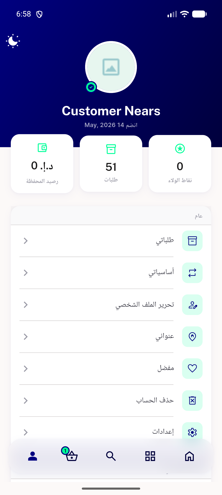

# QA Evidence — NEARS-1354

**PASS — NStatCard renders live on Profile + Refer&Earn (light, RTL); 0/— fallback + IntrinsicHeight equal-height verified; logs clean**

**3 screenshot(s).** Click any thumbnail for full resolution.

<table>
<tr>
<td align="center" width="33%"> ac1 profile stat tiles rtl</td>
<td align="center" width="33%"> ac2 refer earn tiles rtl</td>
<td align="center" width="33%"> diag home rtl</td>
</tr>
</table>

### Other artifacts
- [`progress.md`](progress.md)

---
*From `nears/docs/qa-evidence/NEARS-1354/` · public-repo scrub policy (no live secrets; verified clean).*
