# QA Evidence — NEARS-1355

**PASS — NFilterChip DLS promotion: all 5 ACs demonstrated live (light+RTL), logs clean, 322/322 pkg tests**

**13 screenshot(s).** Click any thumbnail for full resolution.

<table>
<tr>
<td align="center" width="33%"> ac1 default chips module</td>
<td align="center" width="33%"><a href="ac1-default-chips.png">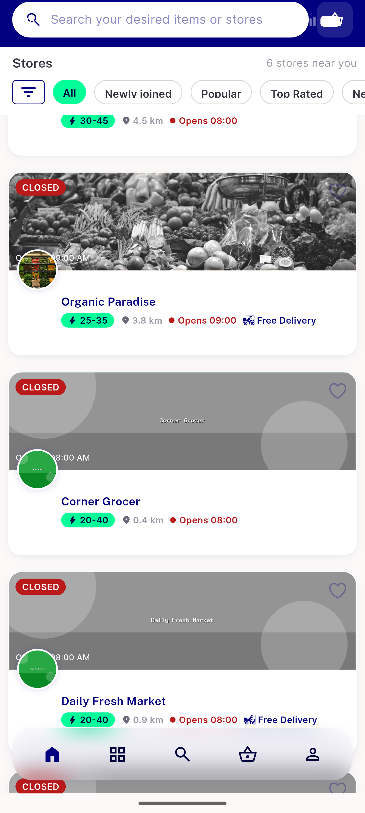</a> ac1 default chips</td>
<td align="center" width="33%"><a href="ac1-popular-selected.png">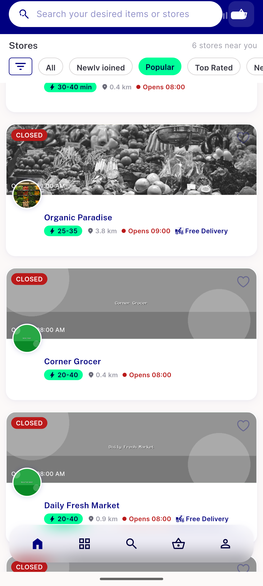</a> ac1 popular selected</td>
</tr>
<tr>
<td align="center" width="33%"><a href="ac2-atrest-nearsmart.png">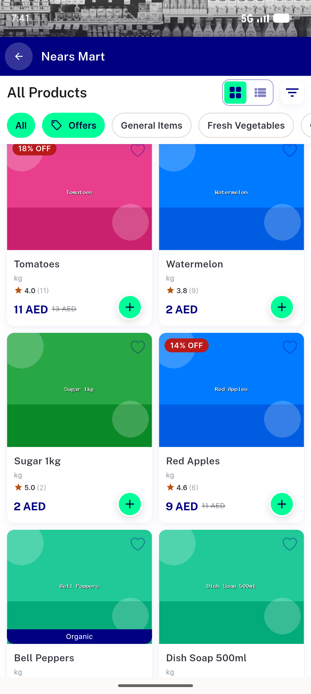</a> ac2 atrest nearsmart</td>
<td align="center" width="33%"><a href="ac2-offers-chip-atrest.png">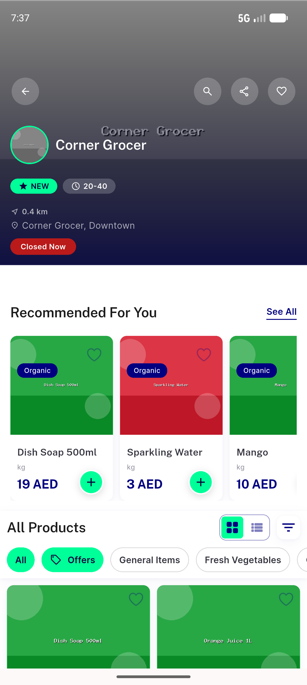</a> ac2 offers chip atrest</td>
<td align="center" width="33%"><a href="ac2-offers-chip-selected.png">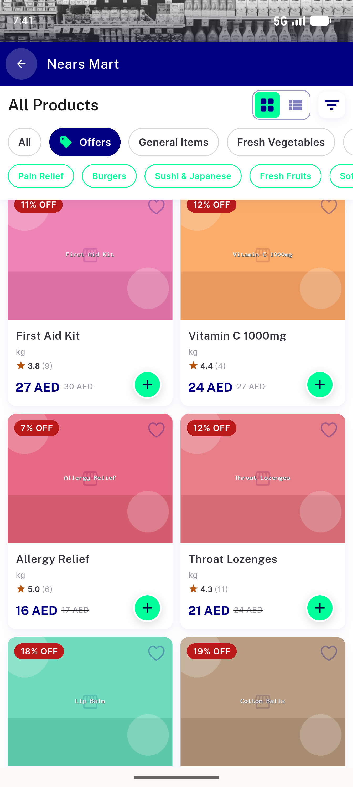</a> ac2 offers chip selected</td>
</tr>
<tr>
<td align="center" width="33%"><a href="ac2-verify.png">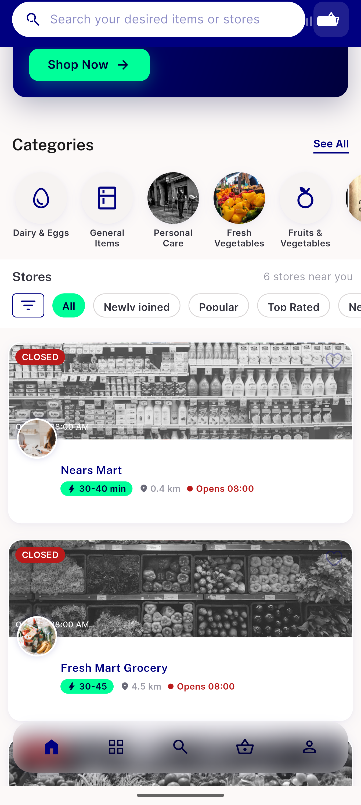</a> ac2 verify</td>
<td align="center" width="33%"><a href="ac3-showcheck-price-selected.png">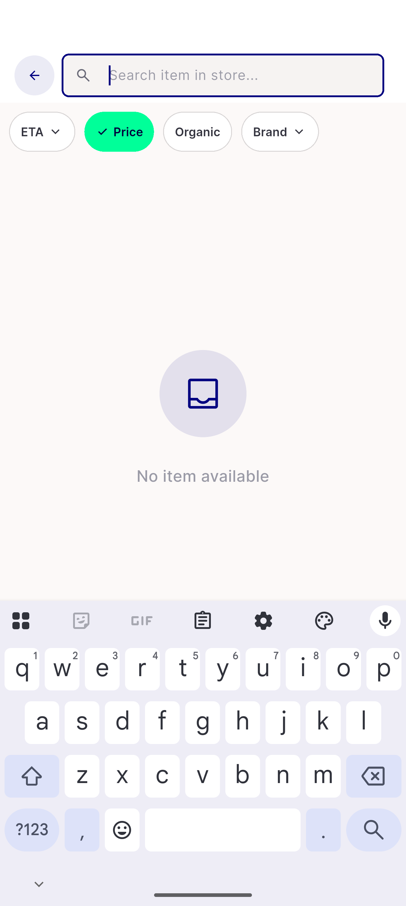</a> ac3 showcheck price selected</td>
<td align="center" width="33%"><a href="ac3-showdropdown.png">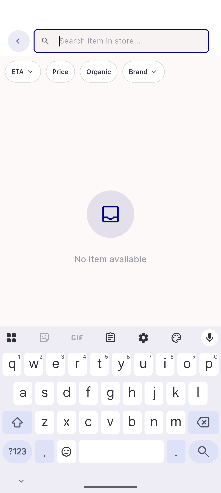</a> ac3 showdropdown</td>
</tr>
<tr>
<td align="center" width="33%"><a href="ac4-after-remove.png">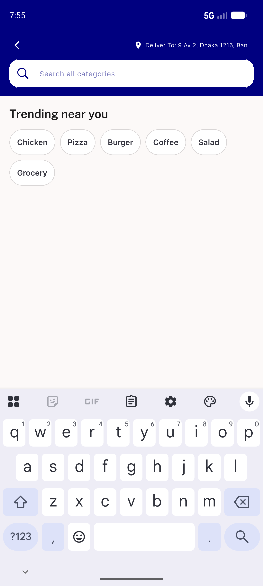</a> ac4 after remove</td>
<td align="center" width="33%"> ac4 history chips before</td>
<td align="center" width="33%"><a href="ac4-recent-chips.png">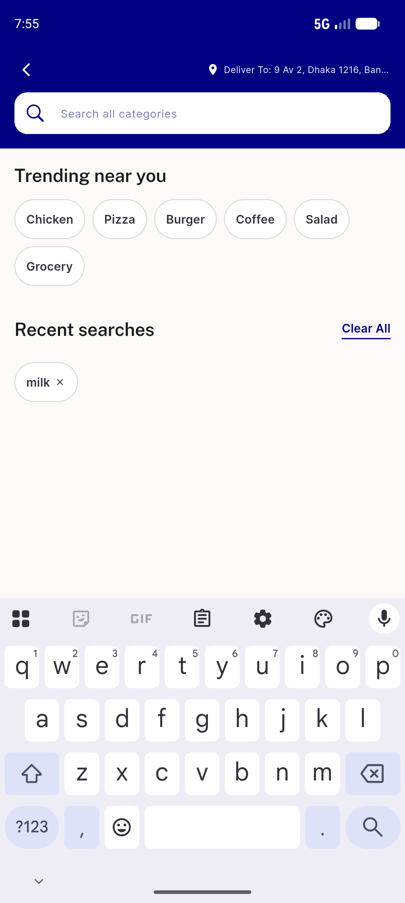</a> ac4 recent chips</td>
</tr>
<tr>
<td align="center" width="33%"><a href="ac5-rtl-chips.png">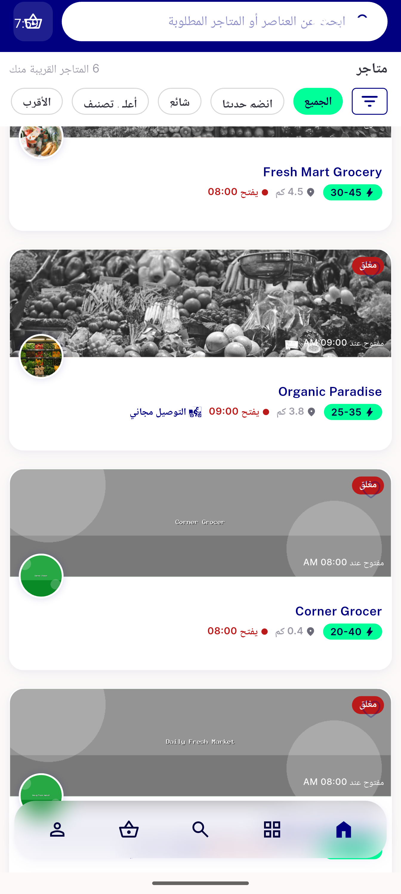</a> ac5 rtl chips</td>
</tr>
</table>

### Other artifacts
- [`progress.md`](progress.md)

---
*From `nears/docs/qa-evidence/NEARS-1355/` · public-repo scrub policy (no live secrets; verified clean).*
