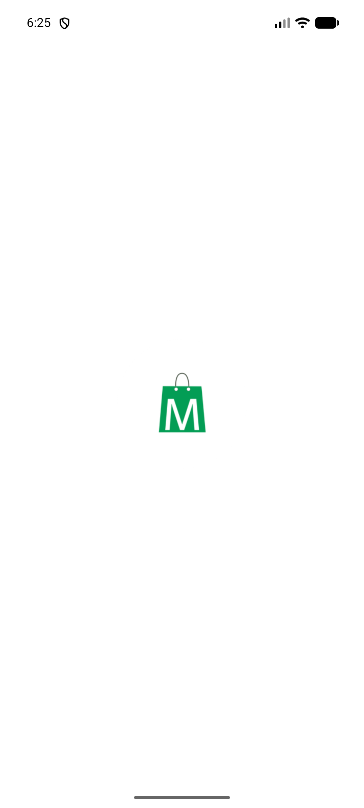
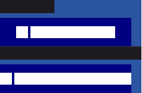
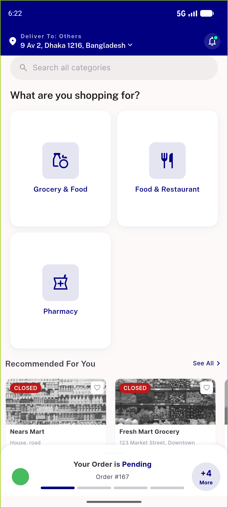

# QA Evidence — NEARS-1356

**PASS — NLocationSelector verbatim promotion; goldens+contract+273 DLS tests green; app boots clean light LTR+RTL, NCountBadge coexists**

**4 screenshot(s).** Click any thumbnail for full resolution.

<table>
<tr>
<td align="center" width="33%"> app boot 5556 clean</td>
<td align="center" width="33%"> golden default longellipsis</td>
<td align="center" width="33%"> golden rtl mirror</td>
</tr>
<tr>
<td align="center" width="33%"> home lightltr regression</td>
</tr>
</table>

---
*From `nears/docs/qa-evidence/NEARS-1356/` · public-repo scrub policy (no live secrets; verified clean).*
