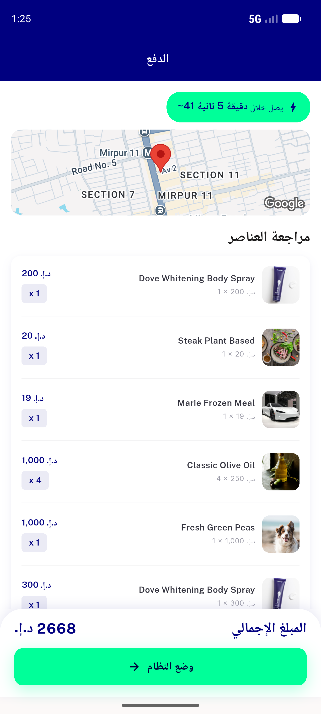
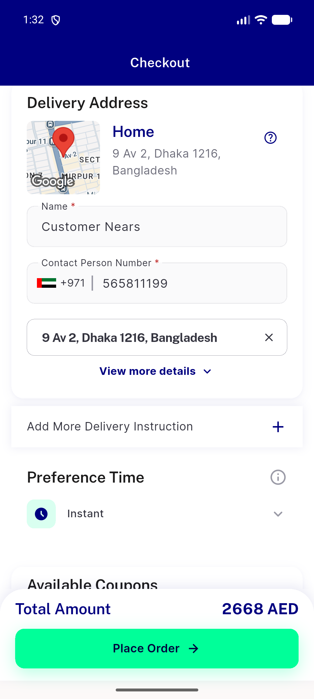
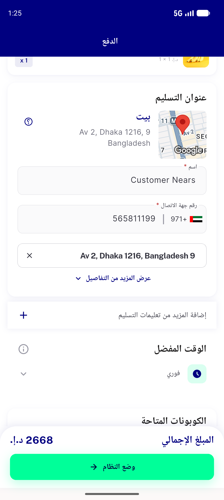
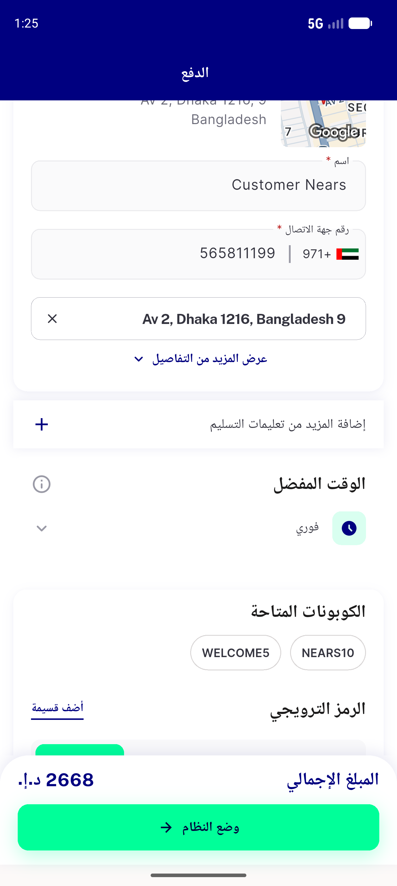
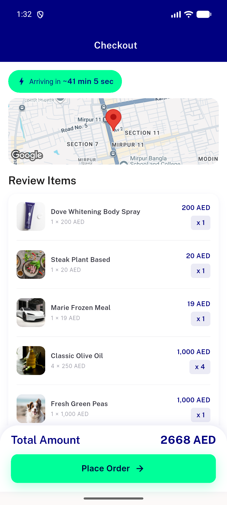
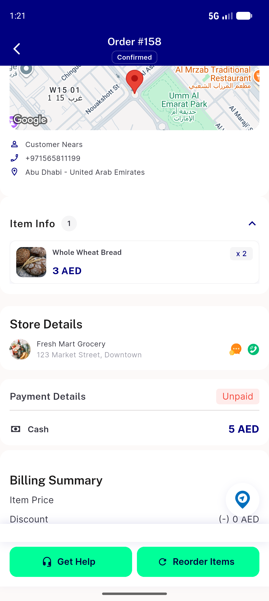
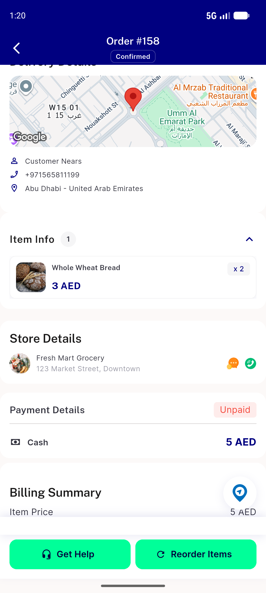
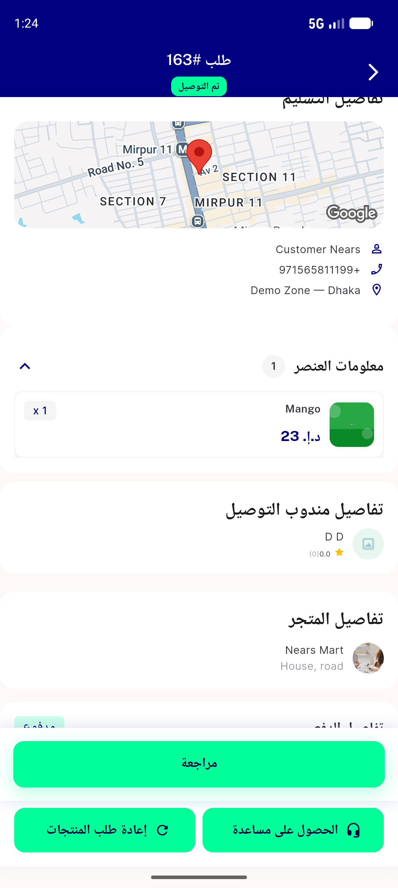

# QA Evidence — NEARS-1358

**PASS — NMapPreview element migration (F4 wave 2): all AC demonstrated live on emulator-5554/5556, light+RTL, real-map+placeholder+non-interactive confirmed, 19/19 package tests + 310/310 UserApp checkout/order tests green**

**10 screenshot(s).** Click any thumbnail for full resolution.

<table>
<tr>
<td align="center" width="33%"> checkout rtl</td>
<td align="center" width="33%"> checkout scrolled light 1</td>
<td align="center" width="33%"> checkout thumbstrip rtl 2</td>
</tr>
<tr>
<td align="center" width="33%"> checkout thumbstrip rtl</td>
<td align="center" width="33%"> checkout top light</td>
<td align="center" width="33%"> current state check</td>
</tr>
<tr>
<td align="center" width="33%"> gesture after</td>
<td align="center" width="33%"> gesture before</td>
<td align="center" width="33%"> order details realmap light</td>
</tr>
<tr>
<td align="center" width="33%"> order details rtl</td>
</tr>
</table>

---
*From `nears/docs/qa-evidence/NEARS-1358/` · public-repo scrub policy (no live secrets; verified clean).*
