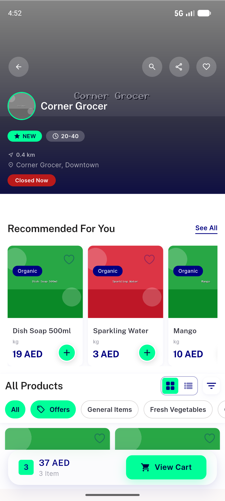
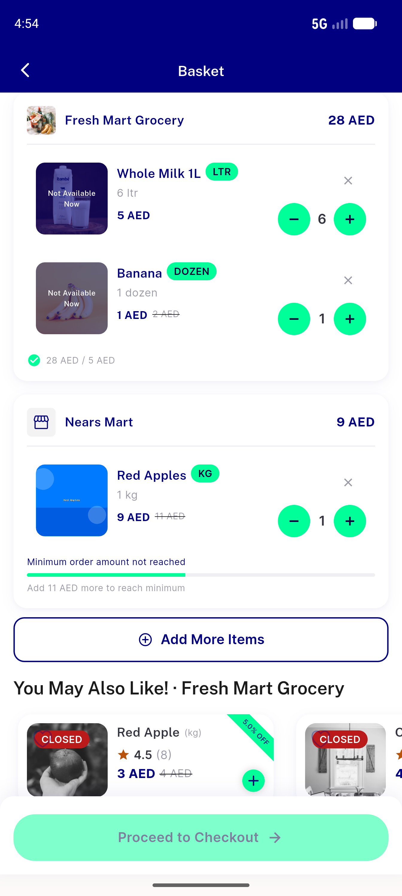
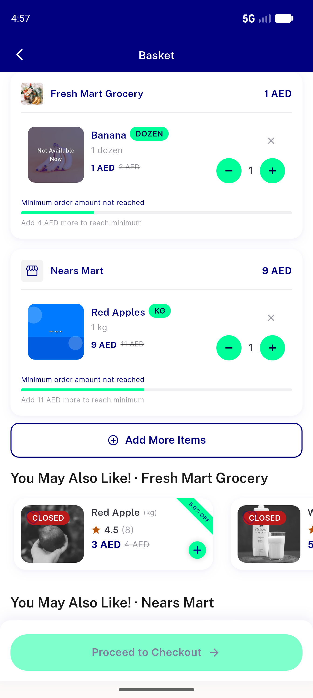
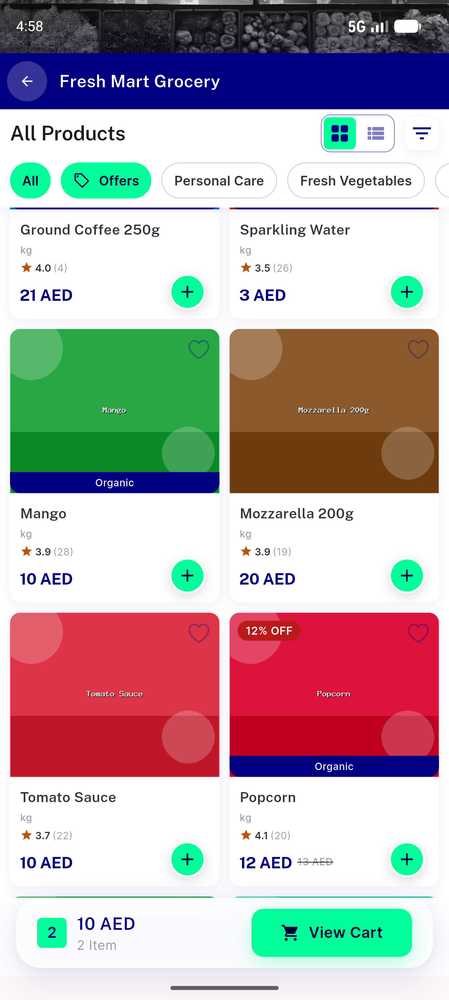
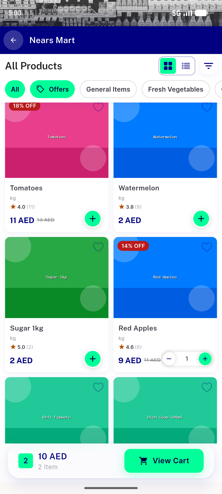
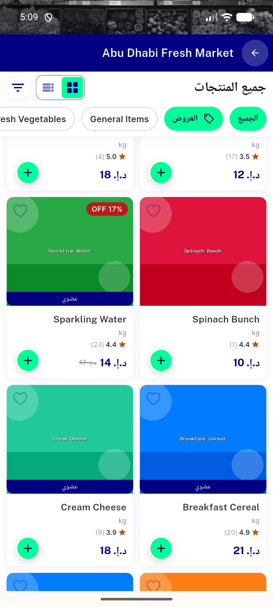

# QA Evidence — NEARS-1359

**PASS — NQtyStepper live on cart + item card (light+RTL), emulator-5554/5556, debug APK @3db452ca**

**7 screenshot(s).** Click any thumbnail for full resolution.

<table>
<tr>
<td align="center" width="33%"> home 5554</td>
<td align="center" width="33%"> store grid 5554</td>
<td align="center" width="33%"> cart 5554</td>
</tr>
<tr>
<td align="center" width="33%"> cart after remove 5554</td>
<td align="center" width="33%"> store grid qtys 5554</td>
<td align="center" width="33%"> nearsmart grid 5554</td>
</tr>
<tr>
<td align="center" width="33%"> rtl store grid 5556</td>
</tr>
</table>

### Other artifacts
- [`progress.md`](progress.md)

---
*From `nears/docs/qa-evidence/NEARS-1359/` · public-repo scrub policy (no live secrets; verified clean).*
