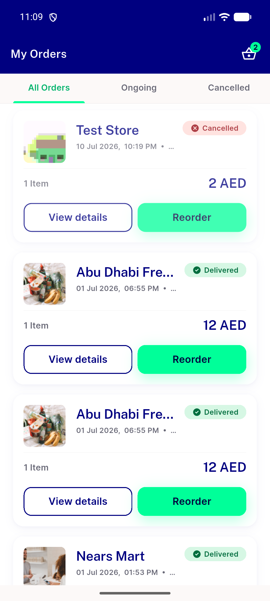
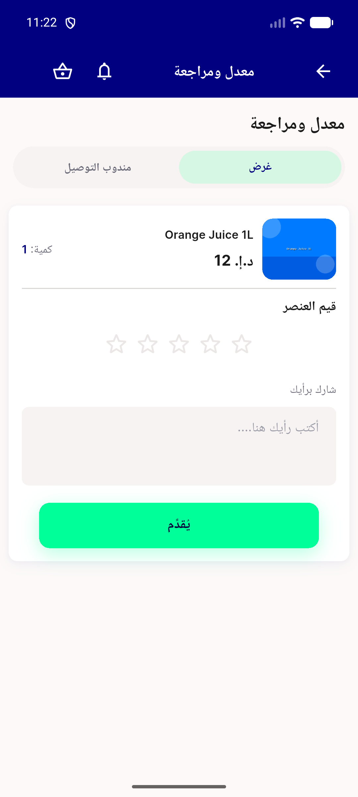
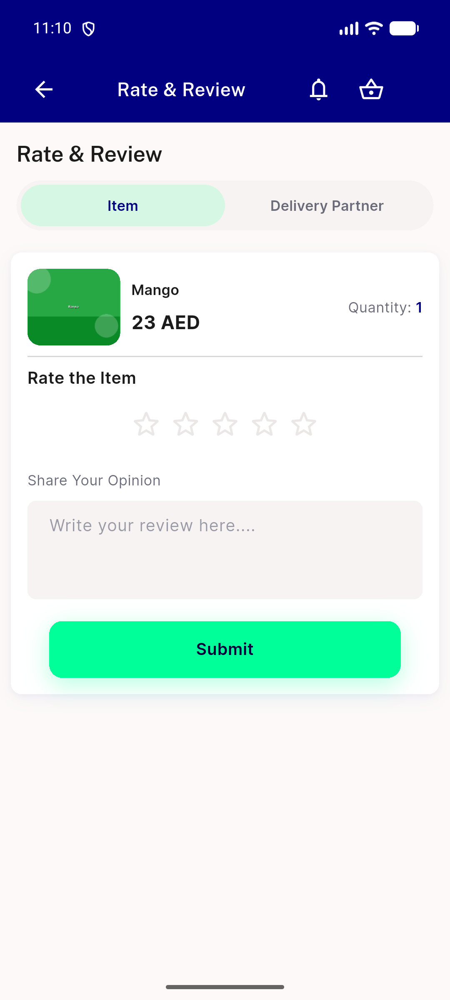
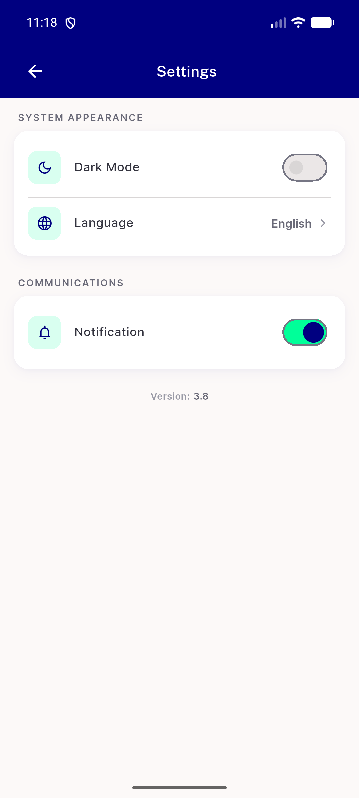

# QA Evidence — NEARS-1362

**PASS — NAppBar verbatim MOVE; app-bar shapes + a11y labels (EN+AR/RTL) identical; goldens byte-clean**

**5 screenshot(s).** Click any thumbnail for full resolution.

<table>
<tr>
<td align="center" width="33%"> ac1 orders customactions en</td>
<td align="center" width="33%"> ac2 ordertracking back ar</td>
<td align="center" width="33%"> ac2 ratereview labels ar rtl</td>
</tr>
<tr>
<td align="center" width="33%"> ac2 ratereview labels en</td>
<td align="center" width="33%"> ac3 settings backonly en</td>
</tr>
</table>

---
*From `nears/docs/qa-evidence/NEARS-1362/` · public-repo scrub policy (no live secrets; verified clean).*
