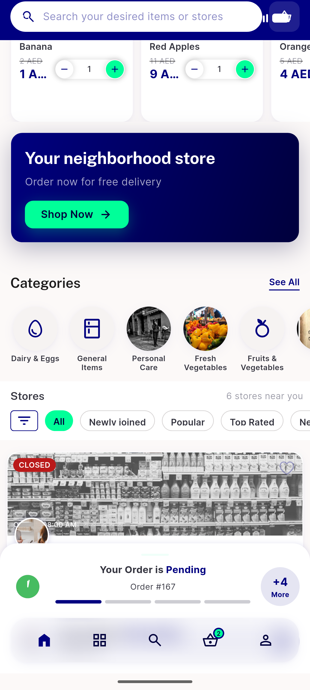
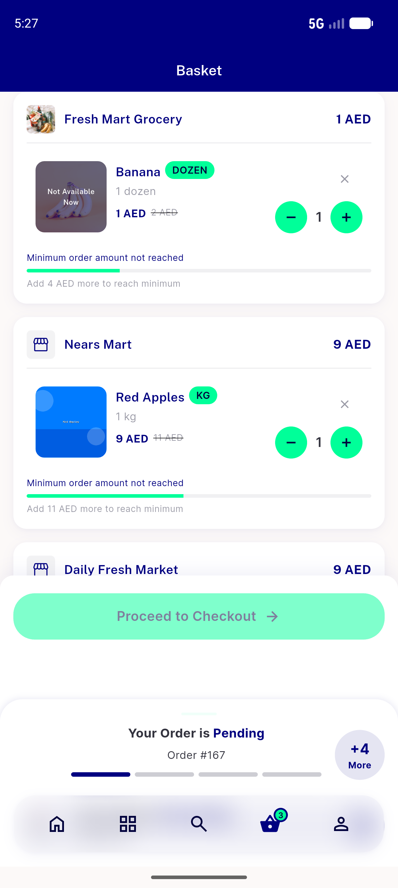

# QA Evidence — NEARS-1363

**PASS — NSectionHeader consolidation: standard + store headers render/mirror correctly on emulator-5554 (light) + emulator-5556 (RTL/ar); logs clean; nears_dls 214/214, analyze 0**

**9 screenshot(s).** Click any thumbnail for full resolution.

<table>
<tr>
<td align="center" width="33%"> ac1 categories header</td>
<td align="center" width="33%"> ac1 global search modules</td>
<td align="center" width="33%"> ac1 home standard headers</td>
</tr>
<tr>
<td align="center" width="33%"> ac1 module categories action</td>
<td align="center" width="33%"> ac2 grouped basket store headers</td>
<td align="center" width="33%"> ac3 rtl categories action</td>
</tr>
<tr>
<td align="center" width="33%"> ac3 rtl categories header</td>
<td align="center" width="33%"> ac3 rtl home standard</td>
<td align="center" width="33%"> ac3 rtl store header cart</td>
</tr>
</table>

### Other artifacts
- [`progress.md`](progress.md)

---
*From `nears/docs/qa-evidence/NEARS-1363/` · public-repo scrub policy (no live secrets; verified clean).*
