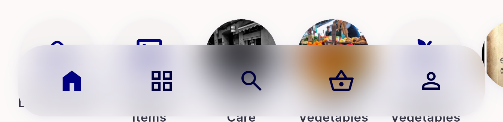
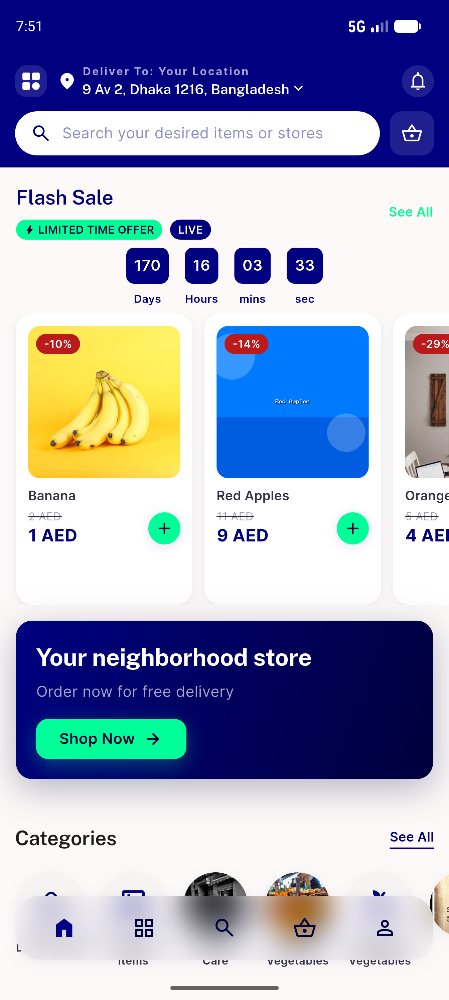
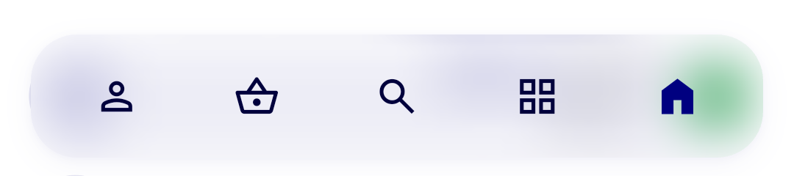
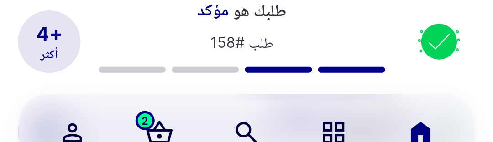
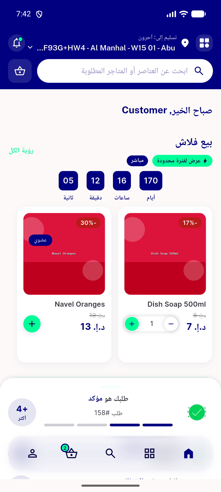
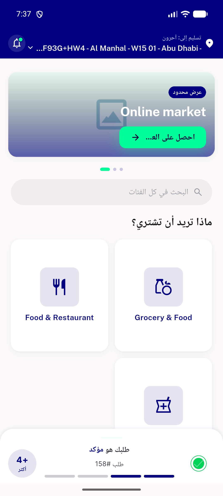
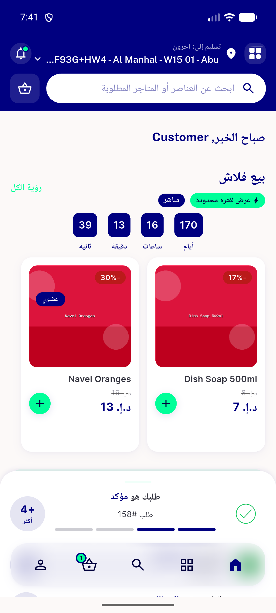

# QA Evidence — NEARS-1365

**PASS — NBottomNav verbatim move: AC1-5 + AC8 live on RTL(5556)+LTR(5554) light, goldens+backstop green**

**8 screenshot(s).** Click any thumbnail for full resolution.

<table>
<tr>
<td align="center" width="33%"> ltr nav crop</td>
<td align="center" width="33%"> ltr nav light 5554</td>
<td align="center" width="33%"> nav crop empty</td>
</tr>
<tr>
<td align="center" width="33%"> nav crop</td>
<td align="center" width="33%"> rtl badge after add 5556</td>
<td align="center" width="33%"> rtl badge empty 5556</td>
</tr>
<tr>
<td align="center" width="33%"> rtl home 5556</td>
<td align="center" width="33%"> rtl nav module 5556</td>
</tr>
</table>

### Other artifacts
- [`progress.md`](progress.md)

---
*From `nears/docs/qa-evidence/NEARS-1365/` · public-repo scrub policy (no live secrets; verified clean).*
