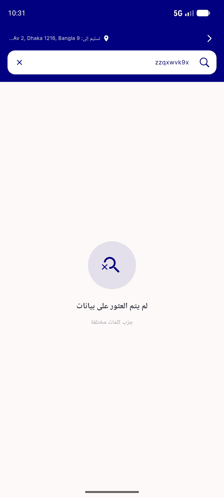
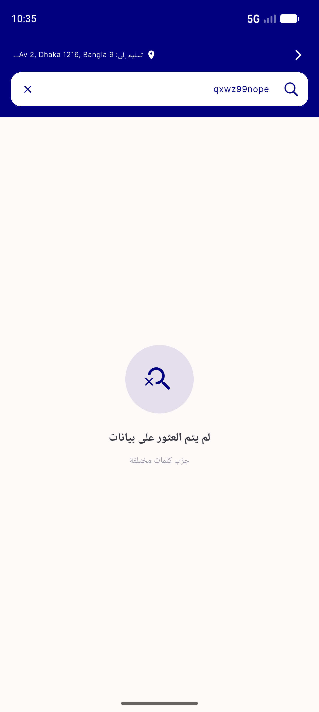

# QA Evidence — NEARS-1366

**PASS — NEmptyState verbatim migration; live title+subtitle+CTA empty-state + CTA fires (RTL/light); 69+ tests + light/dark/rtl goldens green**

**2 screenshot(s).** Click any thumbnail for full resolution.

<table>
<tr>
<td align="center" width="33%"> ac1 search noresults rtl light</td>
<td align="center" width="33%"> ac2 search empty cta rtl light</td>
</tr>
</table>

### Other artifacts
- [`progress.md`](progress.md)

---
*From `nears/docs/qa-evidence/NEARS-1366/` · public-repo scrub policy (no live secrets; verified clean).*
