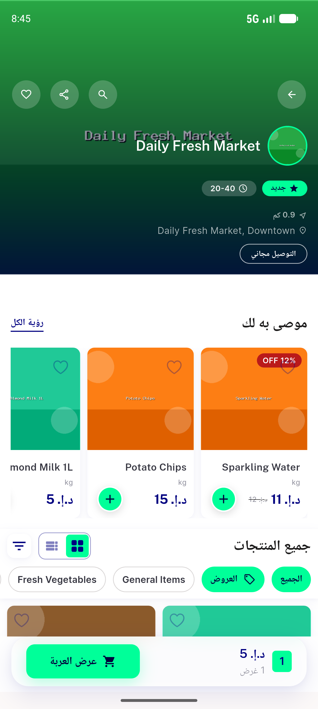
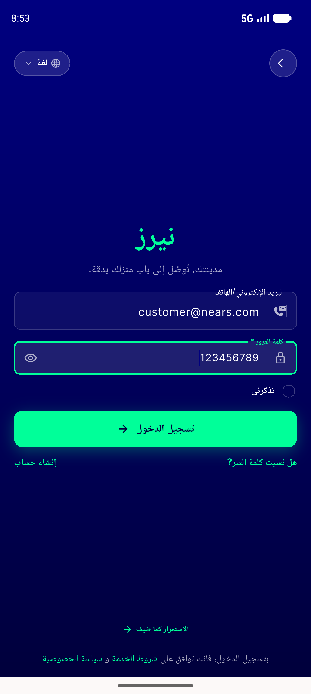
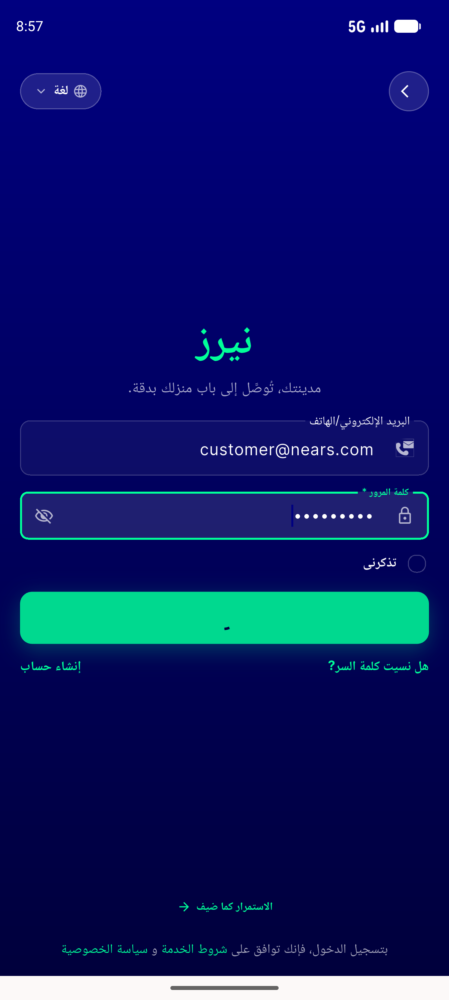
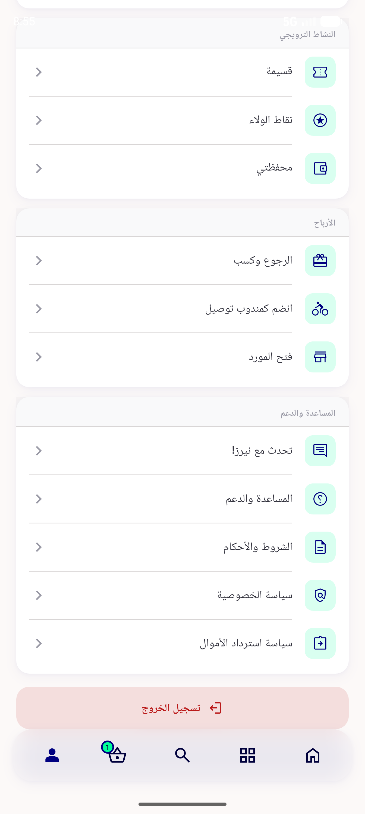
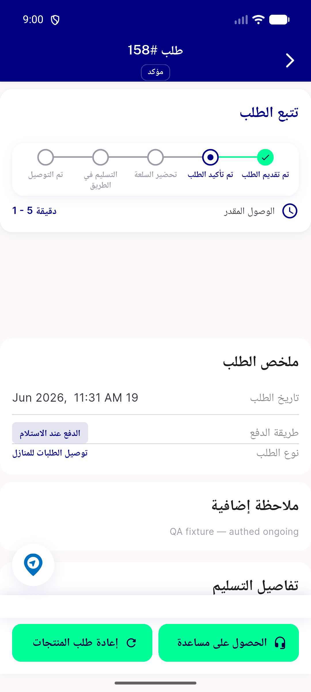

# QA Evidence — NEARS-1367

**PASS — NButton verbatim MOVE, 6 ACs live (light+RTL), goldens pixel-identical**

**6 screenshot(s).** Click any thumbnail for full resolution.

<table>
<tr>
<td align="center" width="33%"> ac1 ac6 cart rtl</td>
<td align="center" width="33%"> ac1 bottomcart rtl</td>
<td align="center" width="33%"> ac2 login loader</td>
</tr>
<tr>
<td align="center" width="33%"> ac2 login spinner</td>
<td align="center" width="33%"> ac3 logout secondary rtl</td>
<td align="center" width="33%"> ac3 order details buttons rtl</td>
</tr>
</table>

### Other artifacts
- [`bug-signin-1px-overflow-preexisting.log`](bug-signin-1px-overflow-preexisting.log)

---
*From `nears/docs/qa-evidence/NEARS-1367/` · public-repo scrub policy (no live secrets; verified clean).*
