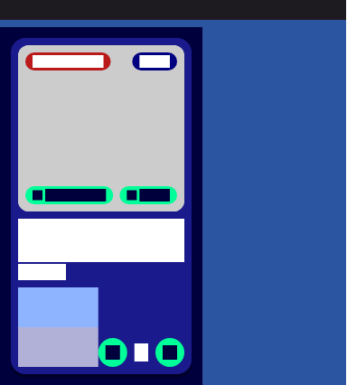
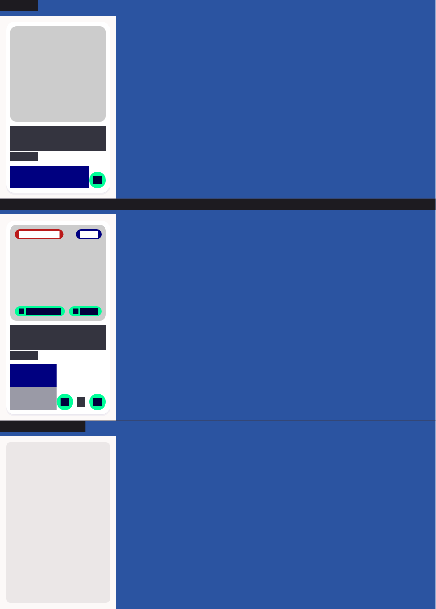
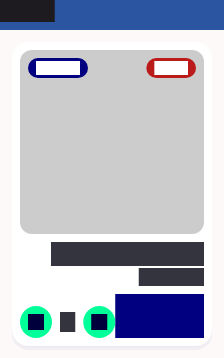

# QA Evidence — NEARS-1368

**PASS — NItemCard golden+package tests green (widgetbook boot blocked by concurrent chrome-devtools MCP profile lock)**

**3 screenshot(s).** Click any thumbnail for full resolution.

<table>
<tr>
<td align="center" width="33%"> golden dark</td>
<td align="center" width="33%"> golden light</td>
<td align="center" width="33%"> golden rtl</td>
</tr>
</table>

---
*From `nears/docs/qa-evidence/NEARS-1368/` · public-repo scrub policy (no live secrets; verified clean).*
