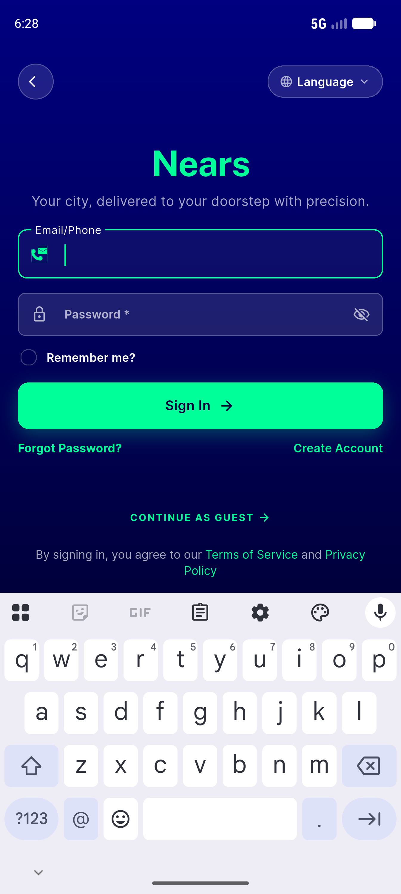
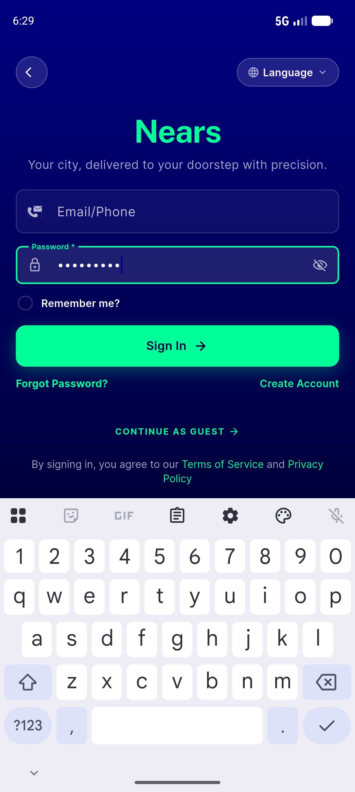
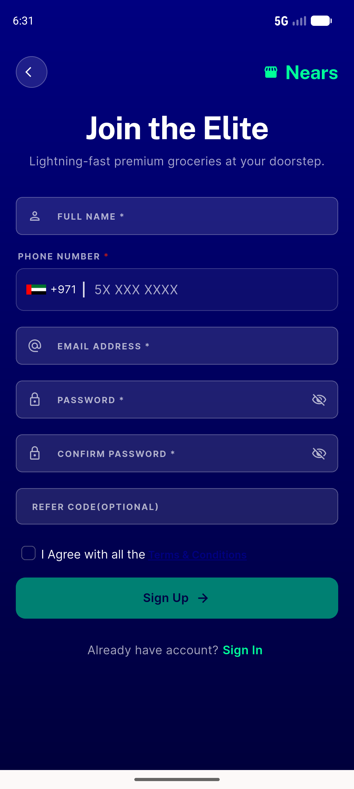
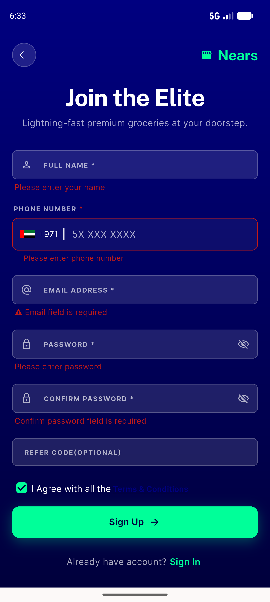
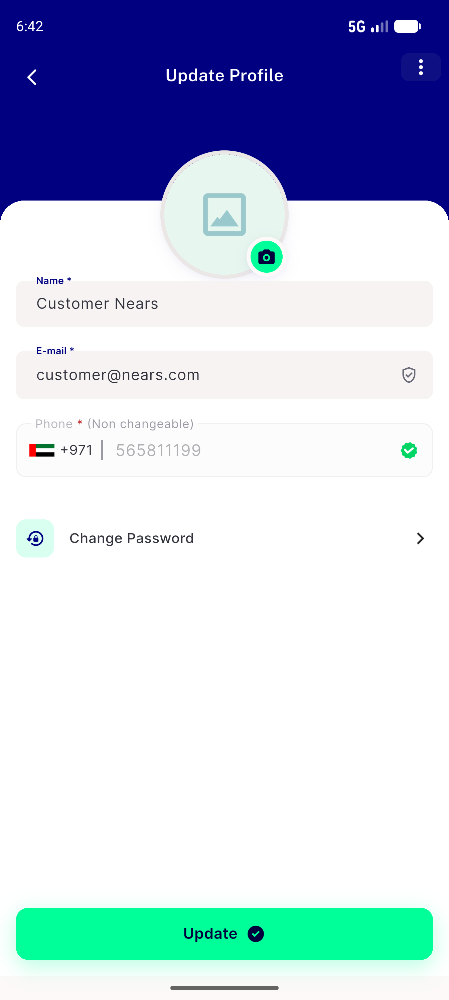
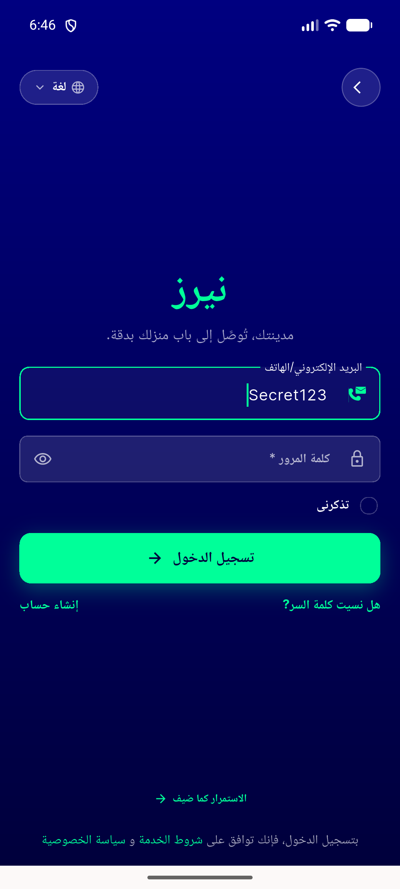

# QA Evidence — NEARS-1369

**PASS — NInput consolidation verified live (login/signup/profile/address + RTL), 6/6 ACs met**

**7 screenshot(s).** Click any thumbnail for full resolution.

<table>
<tr>
<td align="center" width="33%"> ac1 login obscured</td>
<td align="center" width="33%"> ac1 login revealed</td>
<td align="center" width="33%"> ac1 login typed obscured</td>
</tr>
<tr>
<td align="center" width="33%"> ac2 signup baseline</td>
<td align="center" width="33%"> ac2 signup errors</td>
<td align="center" width="33%"> ac5 update profile</td>
</tr>
<tr>
<td align="center" width="33%"> ac6 rtl login obscured</td>
</tr>
</table>

### Other artifacts
- [`progress.md`](progress.md)

---
*From `nears/docs/qa-evidence/NEARS-1369/` · public-repo scrub policy (no live secrets; verified clean).*
