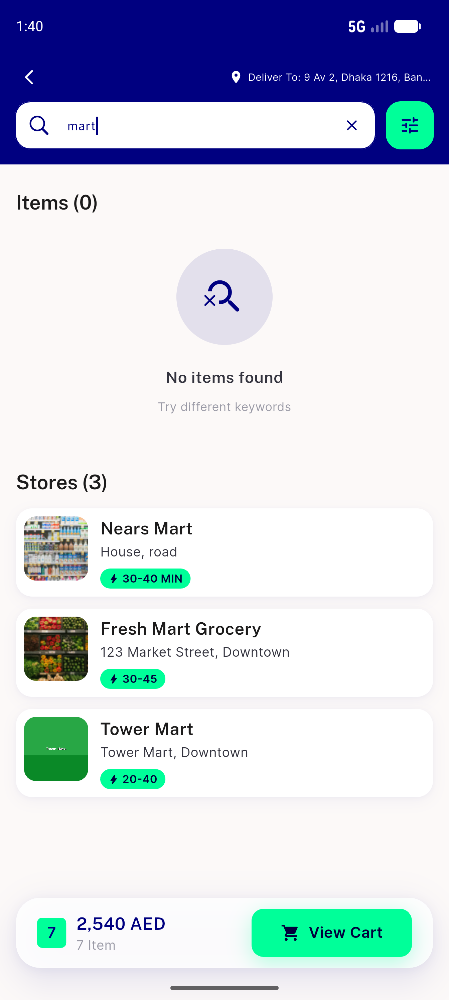
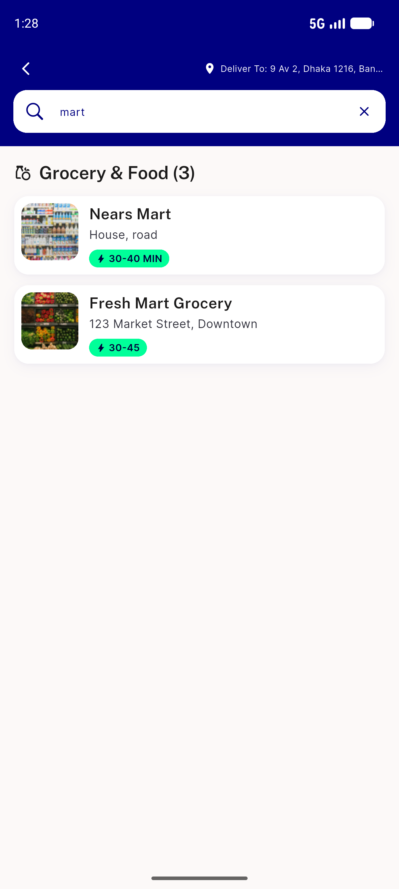
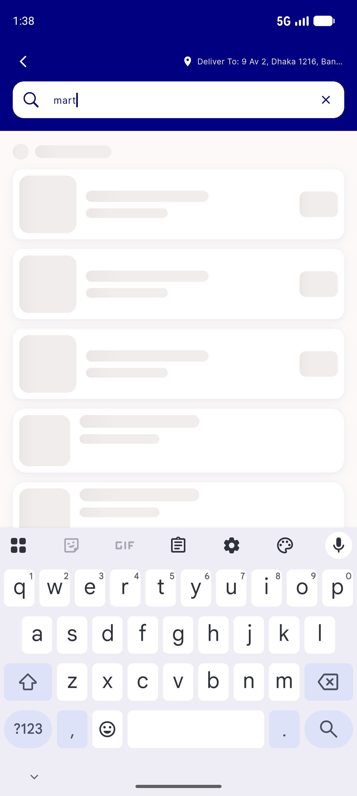
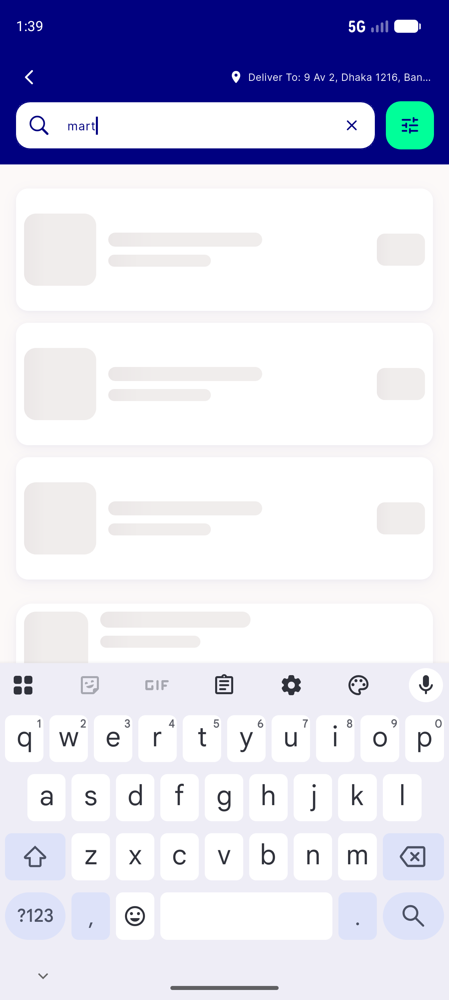
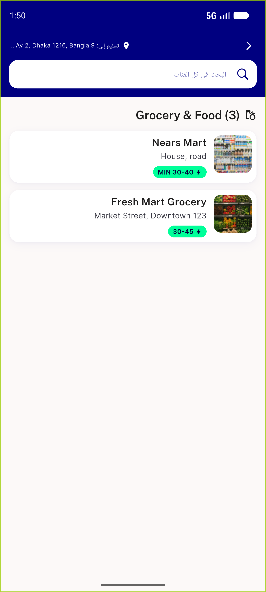

# QA Evidence — NEARS-1370

**PASS — NStoreCard (NEARS-1370) live QA: AC1-AC5 demonstrated on emulator-5554 (light + RTL), golden + unit tests green, logs clean**

**5 screenshot(s).** Click any thumbnail for full resolution.

<table>
<tr>
<td align="center" width="33%"> ac1 ac2 search row real images</td>
<td align="center" width="33%"> ac2 unified search stores</td>
<td align="center" width="33%"> ac3 ac4 global search skeleton</td>
</tr>
<tr>
<td align="center" width="33%"> ac3 search result widget skeleton</td>
<td align="center" width="33%"> rtl search stores</td>
</tr>
</table>

### Other artifacts
- [`ac5-a11y-merged-semantics.xml`](ac5-a11y-merged-semantics.xml)

---
*From `nears/docs/qa-evidence/NEARS-1370/` · public-repo scrub policy (no live secrets; verified clean).*
