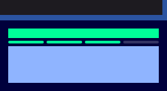
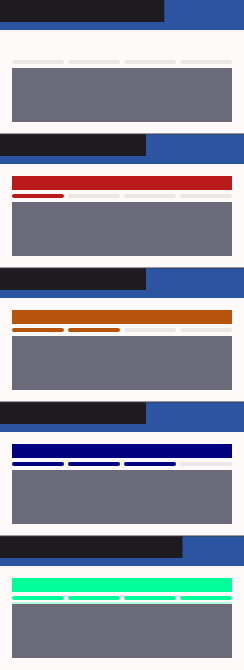

# QA Evidence — NEARS-1371

**PASS — NPasswordStrengthBar display-only migration; goldens 3/3 + 141/141 pkg + 51/51 verification; light-mode**

**3 screenshot(s).** Click any thumbnail for full resolution.

<table>
<tr>
<td align="center" width="33%"> golden dark good</td>
<td align="center" width="33%"> golden rtl weak</td>
<td align="center" width="33%"> golden states light</td>
</tr>
</table>

### Other artifacts
- [`progress.md`](progress.md)

---
*From `nears/docs/qa-evidence/NEARS-1371/` · public-repo scrub policy (no live secrets; verified clean).*
