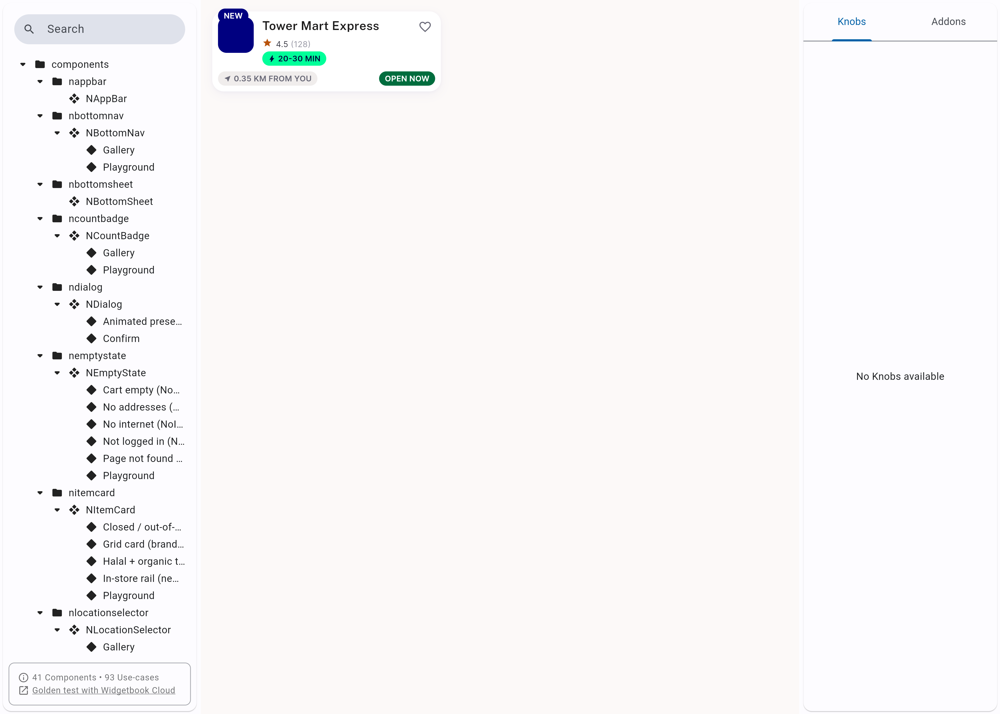
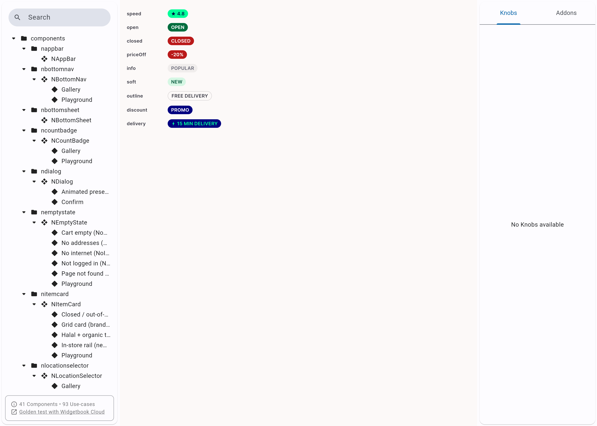
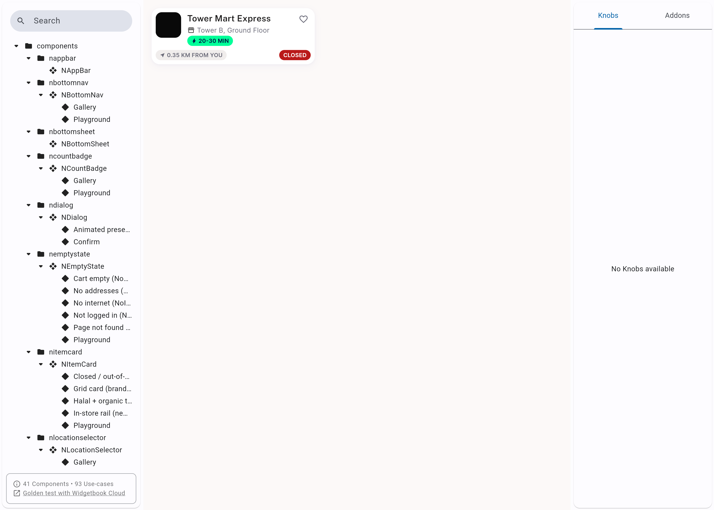
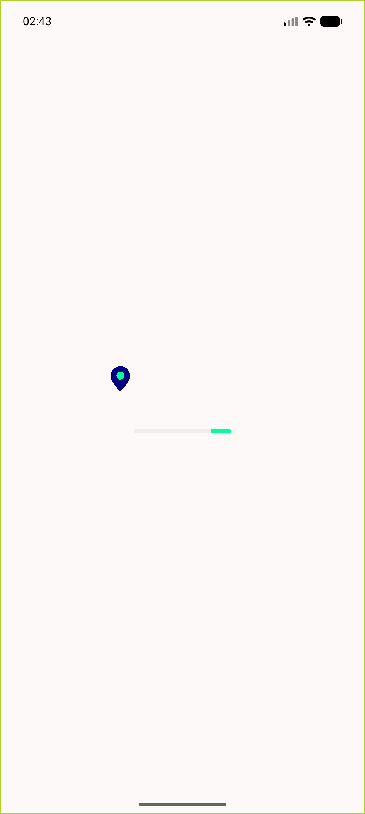
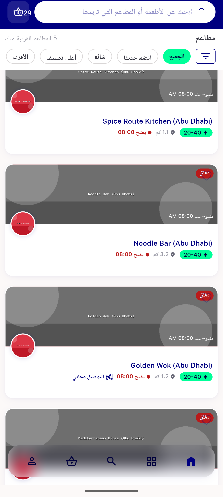
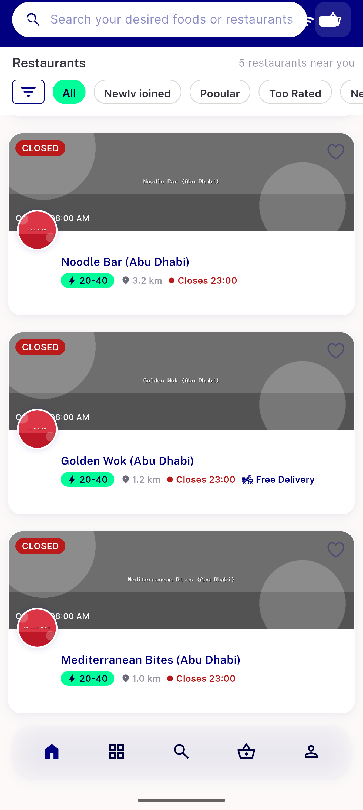

# QA Evidence — NEARS-1372

**PASS — NBadge status:success repointed to #006D3E; OPEN pill 6.45:1 vs CLOSED 6.46:1, matched pair**

**6 screenshot(s).** Click any thumbnail for full resolution.

<table>
<tr>
<td align="center" width="33%"> ac1 storecard tile open pill</td>
<td align="center" width="33%"> ac2 badge gallery open closed pair</td>
<td align="center" width="33%"> ac2 storecard tile closed pill</td>
</tr>
<tr>
<td align="center" width="33%"> ac5 userapp nonstatus badges unchanged</td>
<td align="center" width="33%"> userapp ar rtl store pills</td>
<td align="center" width="33%"> userapp food home closed pills</td>
</tr>
</table>

### Other artifacts
- [`progress.md`](progress.md)

---
*From `nears/docs/qa-evidence/NEARS-1372/` · public-repo scrub policy (no live secrets; verified clean).*
