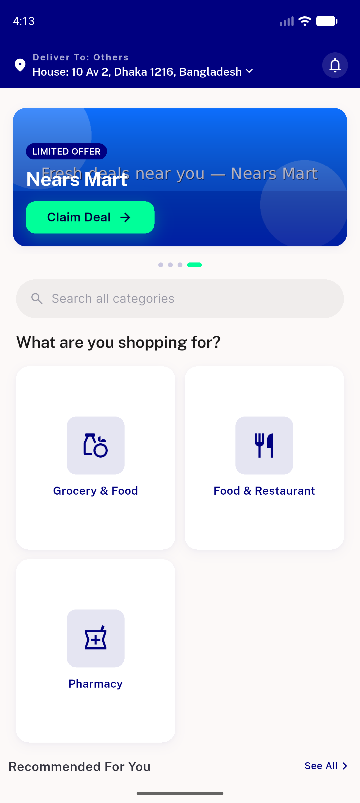
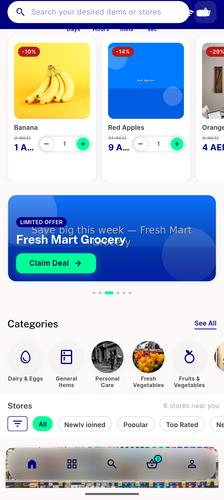
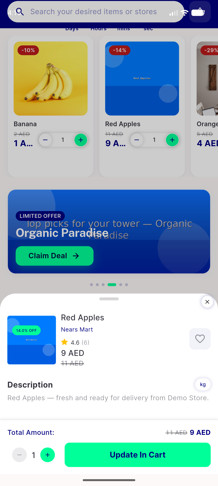
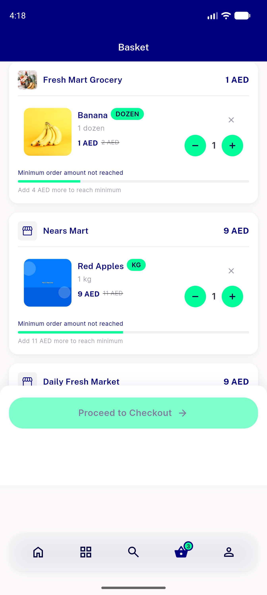
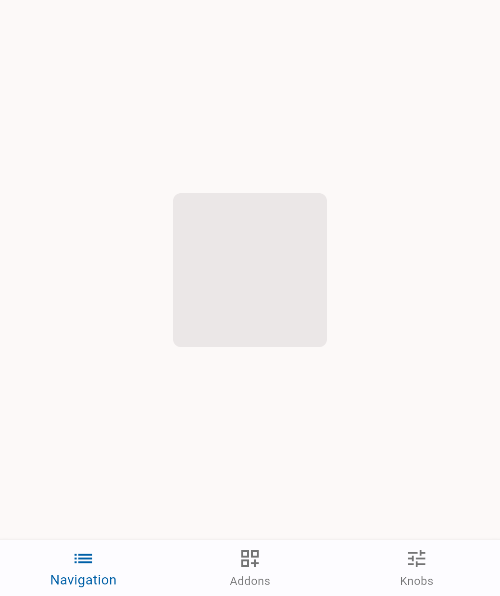

# QA Evidence — NEARS-1380

**PASS — NImage primitive swap: all 5 ACs met, 24/24 unit tests, no regressions (emulator-5554, light mode)**

**9 screenshot(s).** Click any thumbnail for full resolution.

<table>
<tr>
<td align="center" width="33%"> ac1 home rails 2</td>
<td align="center" width="33%"> ac1 home rails</td>
<td align="center" width="33%"> ac1 item cards</td>
</tr>
<tr>
<td align="center" width="33%"> ac1 item details</td>
<td align="center" width="33%"> reg cart</td>
<td align="center" width="33%"> wb default</td>
</tr>
<tr>
<td align="center" width="33%"> wb error</td>
<td align="center" width="33%"> wb fallback</td>
<td align="center" width="33%"> wb loading</td>
</tr>
</table>

### Other artifacts
- [`progress.md`](progress.md)

---
*From `nears/docs/qa-evidence/NEARS-1380/` · public-repo scrub policy (no live secrets; verified clean).*
