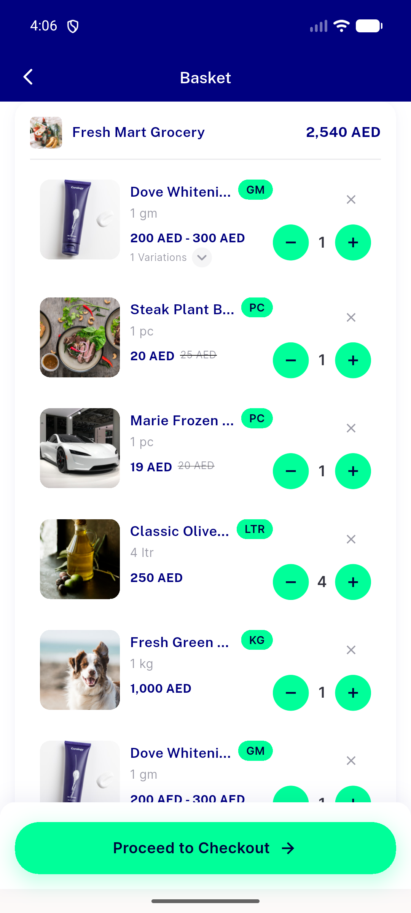
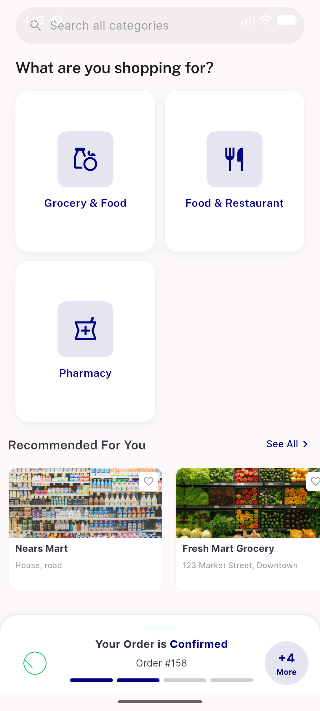
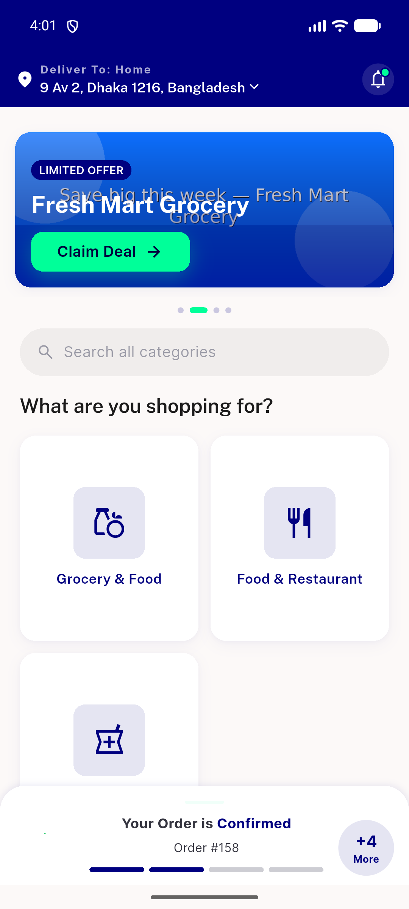
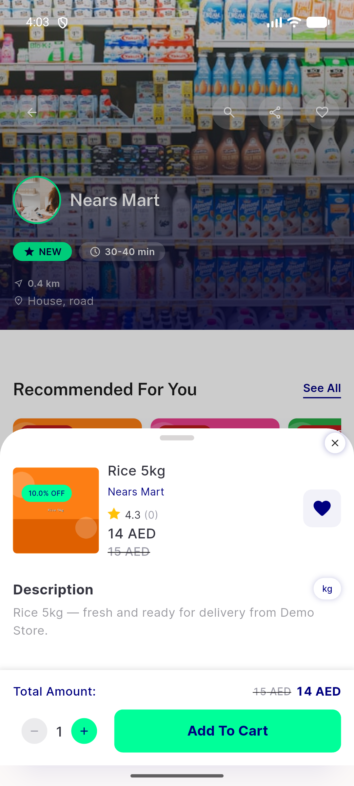
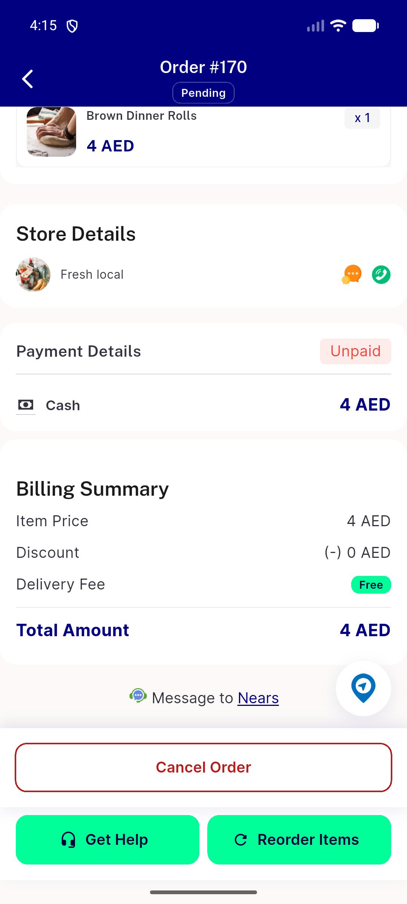
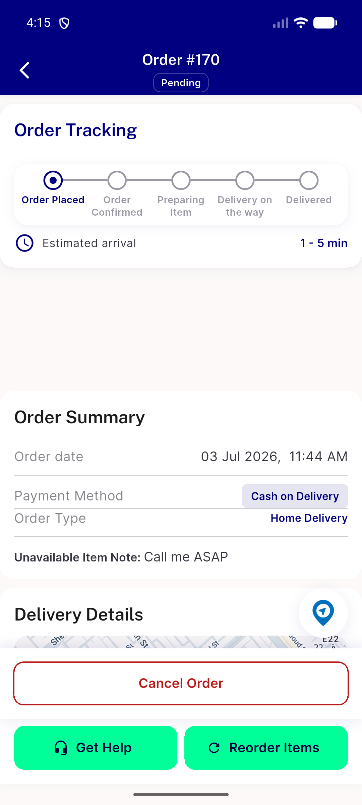
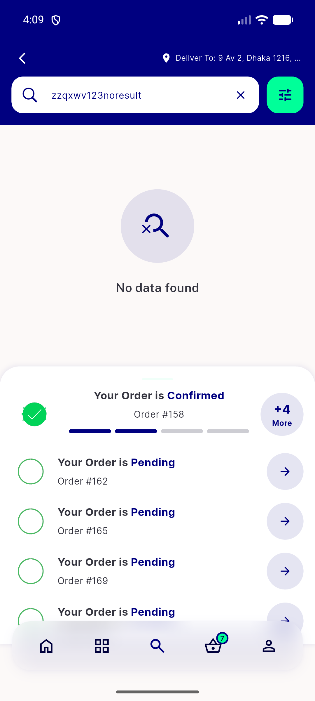
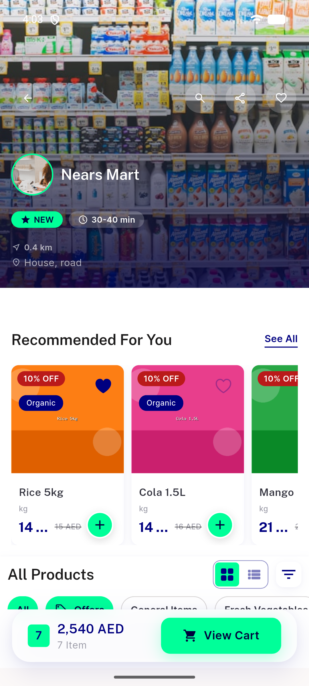
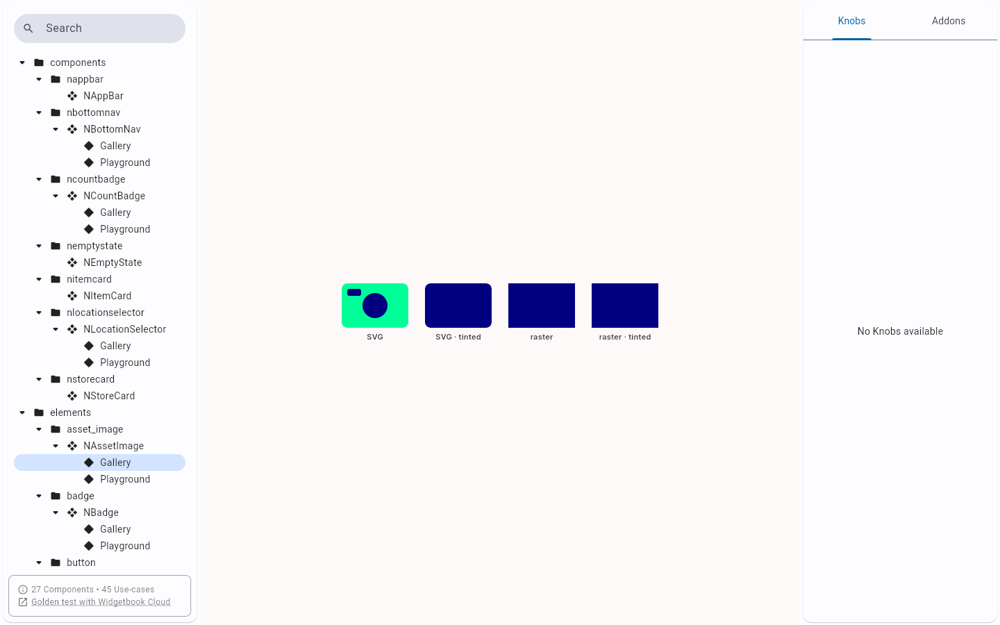
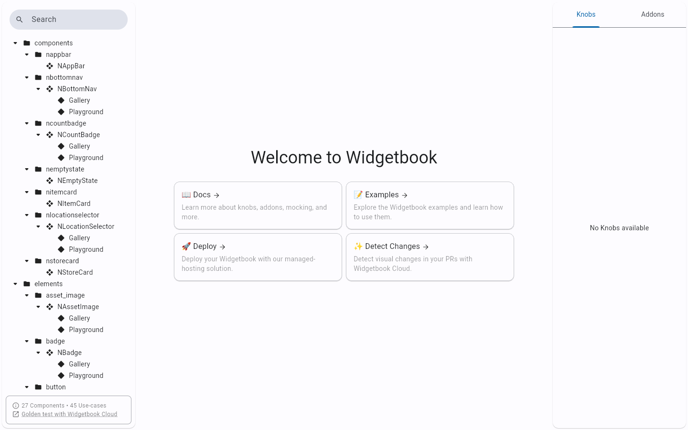

# QA Evidence — NEARS-1381

**PASS — NAssetImage DLS F5 migration: SVG/raster/tint render, width/height transpose fixed, no regressions (light mode)**

**10 screenshot(s).** Click any thumbnail for full resolution.

<table>
<tr>
<td align="center" width="33%"> cart</td>
<td align="center" width="33%"> home modules svg tinted</td>
<td align="center" width="33%"> home</td>
</tr>
<tr>
<td align="center" width="33%"> item detail</td>
<td align="center" width="33%"> order calc</td>
<td align="center" width="33%"> order tracking</td>
</tr>
<tr>
<td align="center" width="33%"> search empty state</td>
<td align="center" width="33%"> store loaded</td>
<td align="center" width="33%"> wb gallery</td>
</tr>
<tr>
<td align="center" width="33%"> wb home</td>
</tr>
</table>

---
*From `nears/docs/qa-evidence/NEARS-1381/` · public-repo scrub policy (no live secrets; verified clean).*
