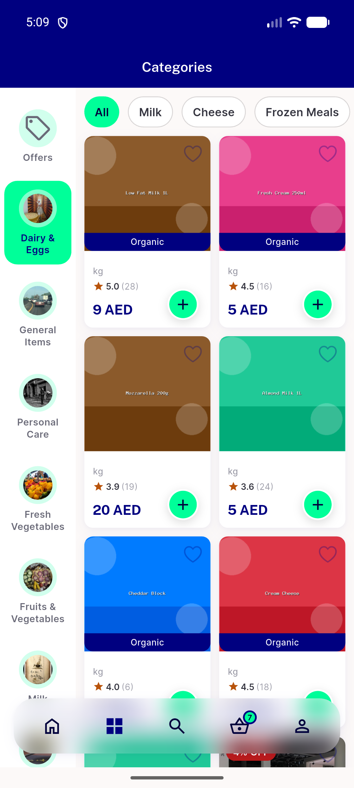
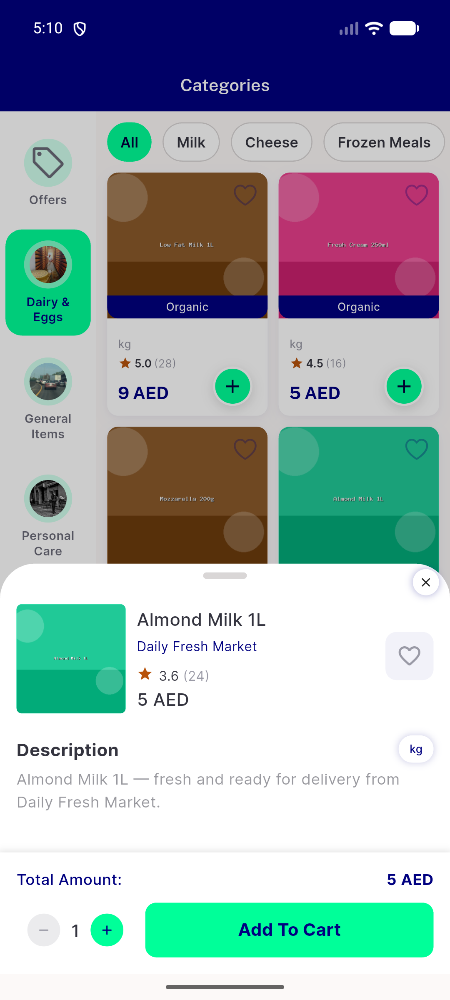
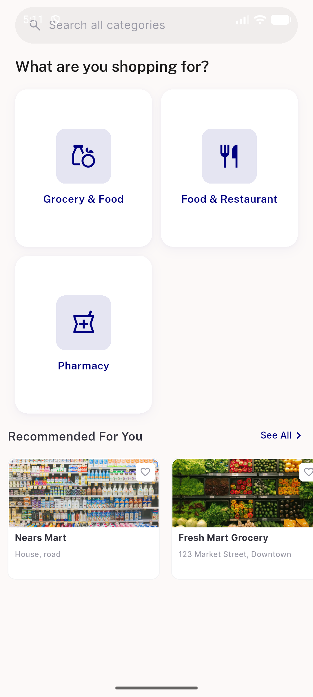
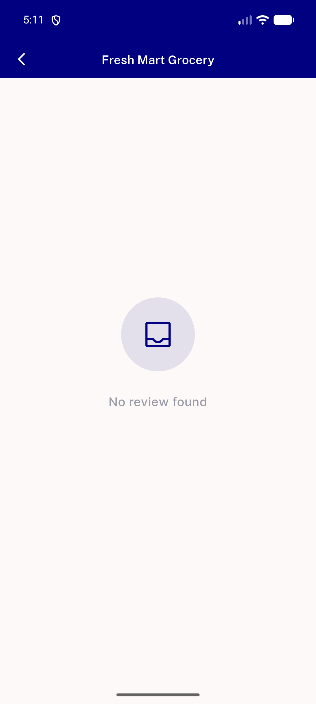
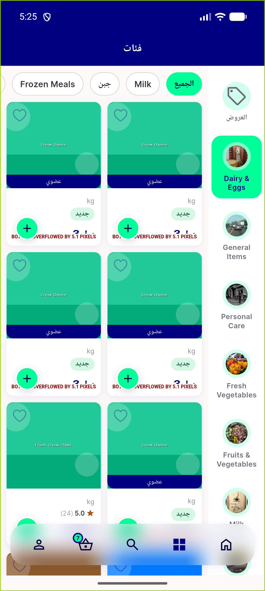
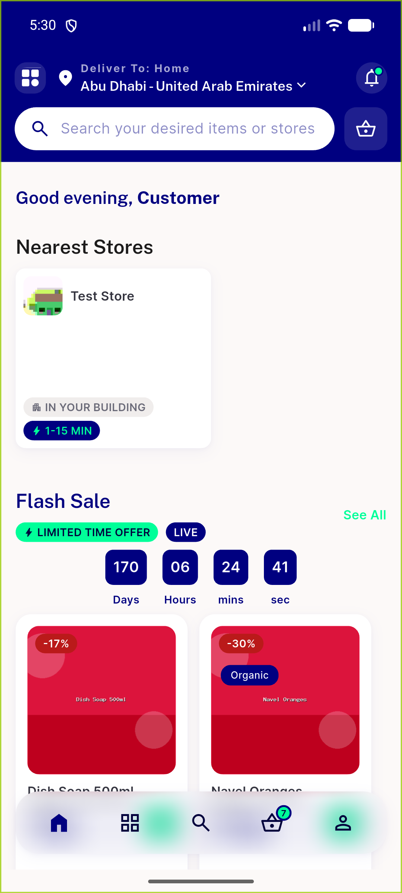
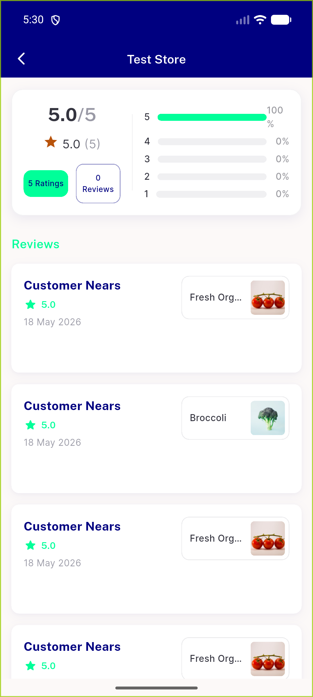
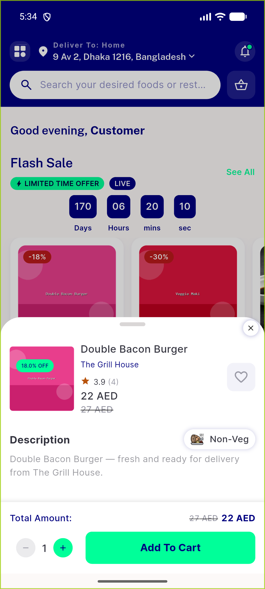

# QA Evidence — NEARS-1382

**PASS — NRating DLS migration; star+numeric+count parity + AC2 warning-hue star verified live at item_bottom_sheet + rating_widget; RTL digits LTR; no NRating regressions**

**9 screenshot(s).** Click any thumbnail for full resolution.

<table>
<tr>
<td align="center" width="33%"> item list ratings</td>
<td align="center" width="33%"> item detail rating</td>
<td align="center" width="33%"> item bottomsheet rating</td>
</tr>
<tr>
<td align="center" width="33%"> recommended storecard</td>
<td align="center" width="33%"> store reviews summary</td>
<td align="center" width="33%"> rtl arabic ratings</td>
</tr>
<tr>
<td align="center" width="33%"> zone2 home teststore</td>
<td align="center" width="33%"> store reviews</td>
<td align="center" width="33%"> item title view</td>
</tr>
</table>

---
*From `nears/docs/qa-evidence/NEARS-1382/` · public-repo scrub policy (no live secrets; verified clean).*
