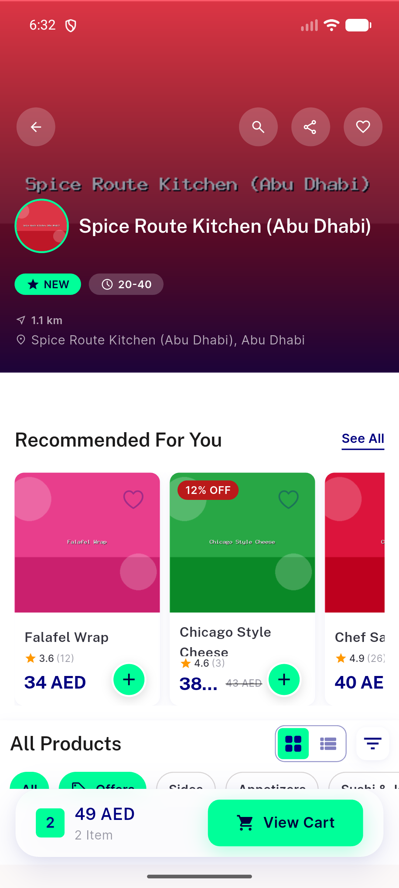
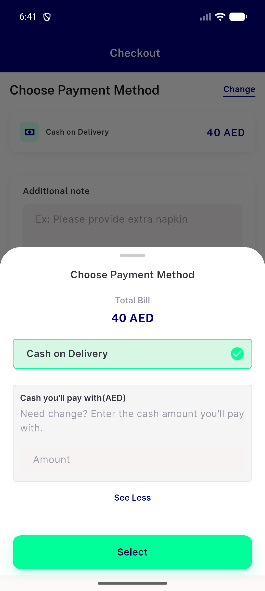
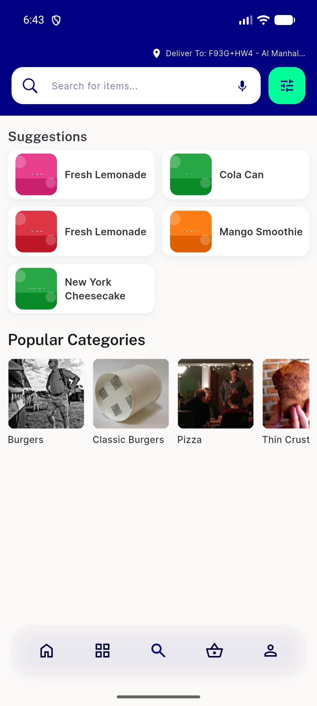

# QA Evidence — NEARS-1383

**PASS — NInkWell parity migration, 3 AC call sites + regression sweep green on emulator-5556**

**5 screenshot(s).** Click any thumbnail for full resolution.

<table>
<tr>
<td align="center" width="33%"> home</td>
<td align="center" width="33%"> store</td>
<td align="center" width="33%"> item sheet</td>
</tr>
<tr>
<td align="center" width="33%"> payment sheet</td>
<td align="center" width="33%"> search</td>
</tr>
</table>

---
*From `nears/docs/qa-evidence/NEARS-1383/` · public-repo scrub policy (no live secrets; verified clean).*
