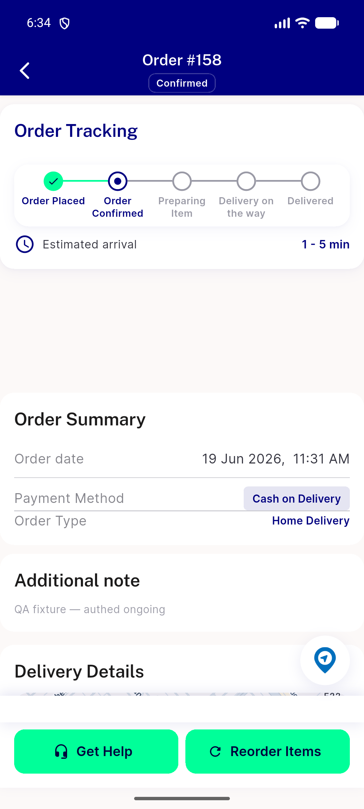
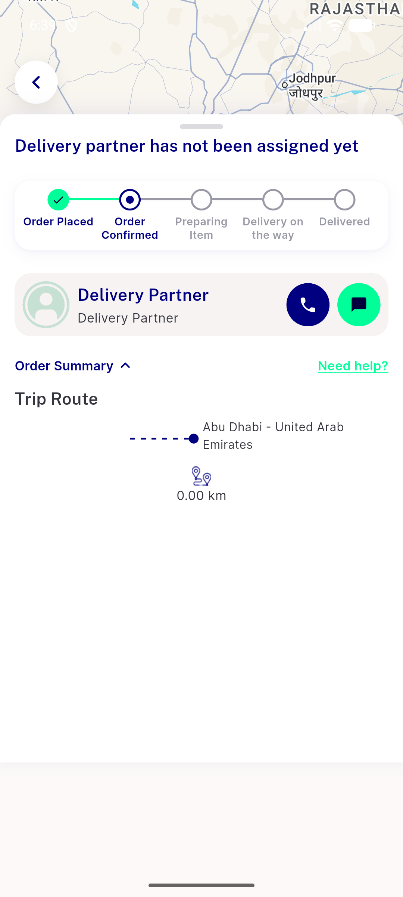
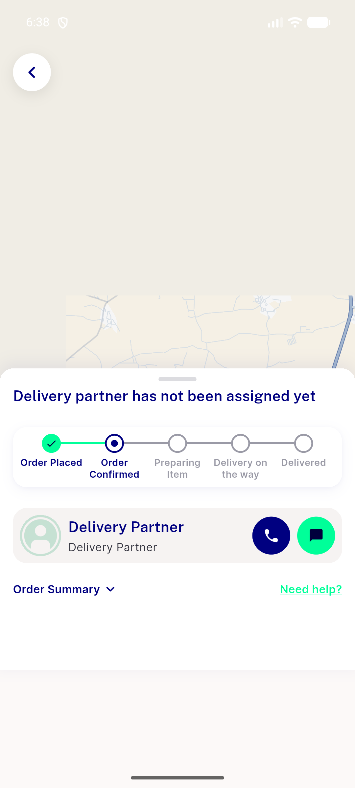
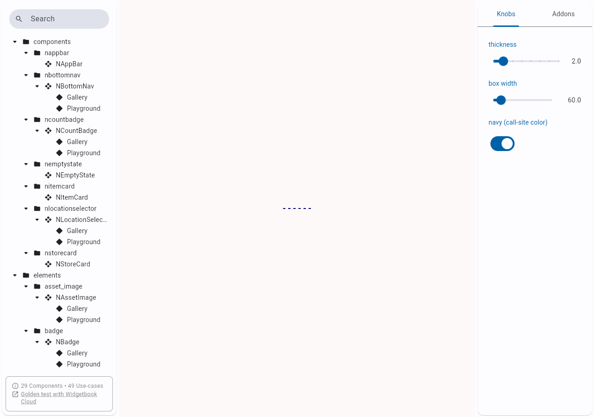
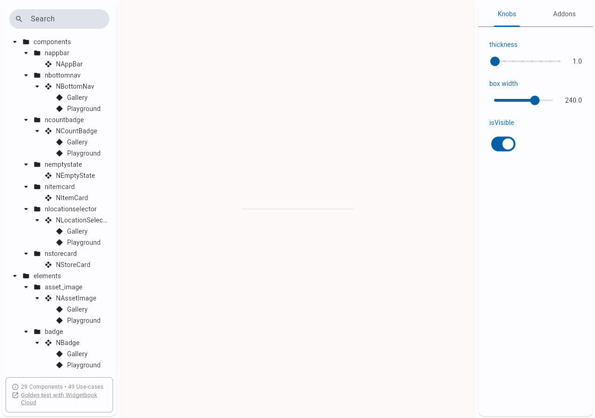

# QA Evidence — NEARS-1384

**PASS — NDivider migration: live trip-route dashed divider pixel-parity + Widgetbook Solid/Dashed stories render; no regressions**

**5 screenshot(s).** Click any thumbnail for full resolution.

<table>
<tr>
<td align="center" width="33%"> ac1 tracking divider</td>
<td align="center" width="33%"> ac1 triproute dashed divider</td>
<td align="center" width="33%"> map screen</td>
</tr>
<tr>
<td align="center" width="33%"> wb dashed</td>
<td align="center" width="33%"> wb solid</td>
</tr>
</table>

---
*From `nears/docs/qa-evidence/NEARS-1384/` · public-repo scrub policy (no live secrets; verified clean).*
