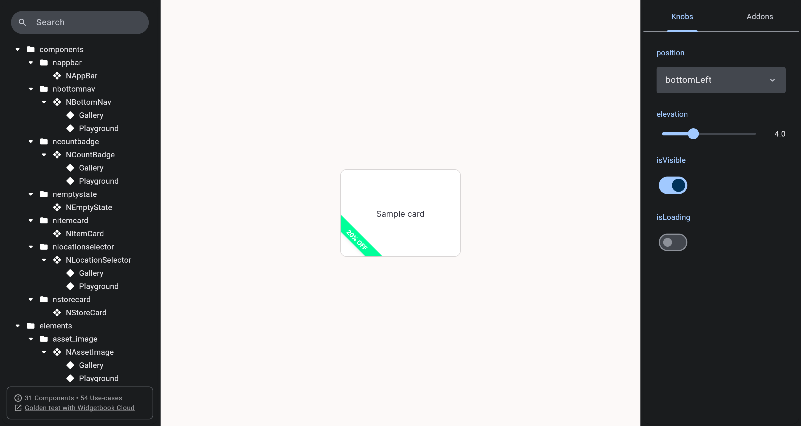
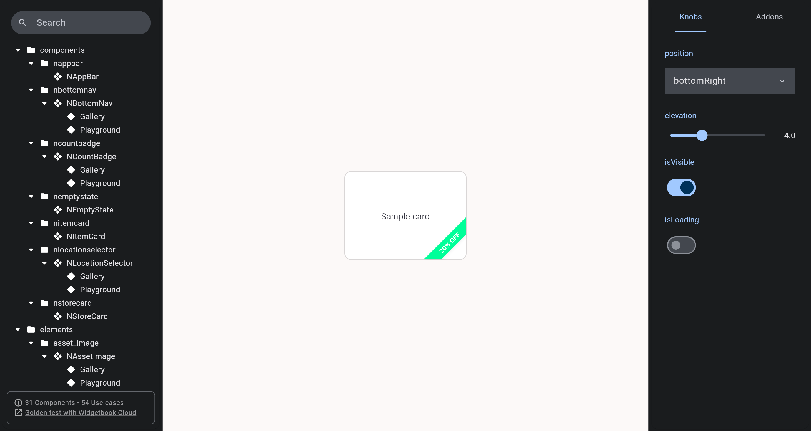
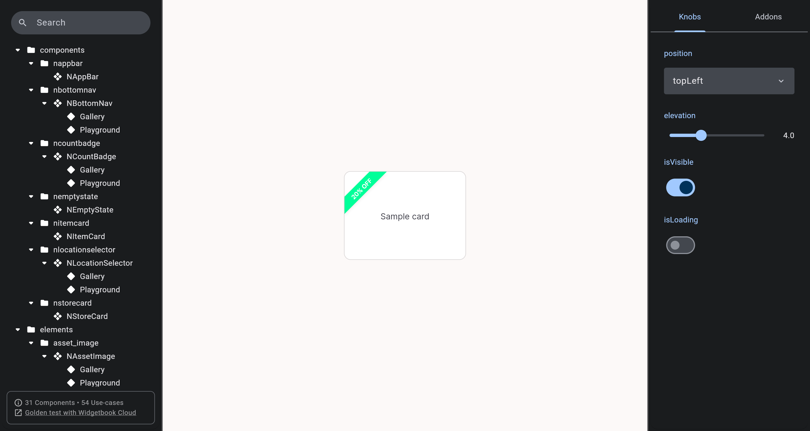
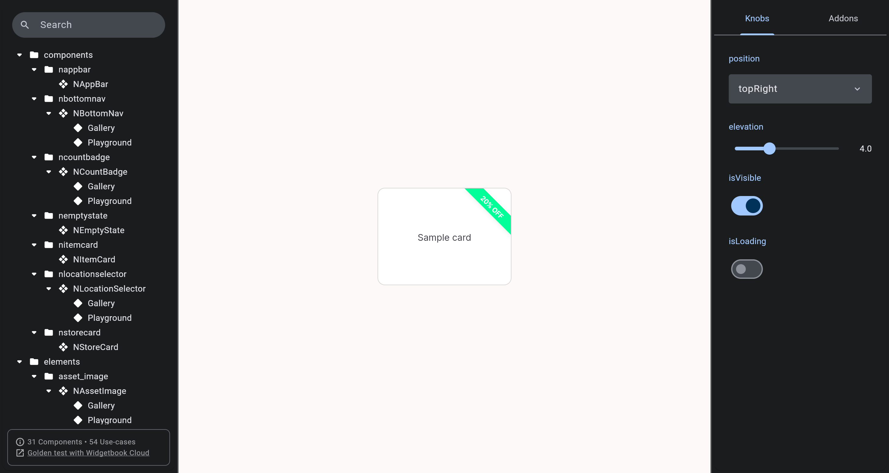
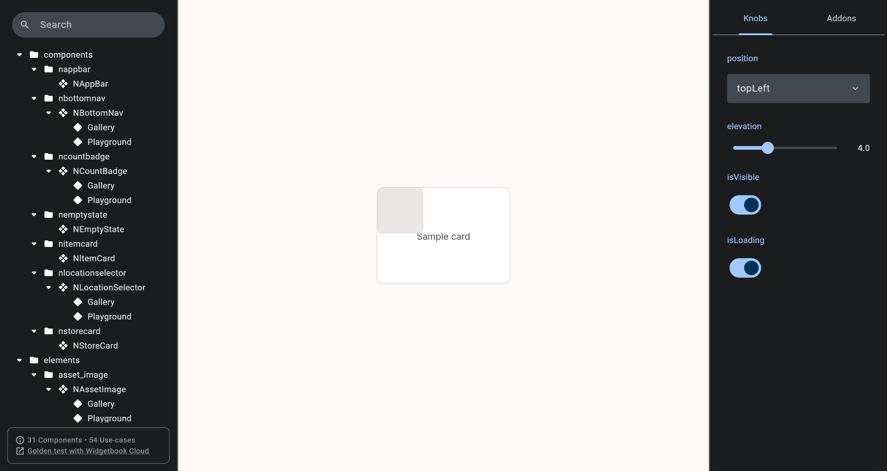
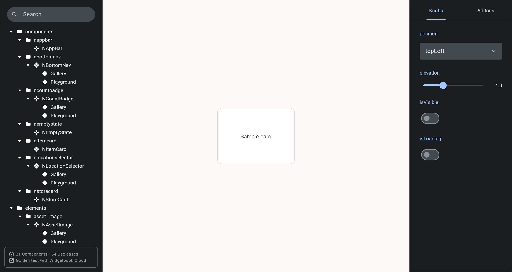

# QA Evidence — NEARS-1385

**PASS — NCornerRibbon DLS migration; 4 corners + isVisible/isLoading live in light mode; 613/613 nears_dls tests green**

**6 screenshot(s).** Click any thumbnail for full resolution.

<table>
<tr>
<td align="center" width="33%"> ac1 bottomLeft</td>
<td align="center" width="33%"> ac1 bottomRight</td>
<td align="center" width="33%"> ac1 topLeft</td>
</tr>
<tr>
<td align="center" width="33%"> ac1 topRight</td>
<td align="center" width="33%"> ac2 isLoading skeleton</td>
<td align="center" width="33%"> ac2 isVisible false</td>
</tr>
</table>

---
*From `nears/docs/qa-evidence/NEARS-1385/` · public-repo scrub policy (no live secrets; verified clean).*
