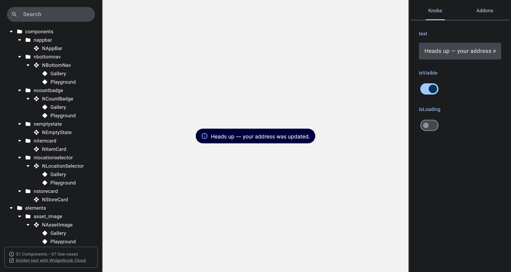

# QA Evidence — NEARS-1386

**FAIL — 3/4 status glyphs render on navyDeep pill; Error glyph tofu (cupertino_icons not bundled)**

**5 screenshot(s).** Click any thumbnail for full resolution.

<table>
<tr>
<td align="center" width="33%"> ac error glyph tofu</td>
<td align="center" width="33%"> ac info navydeep</td>
<td align="center" width="33%"> ac success</td>
</tr>
<tr>
<td align="center" width="33%"> ac warning</td>
<td align="center" width="33%"> bug error glyph tofu</td>
</tr>
</table>

### Other artifacts
- [`bug-error-glyph-tofu.log`](bug-error-glyph-tofu.log)

---
*From `nears/docs/qa-evidence/NEARS-1386/` · public-repo scrub policy (no live secrets; verified clean).*
