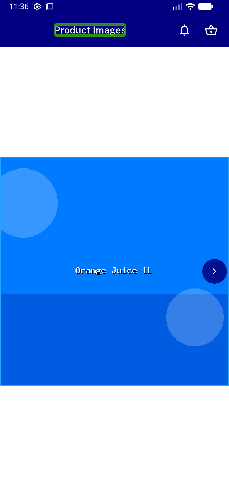
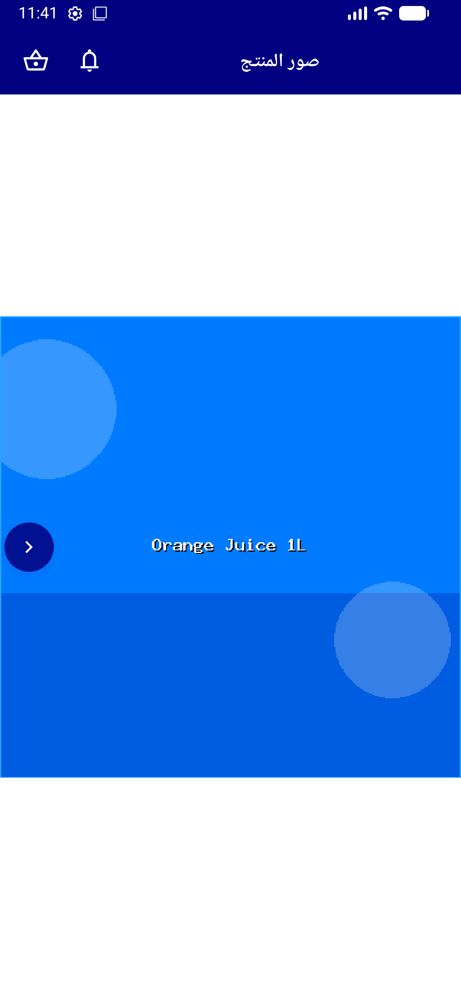

# QA Evidence — NEARS-1387

**FAIL — NIconButton reconcile: AC1-4/6 pass; AC5 stepper 48dp tap-target regressed to 30dp**

**5 screenshot(s).** Click any thumbnail for full resolution.

<table>
<tr>
<td align="center" width="33%"> ac1 active plus added to cart</td>
<td align="center" width="33%"> ac2 out of stock dimmed plus</td>
<td align="center" width="33%"> ac3 gallery chevrons ltr</td>
</tr>
<tr>
<td align="center" width="33%"> ac4 gallery chevrons rtl</td>
<td align="center" width="33%"> ac5 bottomsheet stepper</td>
</tr>
</table>

### Other artifacts
- [`bug-stepper-tap-target-30dp.log`](bug-stepper-tap-target-30dp.log)

---
*From `nears/docs/qa-evidence/NEARS-1387/` · public-repo scrub policy (no live secrets; verified clean).*
