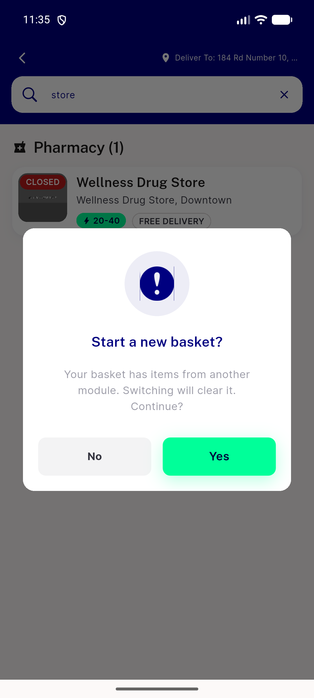
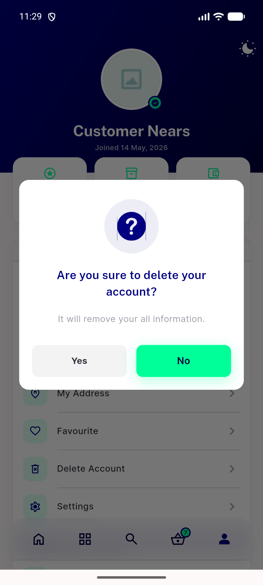
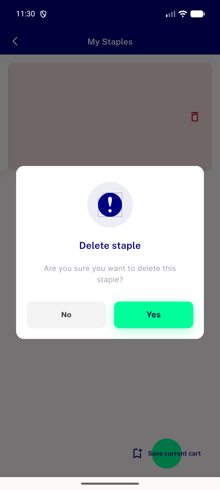
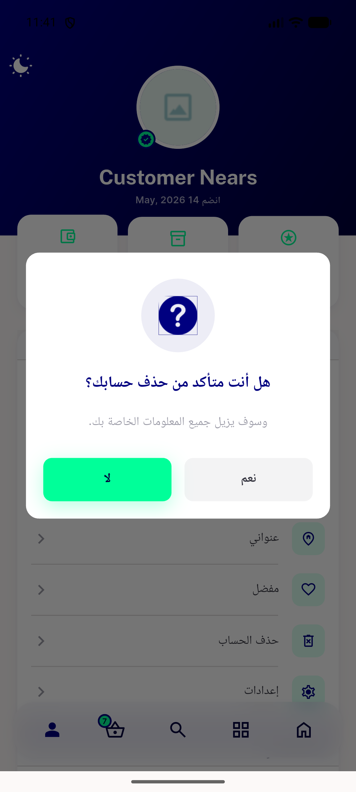

# QA Evidence — NEARS-1388

**PASS (AC2+AC3 live-verified; AC1 unverifiable-live) — NDialog UserApp migration, emulator-5556/5560**

**4 screenshot(s).** Click any thumbnail for full resolution.

<table>
<tr>
<td align="center" width="33%"> ac2 crossmodule reset barrier</td>
<td align="center" width="33%"> ac2 delete account logout inversion</td>
<td align="center" width="33%"> ac2 delete staple normal confirm</td>
</tr>
<tr>
<td align="center" width="33%"> ac2 rtl arabic logout inversion</td>
</tr>
</table>

---
*From `nears/docs/qa-evidence/NEARS-1388/` · public-repo scrub policy (no live secrets; verified clean).*
