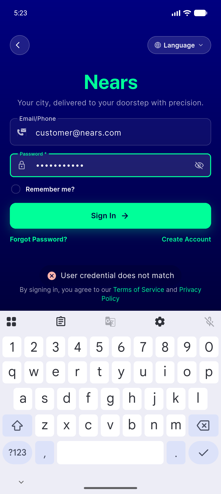
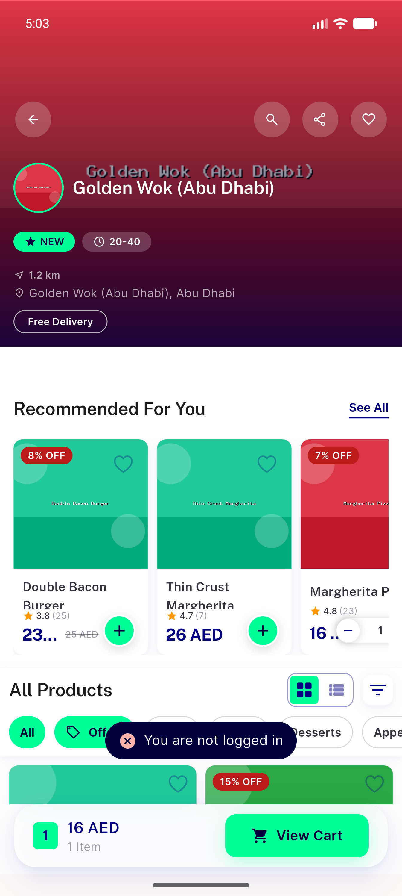
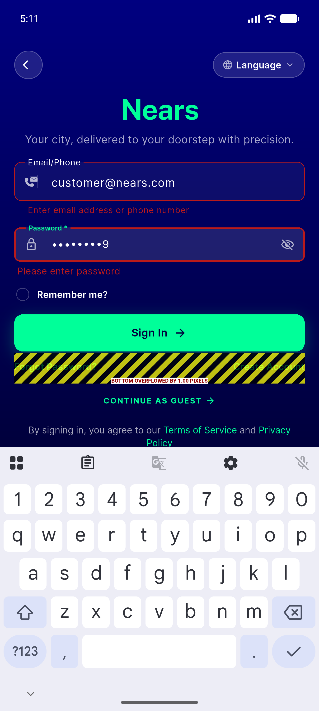

# QA Evidence — NEARS-1390

**PASS — NSnackBar/NToast migration verified live (success+error, both show-paths, navyDeep, 5 screens); 34 automated tests green**

**6 screenshot(s).** Click any thumbnail for full resolution.

<table>
<tr>
<td align="center" width="33%"> ac1 ac5a success referralcopy default</td>
<td align="center" width="33%"> ac2 ac5a error loginfail default</td>
<td align="center" width="33%"> ac2 ac5b error getx notloggedin</td>
</tr>
<tr>
<td align="center" width="33%"> ac4 success favstore home default</td>
<td align="center" width="33%"> ac4 success logout menu default</td>
<td align="center" width="33%"> bug login form 1px overflow</td>
</tr>
</table>

### Other artifacts
- [`progress.md`](progress.md)

---
*From `nears/docs/qa-evidence/NEARS-1390/` · public-repo scrub policy (no live secrets; verified clean).*
