# QA Evidence — NEARS-1392

**PASS — NSelect DLS migration: AC1-5 verified live (light+RTL), dark deferred; 17 unit tests + analyzer clean**

**13 screenshot(s).** Click any thumbnail for full resolution.

<table>
<tr>
<td align="center" width="33%"><a href="ac1-deliverytype-open.png">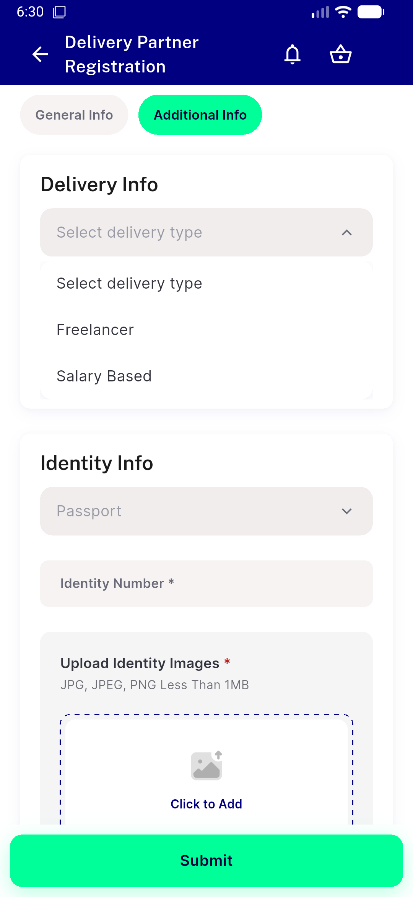</a> ac1 deliverytype open</td>
<td align="center" width="33%"><a href="ac1-dm-steptwo-populated.png">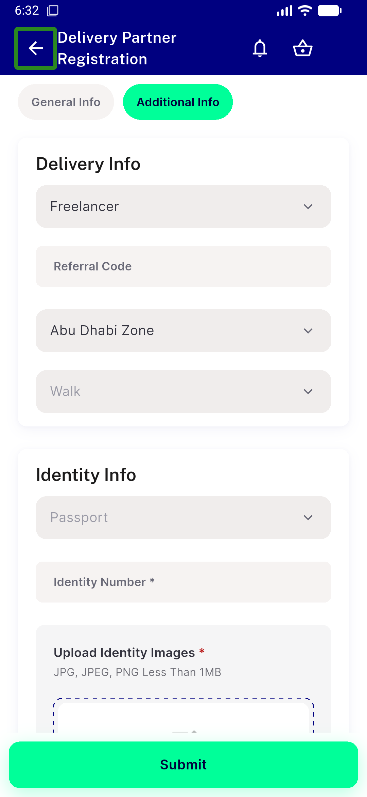</a> ac1 dm steptwo populated</td>
<td align="center" width="33%"><a href="ac1-dmzone-open.png">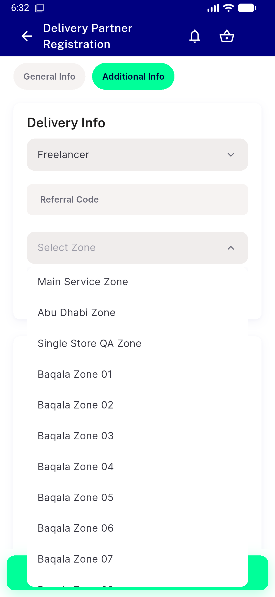</a> ac1 dmzone open</td>
</tr>
<tr>
<td align="center" width="33%"><a href="ac1-freelancer-referral.png">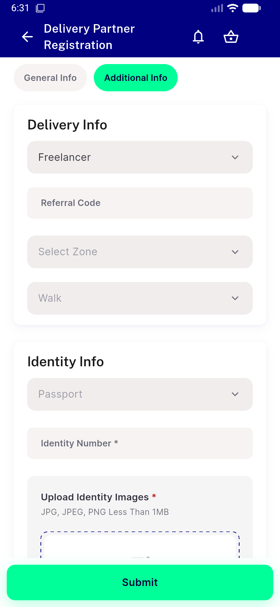</a> ac1 freelancer referral</td>
<td align="center" width="33%"><a href="ac2-module-open.png">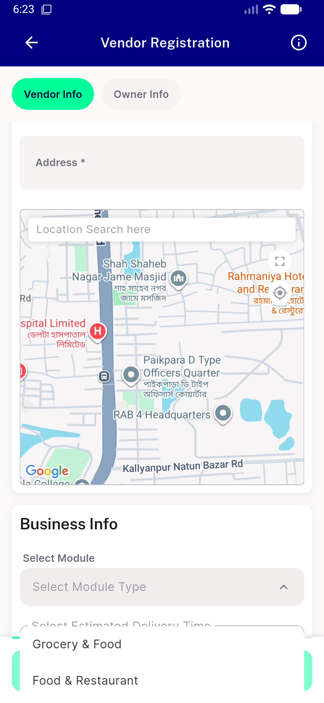</a> ac2 module open</td>
<td align="center" width="33%"><a href="ac2-module-selected.png">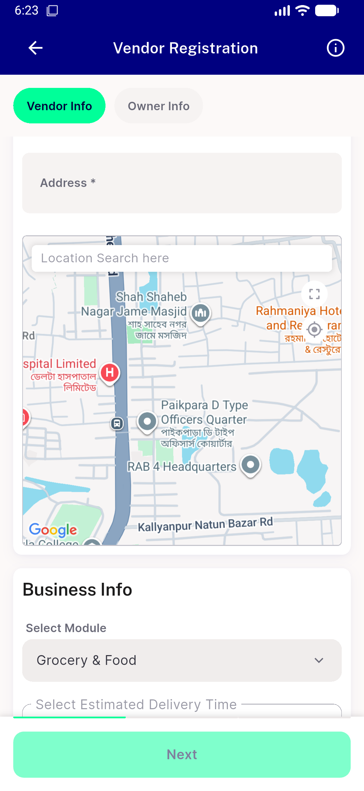</a> ac2 module selected</td>
</tr>
<tr>
<td align="center" width="33%"><a href="ac2-moduleselect-open.png">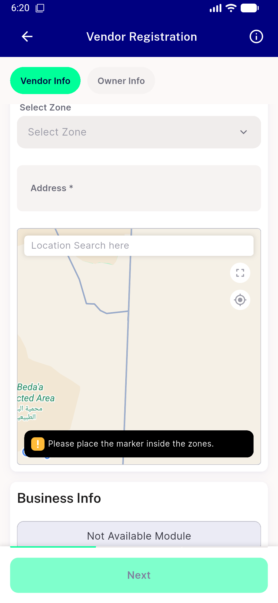</a> ac2 moduleselect open</td>
<td align="center" width="33%"><a href="ac2-zone-selected.png">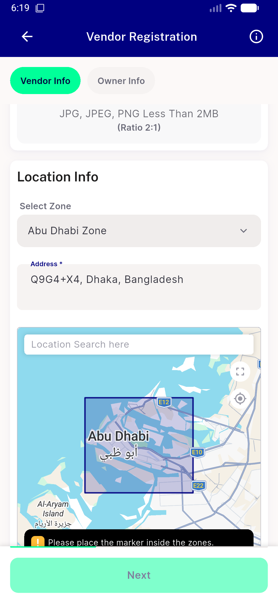</a> ac2 zone selected</td>
<td align="center" width="33%"><a href="ac2-zoneselect-open.png">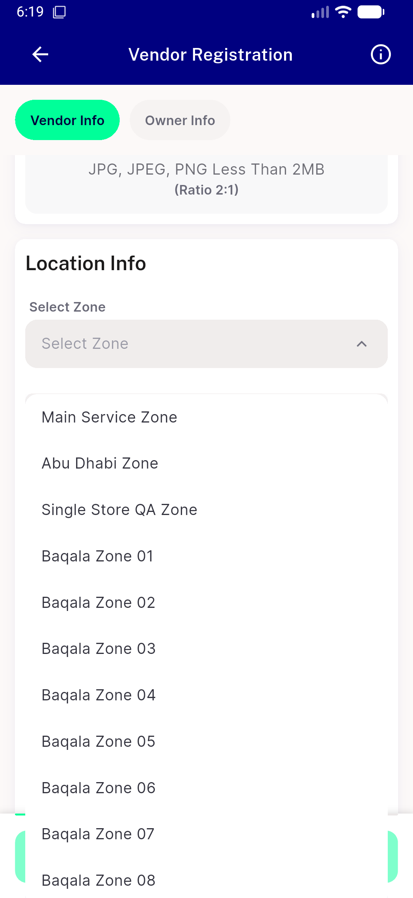</a> ac2 zoneselect open</td>
</tr>
<tr>
<td align="center" width="33%"><a href="ac4-checkout-loaded.png">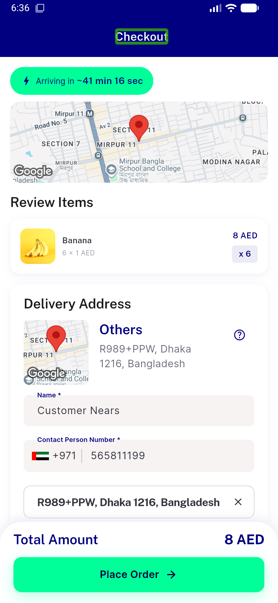</a> ac4 checkout loaded</td>
<td align="center" width="33%"><a href="ac4-checkout.png">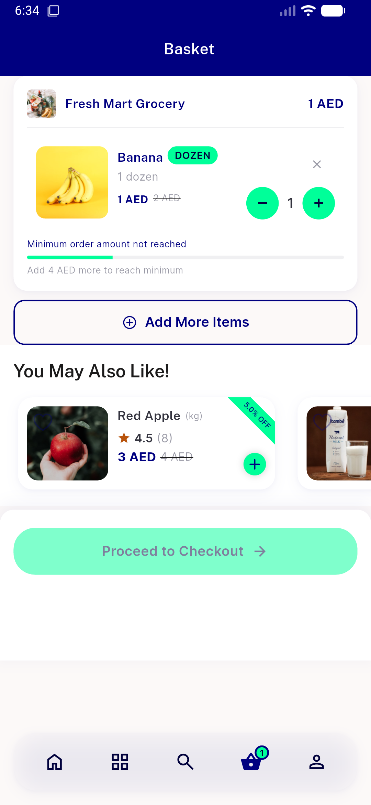</a> ac4 checkout</td>
<td align="center" width="33%"><a href="ac5-rtl-select-collapsed.png">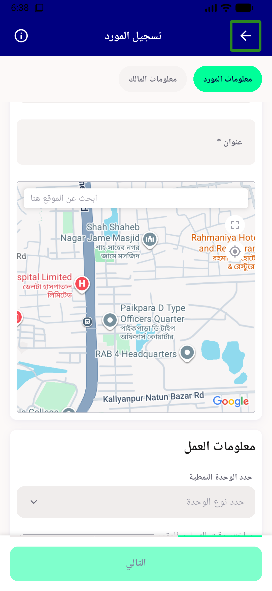</a> ac5 rtl select collapsed</td>
</tr>
<tr>
<td align="center" width="33%"><a href="ac5-rtl-select-open.png">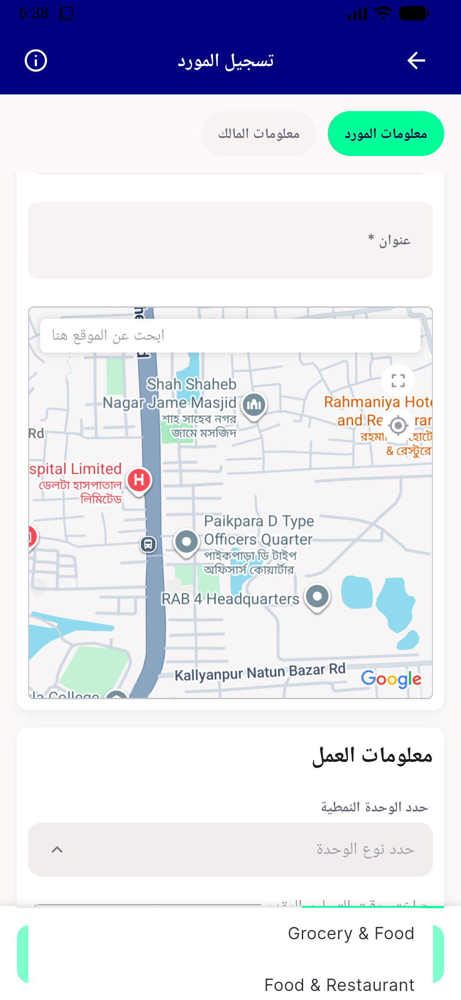</a> ac5 rtl select open</td>
</tr>
</table>

---
*From `nears/docs/qa-evidence/NEARS-1392/` · public-repo scrub policy (no live secrets; verified clean).*
