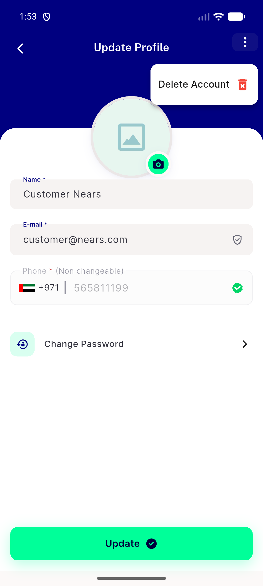
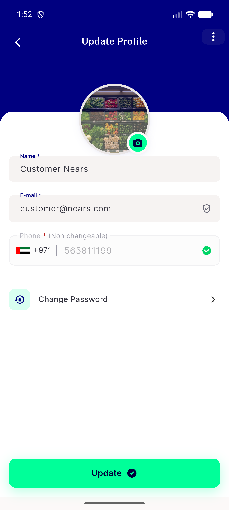
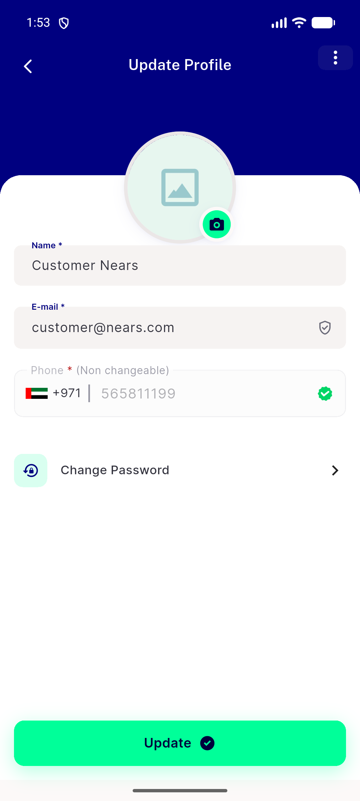
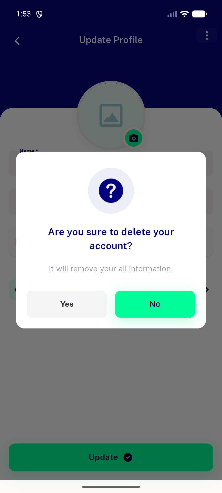
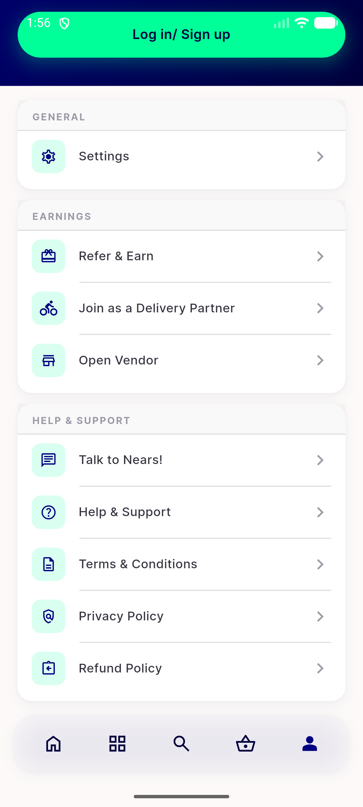
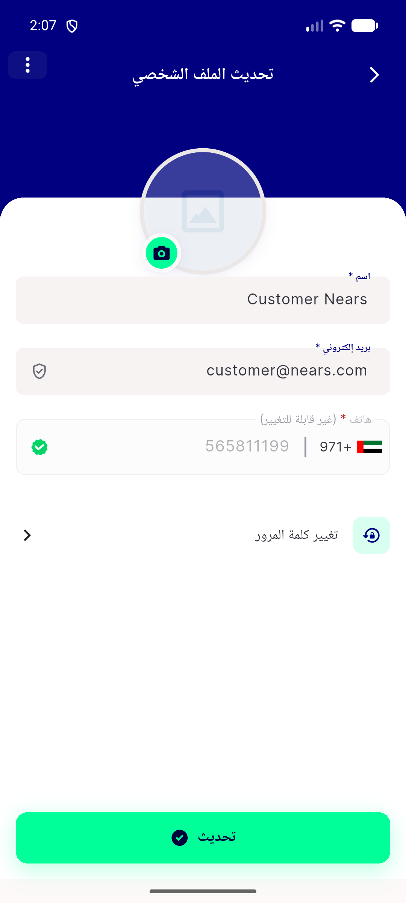
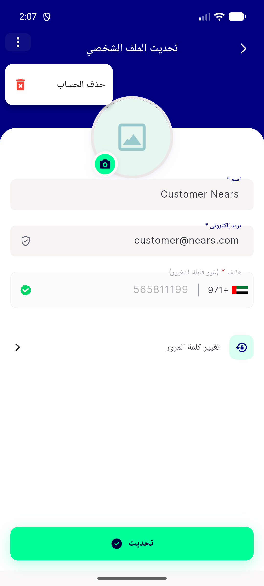

# QA Evidence — NEARS-1393

**PASS — NPopupMenu DLS component verified live on emulator-5556 (light mode); all 5 ACs demonstrated, regression clean**

**7 screenshot(s).** Click any thumbnail for full resolution.

<table>
<tr>
<td align="center" width="33%"> ac1 ac2 popup menu open</td>
<td align="center" width="33%"> ac1 kebab header</td>
<td align="center" width="33%"> ac3 cancelled safe</td>
</tr>
<tr>
<td align="center" width="33%"> ac3 confirm dialog</td>
<td align="center" width="33%"> ac4 guest profile hub</td>
<td align="center" width="33%"> ac5 rtl kebab mirrored</td>
</tr>
<tr>
<td align="center" width="33%"> ac5 rtl popup mirrored</td>
</tr>
</table>

---
*From `nears/docs/qa-evidence/NEARS-1393/` · public-repo scrub policy (no live secrets; verified clean).*
