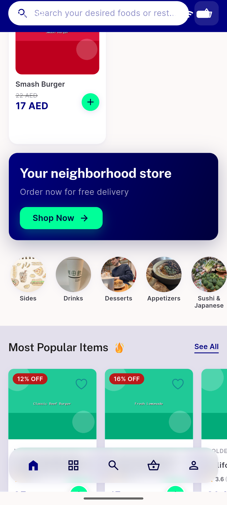
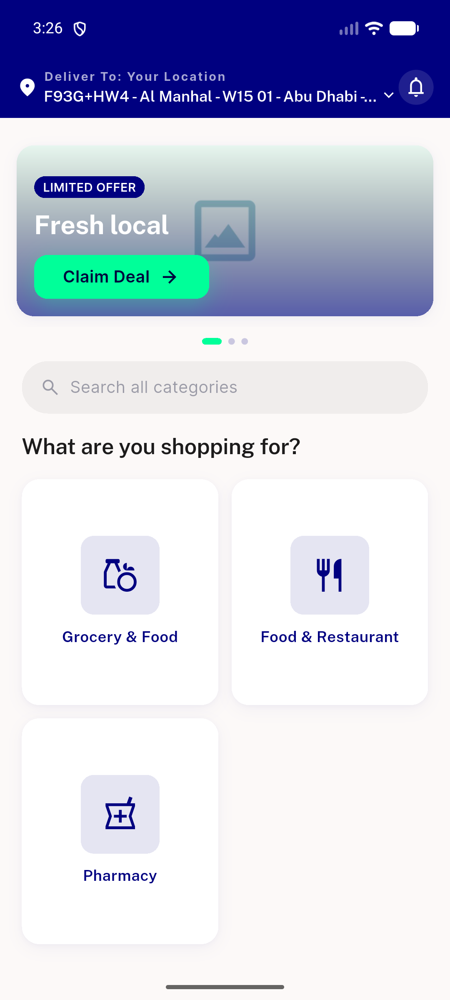
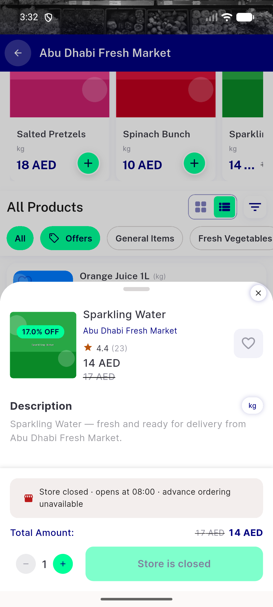
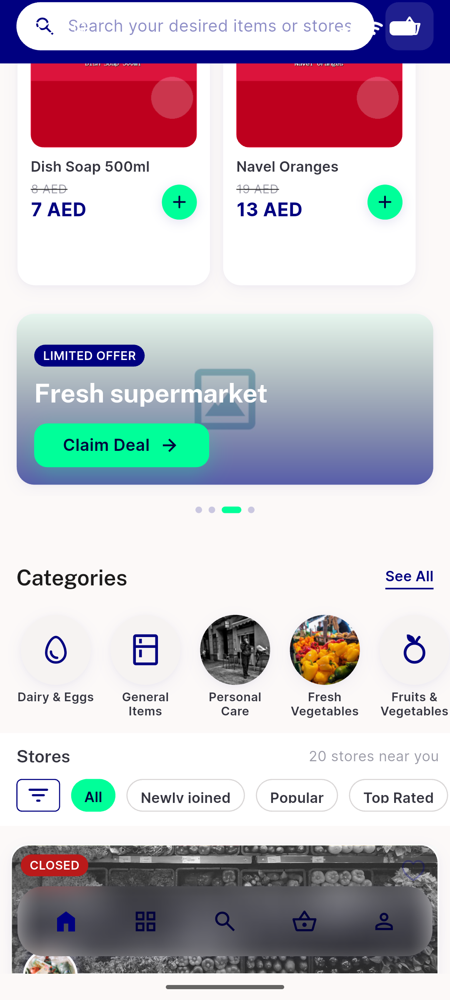
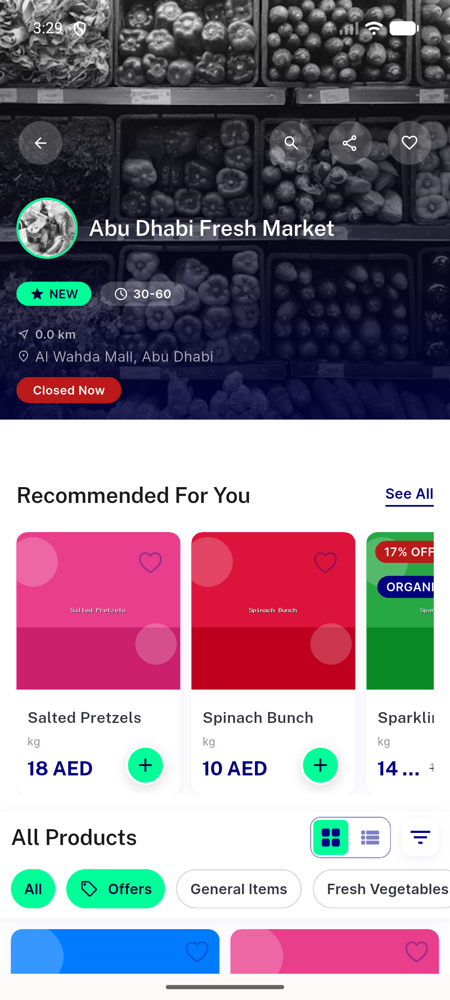
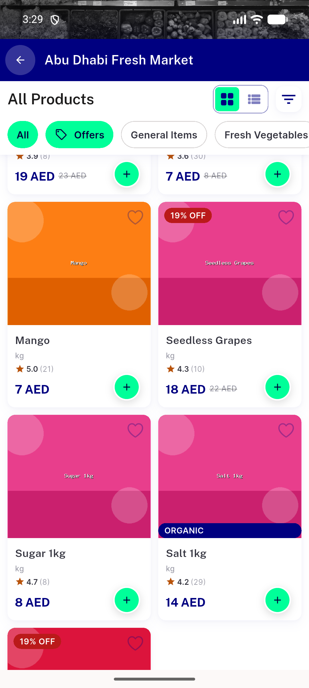
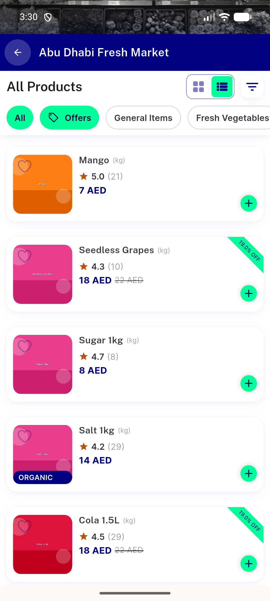

# QA Evidence — NEARS-1394

**PASS — NBadge tag-trio migration (discount/new/organic) verified light-mode on emulator-5556 (EN) + 5558 (RTL) + Widgetbook**

**10 screenshot(s).** Click any thumbnail for full resolution.

<table>
<tr>
<td align="center" width="33%"> food 06 new pill</td>
<td align="center" width="33%"> home 01 top</td>
<td align="center" width="33%"> item details 04 discount organic soft</td>
</tr>
<tr>
<td align="center" width="33%"> module 05 newly joined</td>
<td align="center" width="33%"> rtl 07 store pills arabic</td>
<td align="center" width="33%"> rtl 08 nearsmart pills</td>
</tr>
<tr>
<td align="center" width="33%"> rtl 09 organic paradise</td>
<td align="center" width="33%"> store8 01 discount organic pills</td>
<td align="center" width="33%"> store8 02 grid cards</td>
</tr>
<tr>
<td align="center" width="33%"> store8 03 listview mint discount</td>
</tr>
</table>

### Other artifacts
- [`progress.md`](progress.md)

---
*From `nears/docs/qa-evidence/NEARS-1394/` · public-repo scrub policy (no live secrets; verified clean).*
