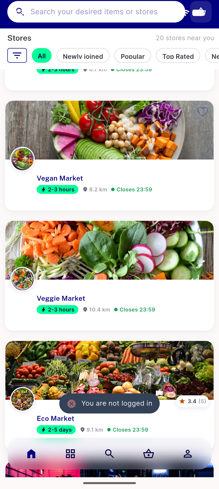
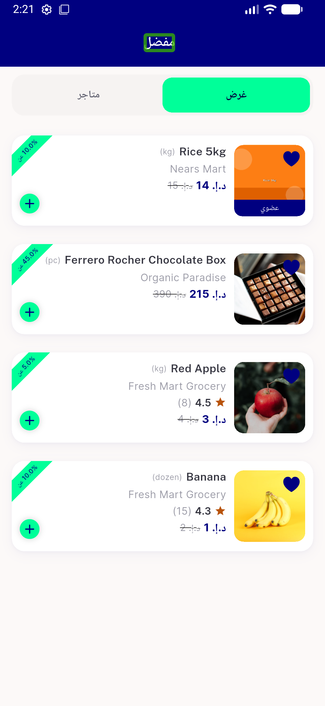
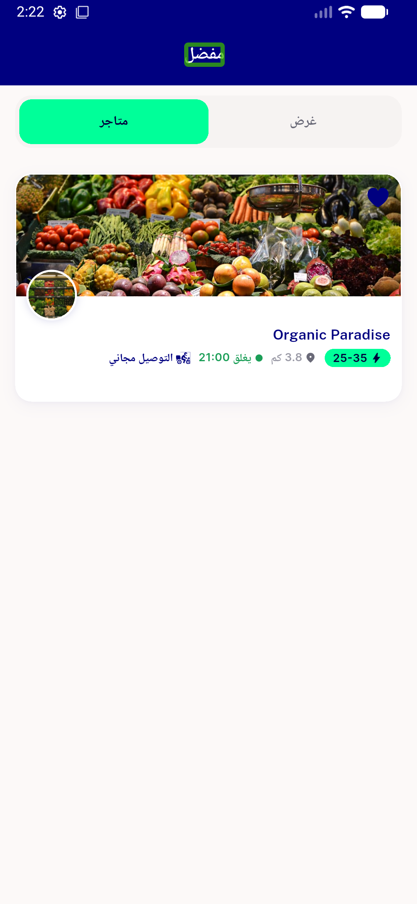
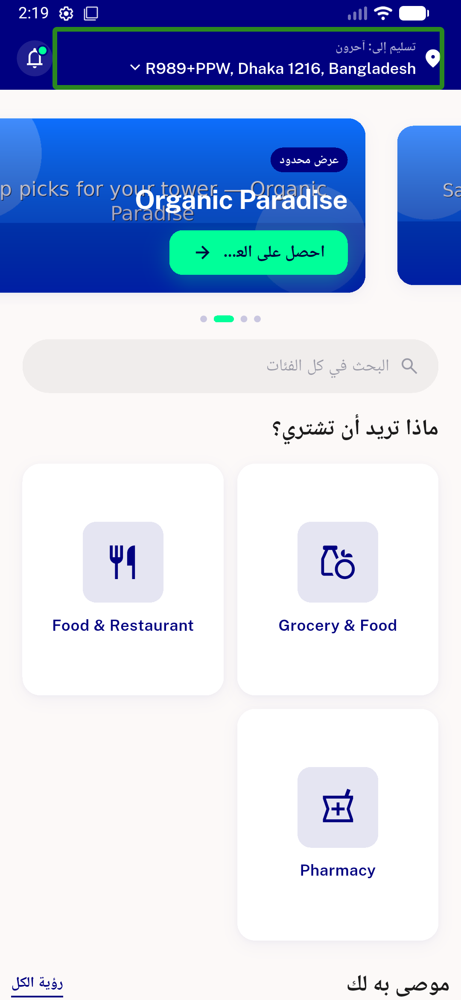
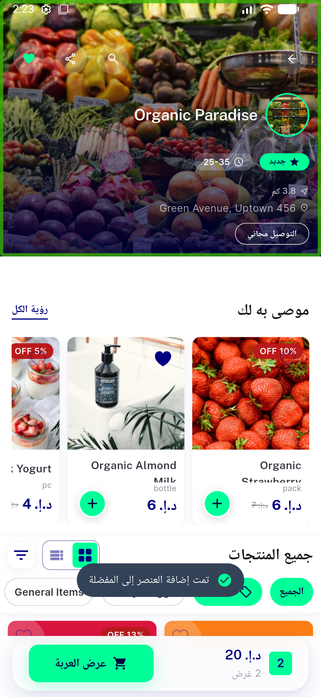
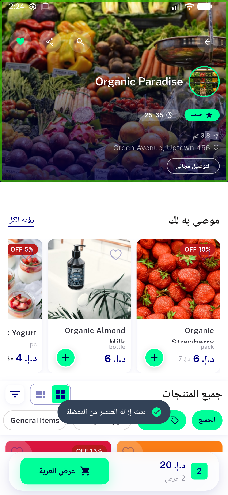
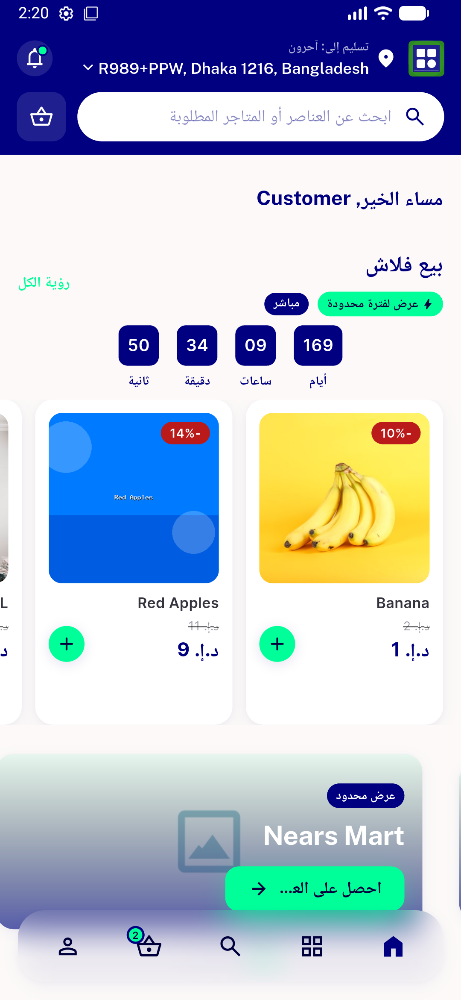
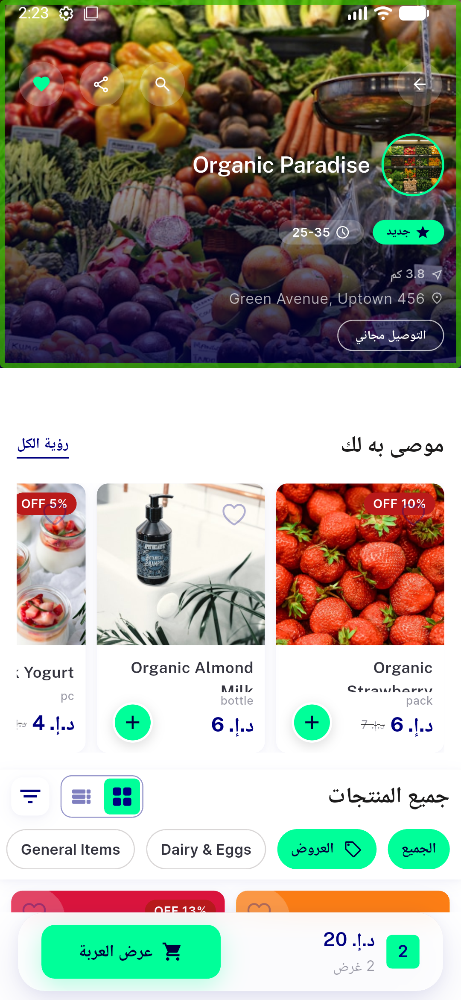
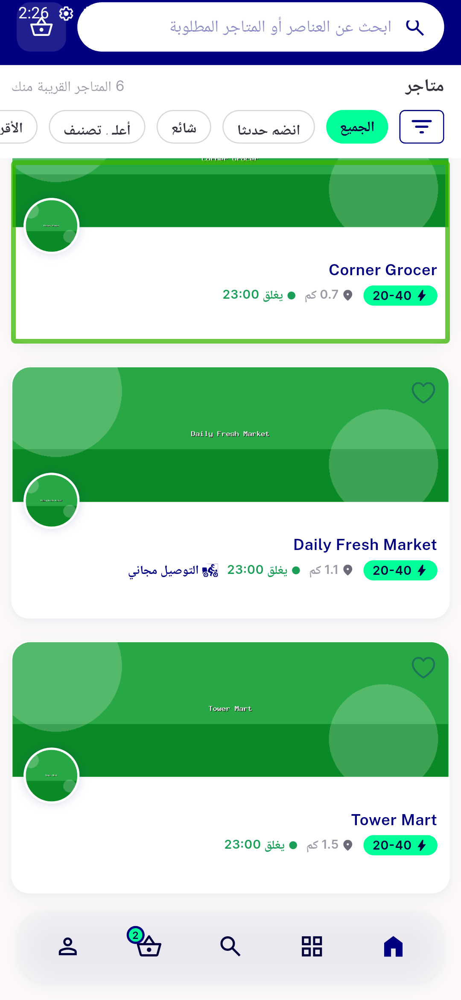

# QA Evidence — NEARS-1395

**PASS — NFavourite DLS migration: item+store add/remove live (200), solid/outline navy parity, RTL corner + auth-gate verified, 17/17 unit tests**

**9 screenshot(s).** Click any thumbnail for full resolution.

<table>
<tr>
<td align="center" width="33%"> auth gate guest</td>
<td align="center" width="33%"> favourites screen</td>
<td align="center" width="33%"> favourites stores tab</td>
</tr>
<tr>
<td align="center" width="33%"> home arabic</td>
<td align="center" width="33%"> item added</td>
<td align="center" width="33%"> item removed</td>
</tr>
<tr>
<td align="center" width="33%"> module flashsale</td>
<td align="center" width="33%"> store detail before</td>
<td align="center" width="33%"> store list rtl</td>
</tr>
</table>

---
*From `nears/docs/qa-evidence/NEARS-1395/` · public-repo scrub policy (no live secrets; verified clean).*
