# QA Evidence — NEARS-1396

**PASS — NButton reconcile (53 sites): all reachable ACs demonstrated live LTR+RTL, DLS 674/674, 0 overflow; 4 states golden/code-verified (live-gated); no task bugs**

**11 screenshot(s).** Click any thumbnail for full resolution.

<table>
<tr>
<td align="center" width="33%"><a href="ac1-cart-proceed-checkout.png">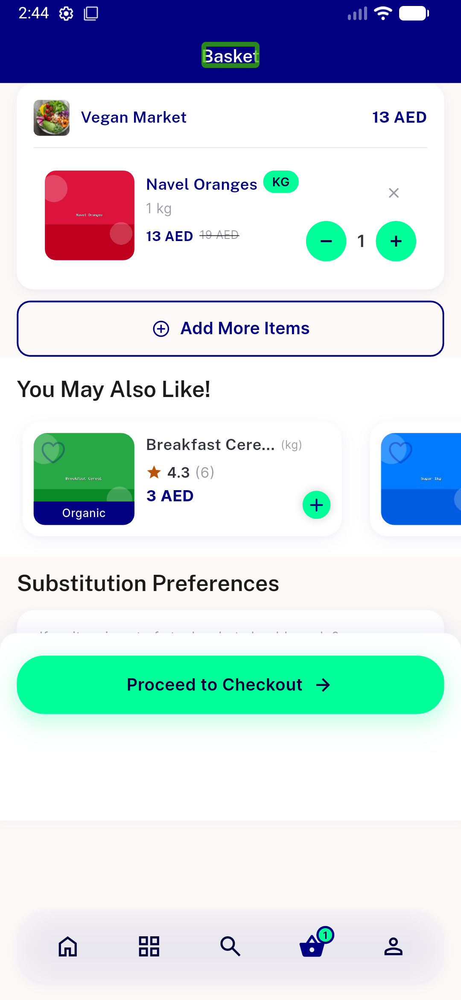</a> ac1 cart proceed checkout</td>
<td align="center" width="33%"><a href="ac1-forgetpass-request-otp.png">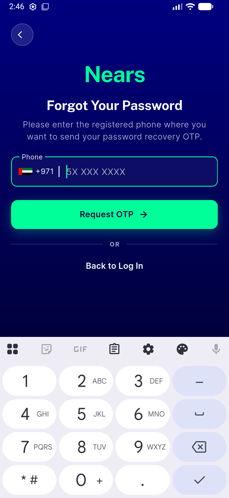</a> ac1 forgetpass request otp</td>
<td align="center" width="33%"><a href="ac1-signin-loading-spinner.png">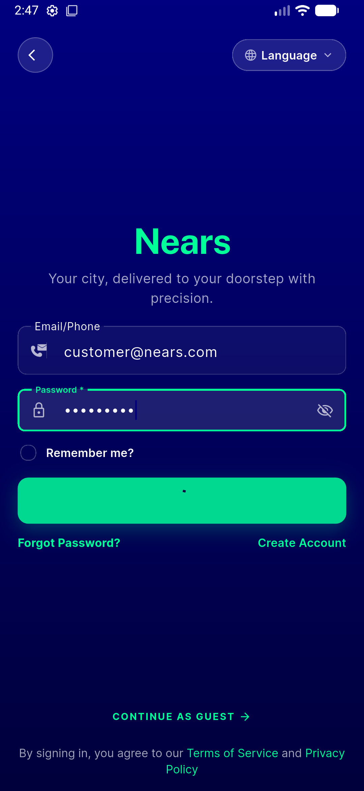</a> ac1 signin loading spinner</td>
</tr>
<tr>
<td align="center" width="33%"><a href="ac2-add-address-save.png">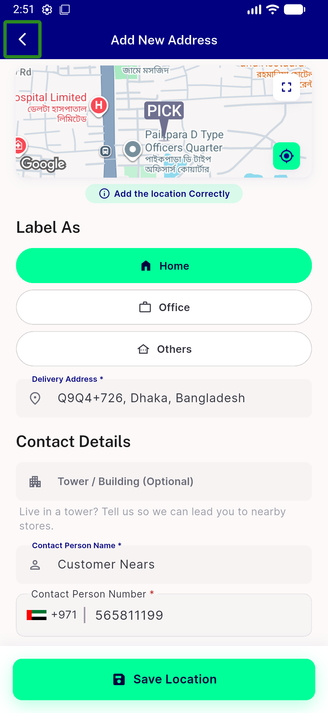</a> ac2 add address save</td>
<td align="center" width="33%"><a href="ac3-item-bottomsheet-addtocart.png">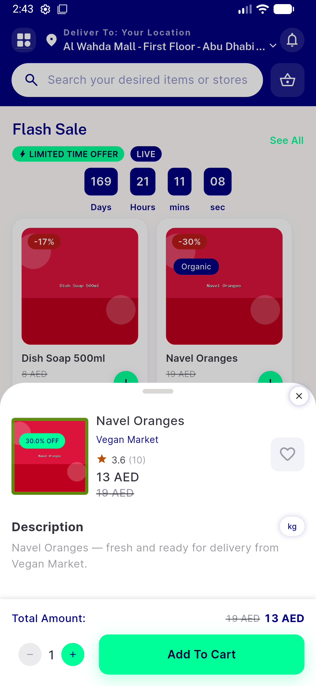</a> ac3 item bottomsheet addtocart</td>
<td align="center" width="33%"><a href="ac6-notification-destructive-ltr.png">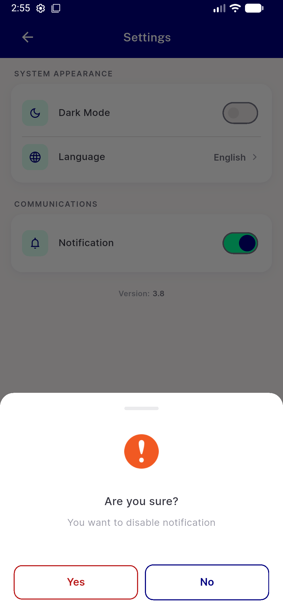</a> ac6 notification destructive ltr</td>
</tr>
<tr>
<td align="center" width="33%"><a href="ac6-notification-destructive-rtl-arabic.png">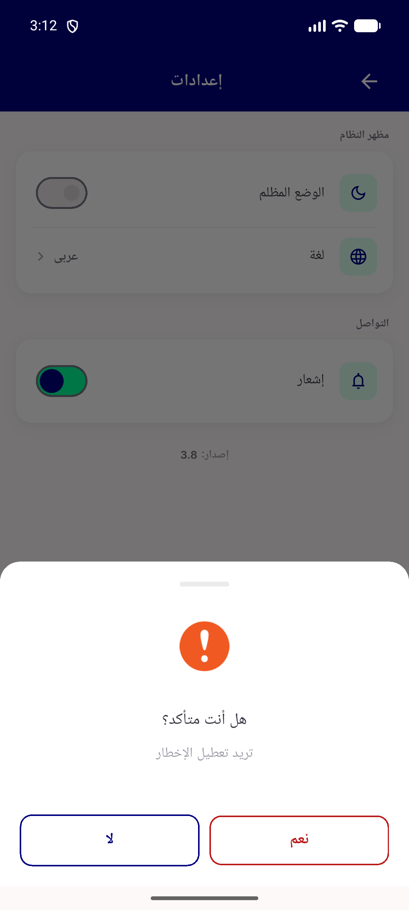</a> ac6 notification destructive rtl arabic</td>
<td align="center" width="33%"><a href="ac7-filter-reset-tertiary.png">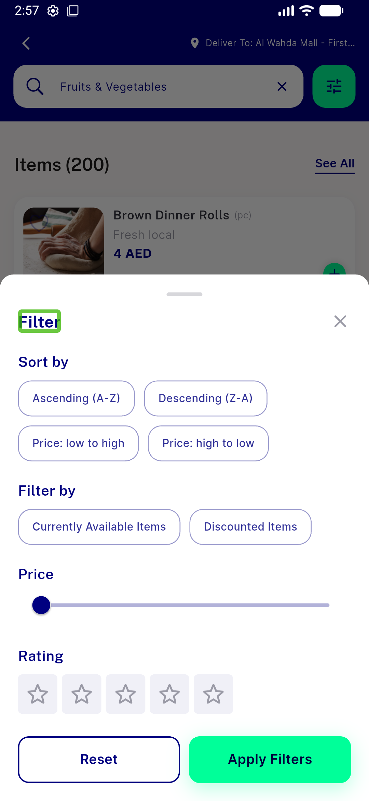</a> ac7 filter reset tertiary</td>
<td align="center" width="33%"><a href="ac7-search-filter-reset.png">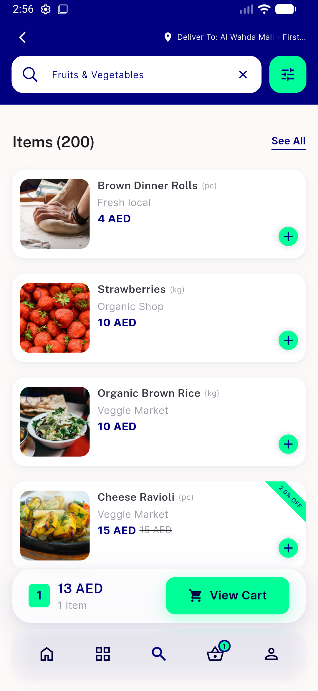</a> ac7 search filter reset</td>
</tr>
<tr>
<td align="center" width="33%"><a href="ac8-eta-pill-brpill-capsule.png">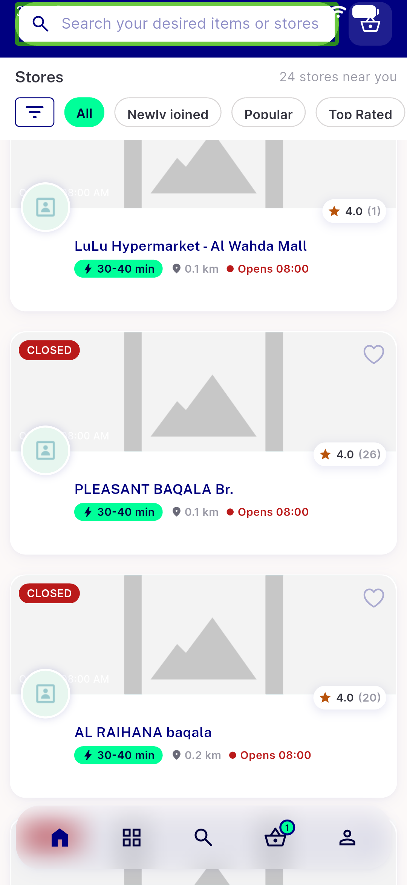</a> ac8 eta pill brpill capsule</td>
<td align="center" width="33%"><a href="ac9-loyalty-convert.png">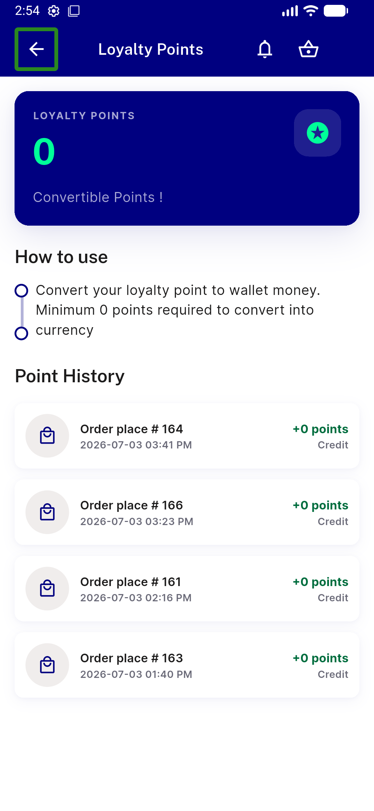</a> ac9 loyalty convert</td>
</tr>
</table>

### Other artifacts
- [`bug-preexisting-repo-null-typeerror.log`](bug-preexisting-repo-null-typeerror.log)
- [`progress.md`](progress.md)

---
*From `nears/docs/qa-evidence/NEARS-1396/` · public-repo scrub policy (no live secrets; verified clean).*
