# QA Evidence — NEARS-1397

**FAIL — NInput/NPhoneField migration: AC-breaking keyboard-drop on manual_login email→phone swap**

**15 screenshot(s).** Click any thumbnail for full resolution.

<table>
<tr>
<td align="center" width="33%"><a href="00-home-boot.png">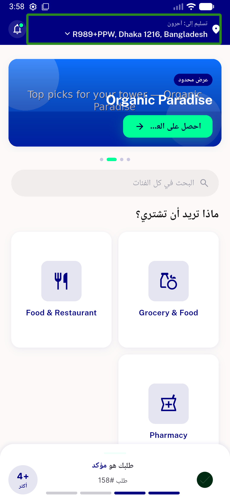</a> home boot</td>
<td align="center" width="33%"><a href="01-signin-email-phone.png">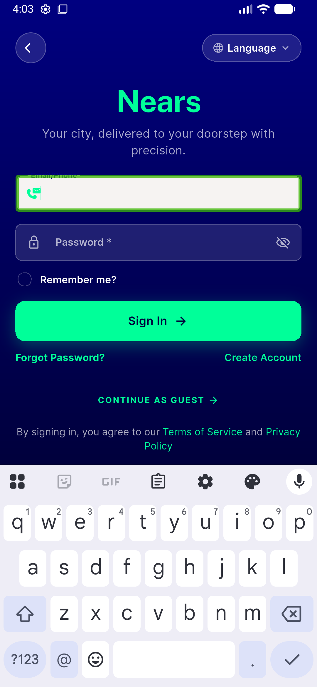</a> signin email phone</td>
<td align="center" width="33%"> signin phone swap</td>
</tr>
<tr>
<td align="center" width="33%"> phone digits</td>
<td align="center" width="33%"><a href="03b-phone-digits2.png">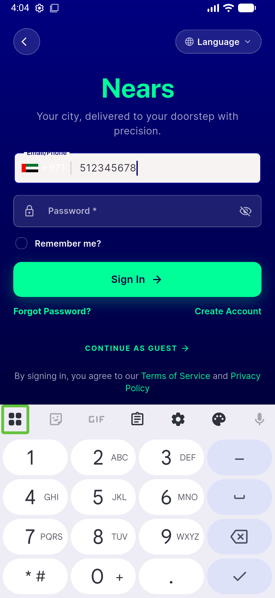</a> 03b phone digits2</td>
<td align="center" width="33%"><a href="03c-swap-full-number.png">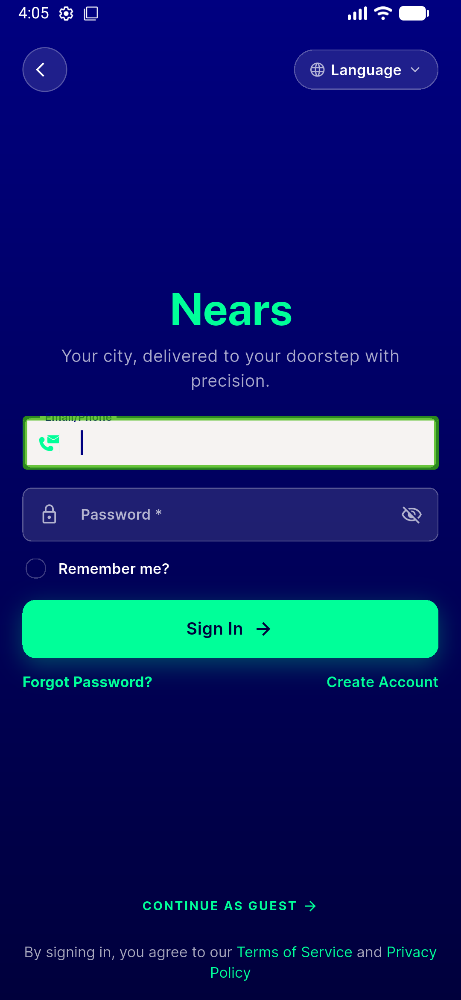</a> 03c swap full number</td>
</tr>
<tr>
<td align="center" width="33%"><a href="03d-swap-humanpace.png">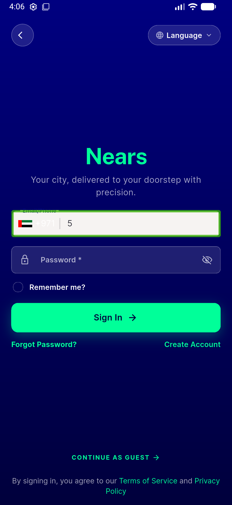</a> 03d swap humanpace</td>
<td align="center" width="33%"> forget password phone</td>
<td align="center" width="33%"><a href="06-picker-selected.png">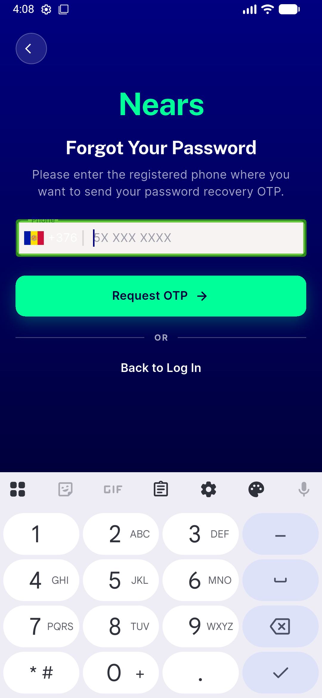</a> picker selected</td>
</tr>
<tr>
<td align="center" width="33%"><a href="07a-pw-obscured.png">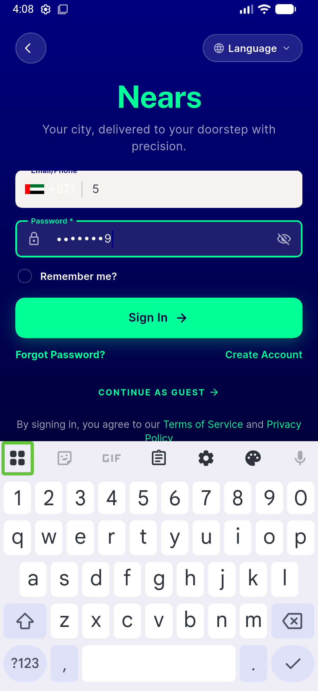</a> 07a pw obscured</td>
<td align="center" width="33%"><a href="07b-pw-shown.png">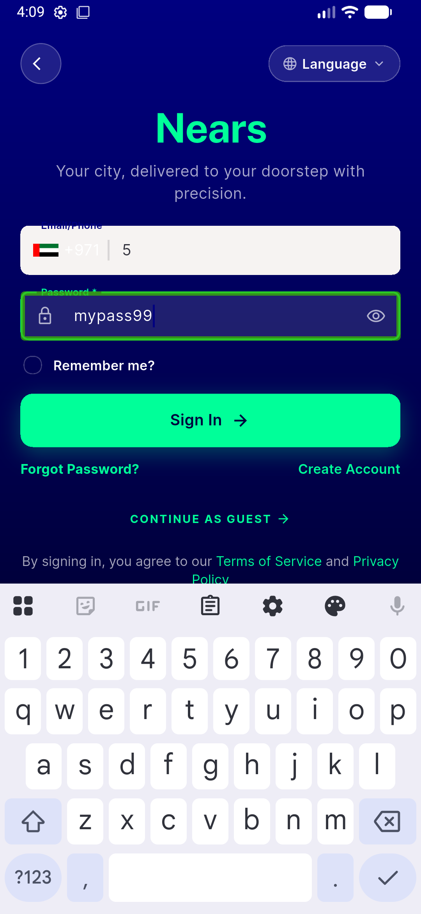</a> 07b pw shown</td>
<td align="center" width="33%"> signup</td>
</tr>
<tr>
<td align="center" width="33%"><a href="09-signup-validators.png">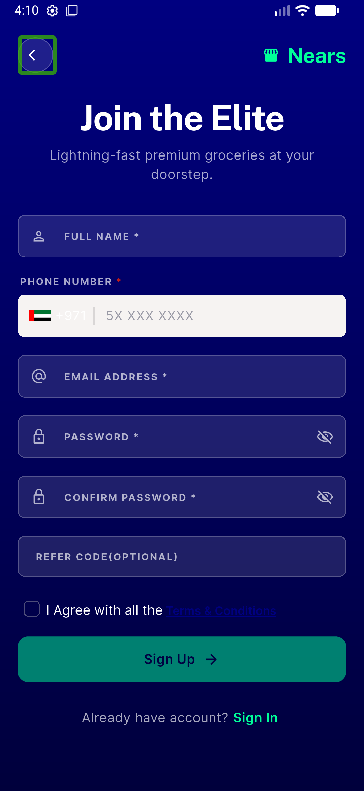</a> signup validators</td>
<td align="center" width="33%"><a href="10-referral-focus-tint.png">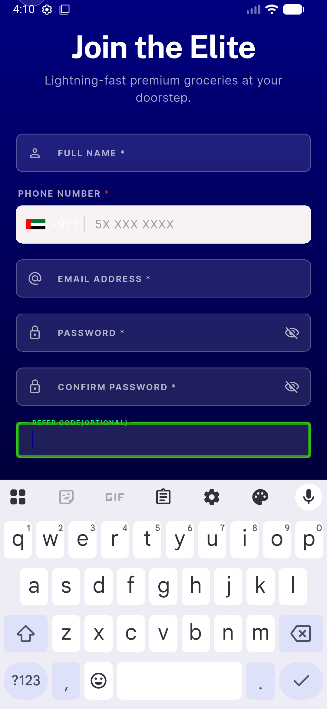</a> referral focus tint</td>
<td align="center" width="33%"><a href="12-checkout.png">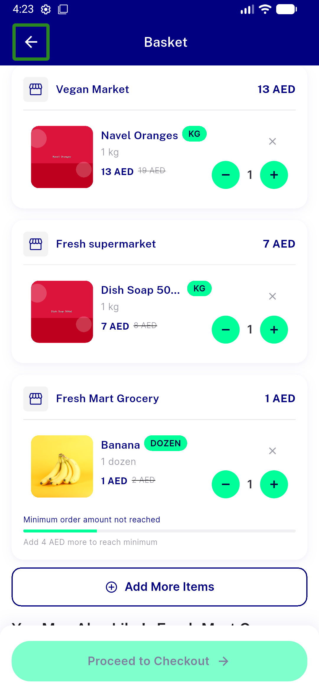</a> checkout</td>
</tr>
</table>

### Other artifacts
- [`bug-login-swap-keyboard-drop.log`](bug-login-swap-keyboard-drop.log)
- [`progress.md`](progress.md)

---
*From `nears/docs/qa-evidence/NEARS-1397/` · public-repo scrub policy (no live secrets; verified clean).*
