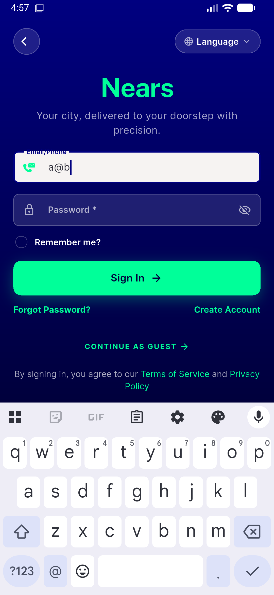
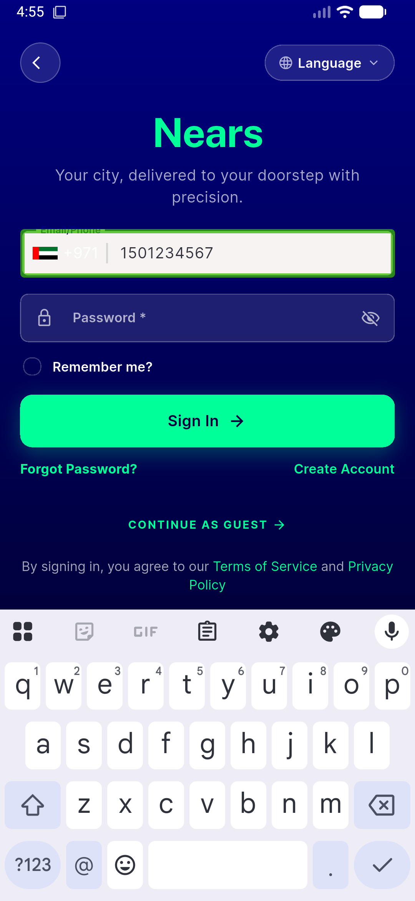
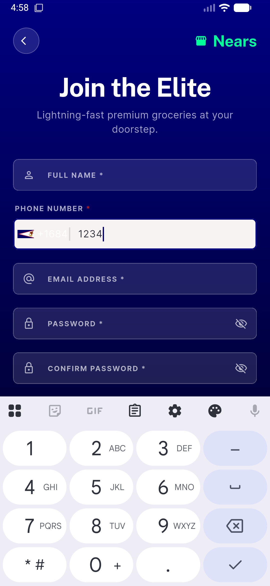
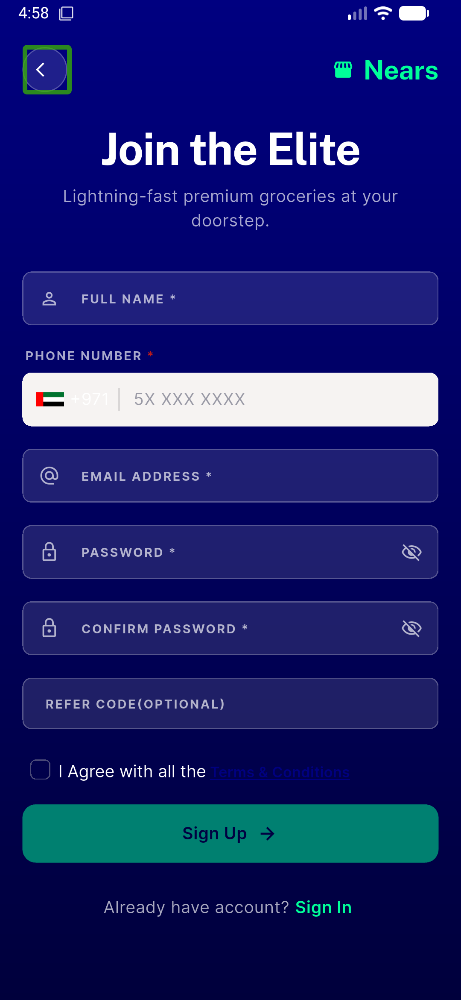

# QA Evidence — NEARS-1397

**DELTA re-QA fix-cycle 1: AC3/TB1 PASS — combined email/phone field IME survives autodetect swap; NPhoneField regression clean**

**4 screenshot(s).** Click any thumbnail for full resolution.

<table>
<tr>
<td align="center" width="33%"> ac3 email mode glyph</td>
<td align="center" width="33%"> ac3 phone mode keyboard up</td>
<td align="center" width="33%"> ac4 nphonefield picker selected</td>
</tr>
<tr>
<td align="center" width="33%"> ac4 nphonefield signup</td>
</tr>
</table>

### Other artifacts
- [`bug-reverse-toggle-via-typing-blocked.log`](bug-reverse-toggle-via-typing-blocked.log)
- [`progress.md`](progress.md)

---
*From `nears/docs/qa-evidence/NEARS-1397/` · public-repo scrub policy (no live secrets; verified clean).*
