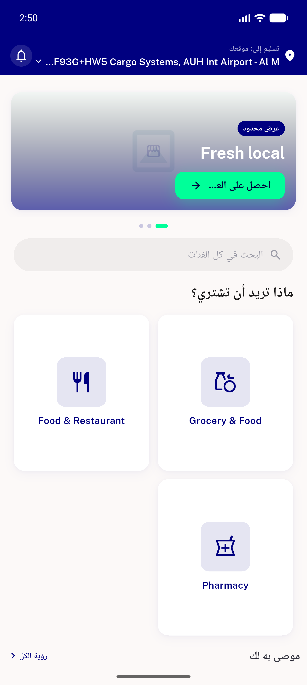
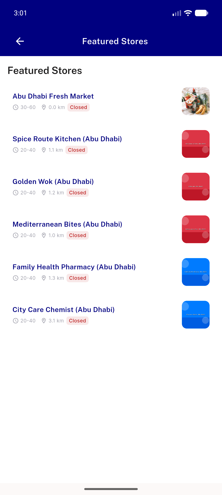
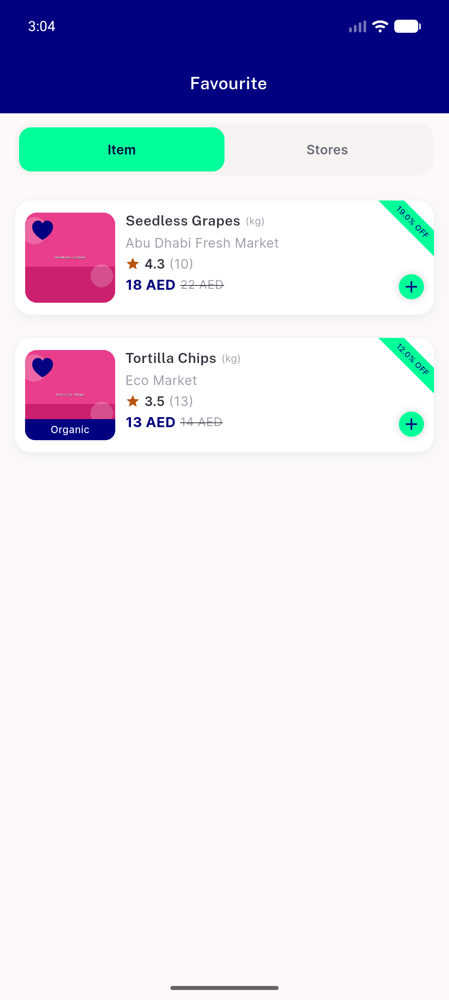
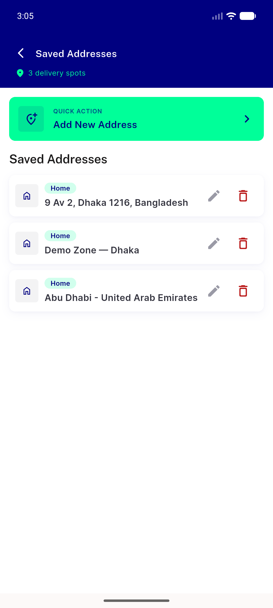
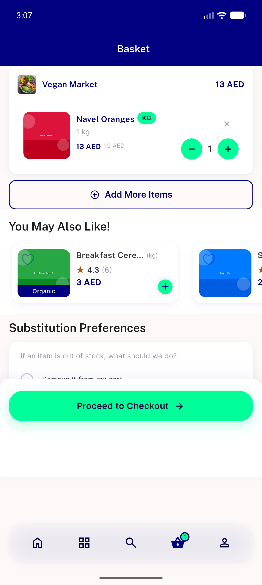
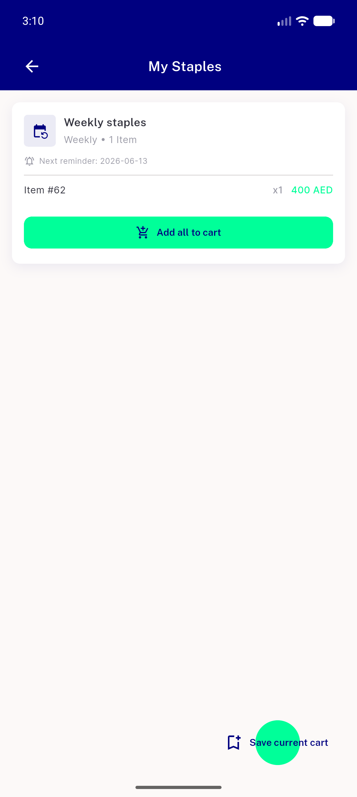
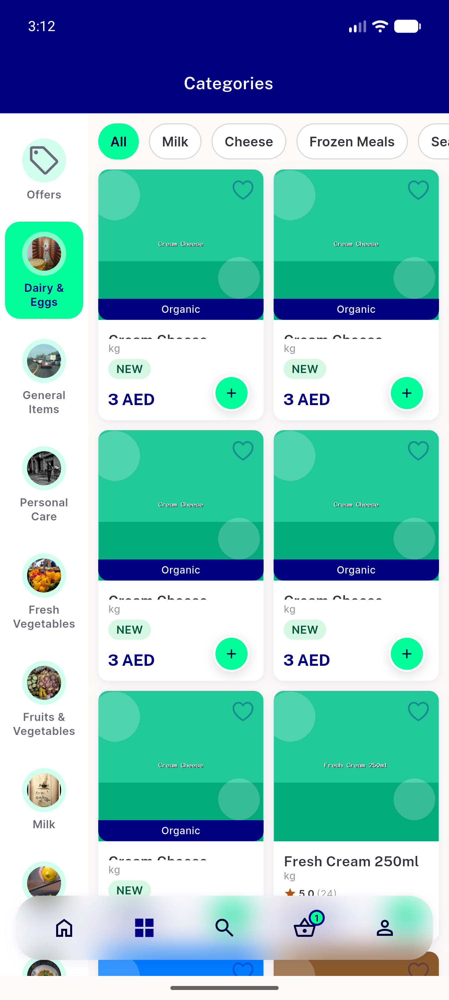
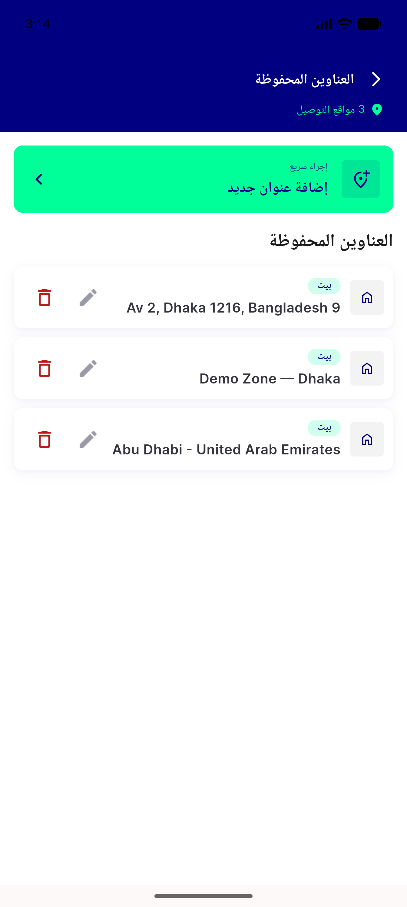

# QA Evidence — NEARS-1398

**PASS — NAppBar reconcile: 6 live sites verified, no phantom bell/cart, RTL mirror OK, light mode**

**8 screenshot(s).** Click any thumbnail for full resolution.

<table>
<tr>
<td align="center" width="33%"> menu rtl</td>
<td align="center" width="33%"> all store</td>
<td align="center" width="33%"> favourite</td>
</tr>
<tr>
<td align="center" width="33%"> address</td>
<td align="center" width="33%"> cart</td>
<td align="center" width="33%"> staples</td>
</tr>
<tr>
<td align="center" width="33%"> category tab</td>
<td align="center" width="33%"> address rtl</td>
</tr>
</table>

---
*From `nears/docs/qa-evidence/NEARS-1398/` · public-repo scrub policy (no live secrets; verified clean).*
