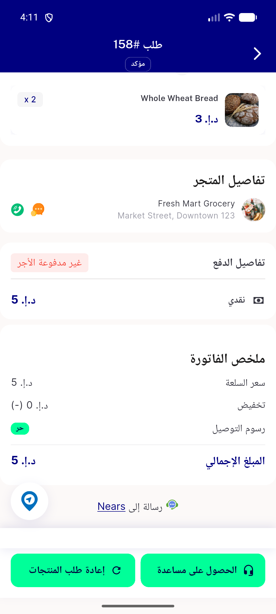
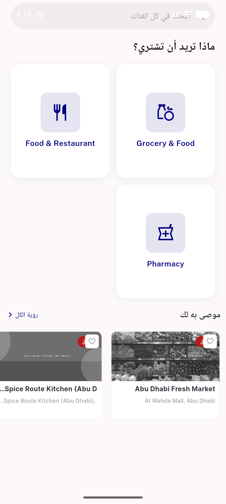
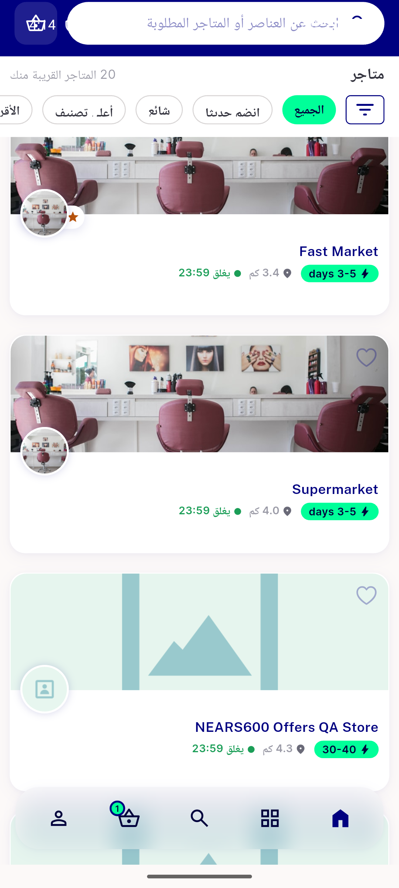
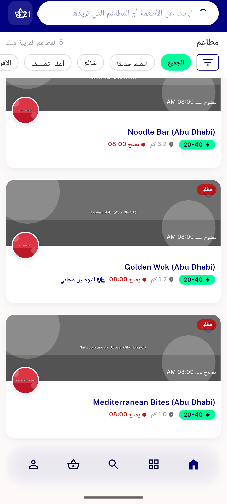
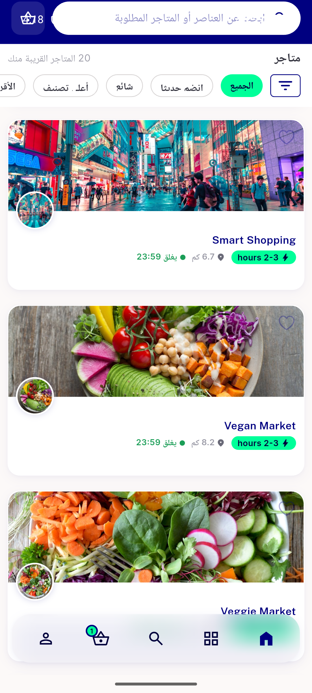
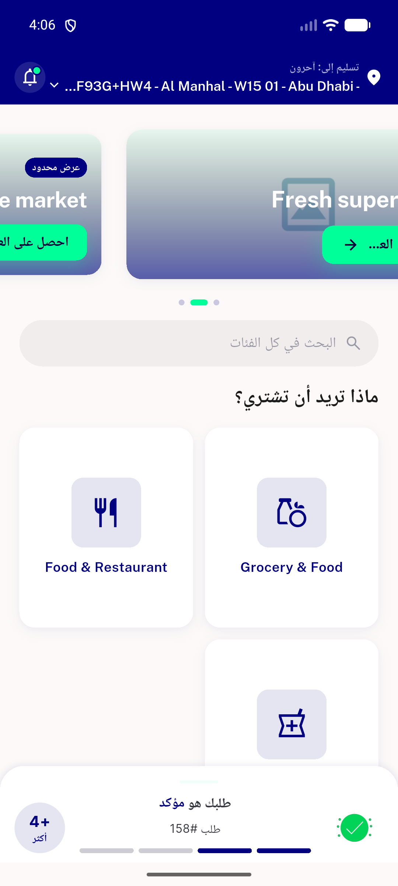

# QA Evidence — NEARS-1399

**PASS — NSurfaceCard reconcile: 4 sites (3 live RTL + 1 desktop-gated), border dropped + ambient shadow, edge-to-edge covers, 22 DLS + widgetbook tests green, logs clean**

**6 screenshot(s).** Click any thumbnail for full resolution.

<table>
<tr>
<td align="center" width="33%"> ac1 orderitemwidget order158</td>
<td align="center" width="33%"> ac1 recommendedstorecard 931 rtl</td>
<td align="center" width="33%"> ac1 storecard allstores rtl</td>
</tr>
<tr>
<td align="center" width="33%"> ac2 storecard closed overlays rtl</td>
<td align="center" width="33%"> ac8 storecard edge2edge covers</td>
<td align="center" width="33%"> home featured rtl</td>
</tr>
</table>

### Other artifacts
- [`progress.md`](progress.md)

---
*From `nears/docs/qa-evidence/NEARS-1399/` · public-repo scrub policy (no live secrets; verified clean).*
