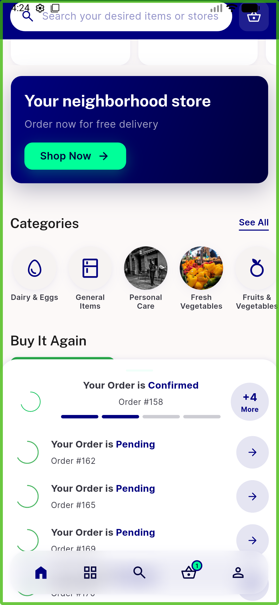
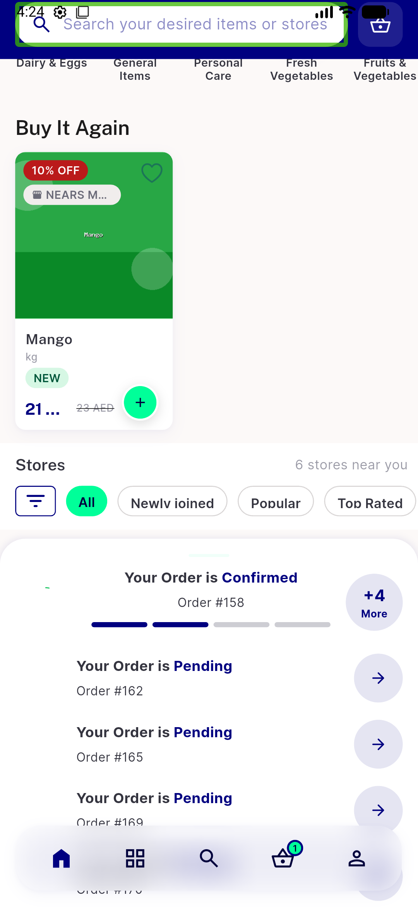
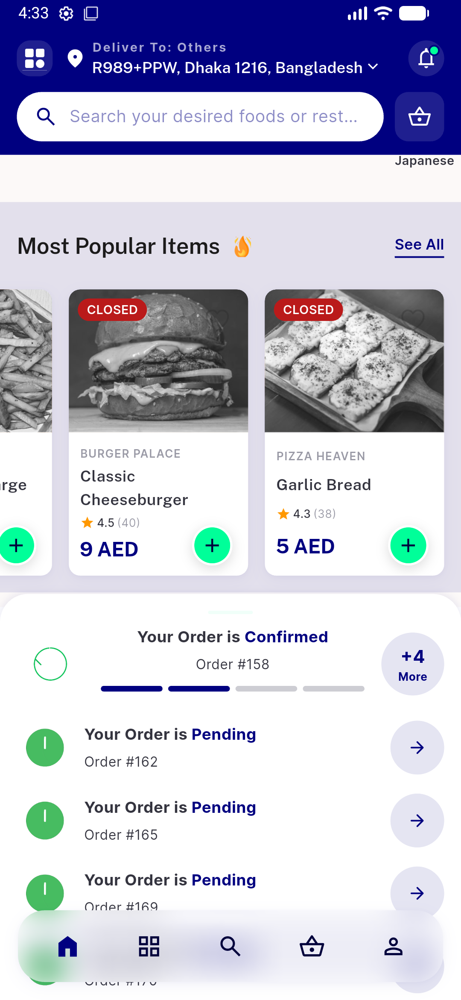
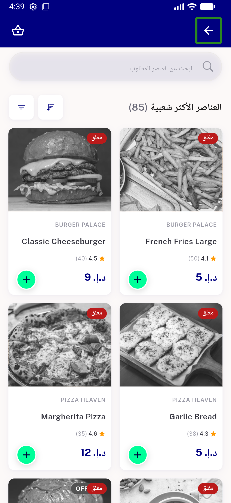

# QA Evidence — NEARS-1400

**PASS — NSectionHeader reconcile: 6 live sites (incl icon site + RTL), no chevron, nav intact, logs clean**

**6 screenshot(s).** Click any thumbnail for full resolution.

<table>
<tr>
<td align="center" width="33%"> home top</td>
<td align="center" width="33%"> 01b categories header</td>
<td align="center" width="33%"> popular stores</td>
</tr>
<tr>
<td align="center" width="33%"> most popular icon site</td>
<td align="center" width="33%"> rtl categories</td>
<td align="center" width="33%"> seeall nav</td>
</tr>
</table>

### Other artifacts
- [`progress.md`](progress.md)

---
*From `nears/docs/qa-evidence/NEARS-1400/` · public-repo scrub policy (no live secrets; verified clean).*
