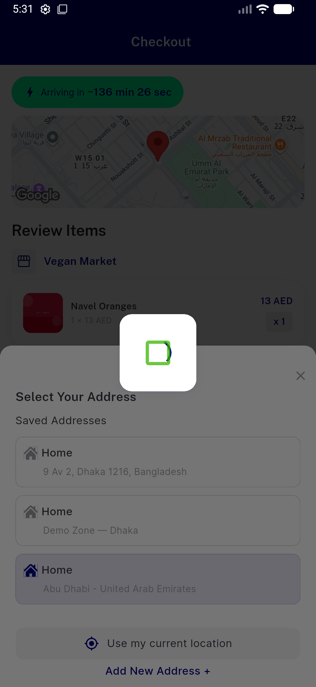
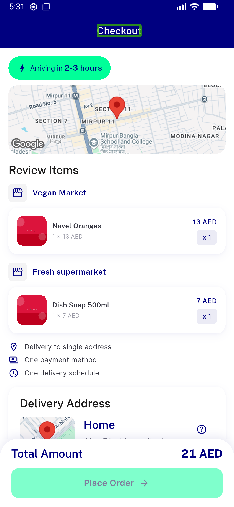
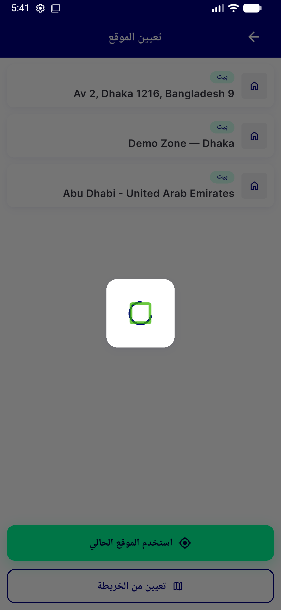
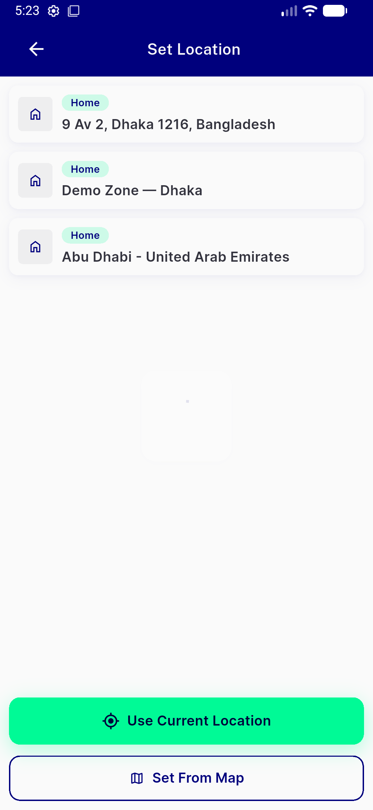
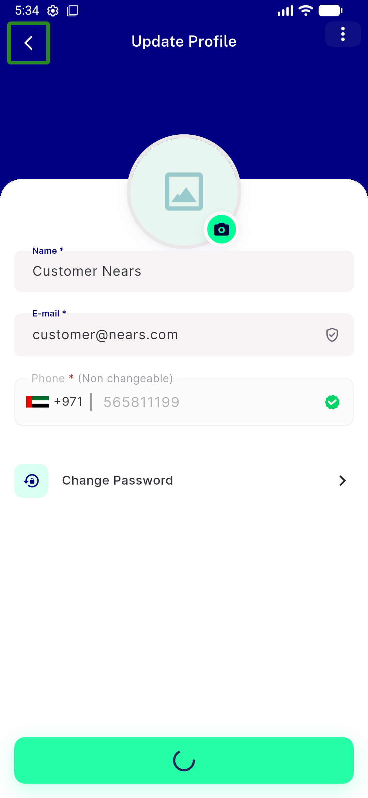
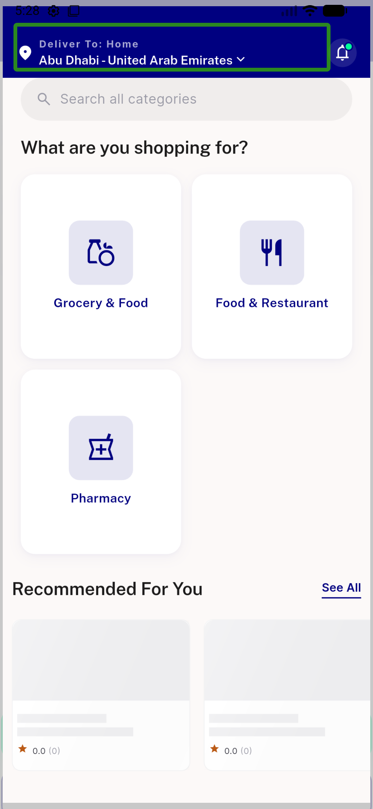

# QA Evidence — NEARS-1401

**PASS — NSpinnerBox boxed loader re-theme verified live (LTR+RTL), migration complete, all tests green**

**6 screenshot(s).** Click any thumbnail for full resolution.

<table>
<tr>
<td align="center" width="33%"> ac1 boxed loader checkout ltr</td>
<td align="center" width="33%"> ac2 flow complete after loader dismiss</td>
<td align="center" width="33%"> ac3 boxed loader rtl arabic</td>
</tr>
<tr>
<td align="center" width="33%"> ac4 access location loader</td>
<td align="center" width="33%"> ac5 profile save navy spinner</td>
<td align="center" width="33%"> reg zone switch home ok</td>
</tr>
</table>

---
*From `nears/docs/qa-evidence/NEARS-1401/` · public-repo scrub policy (no live secrets; verified clean).*
