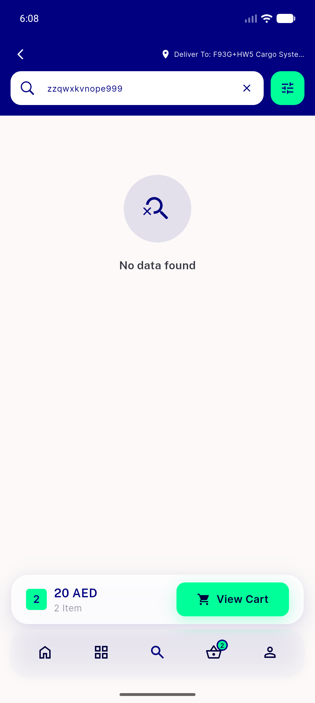
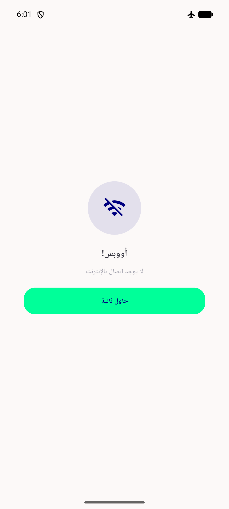
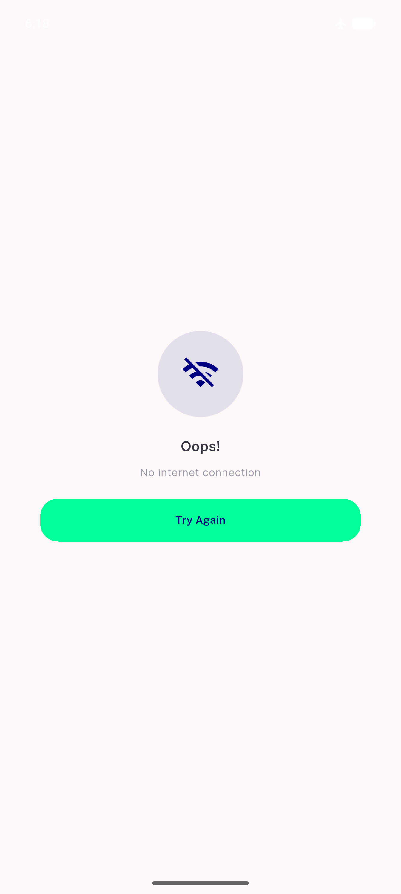
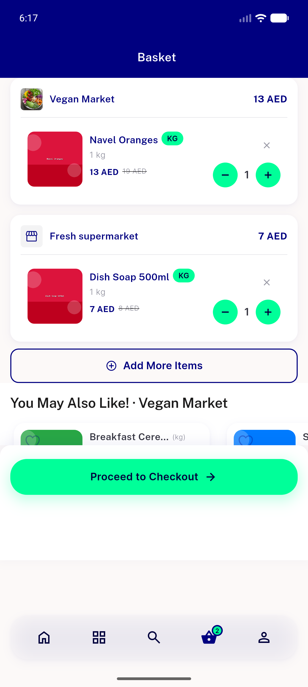
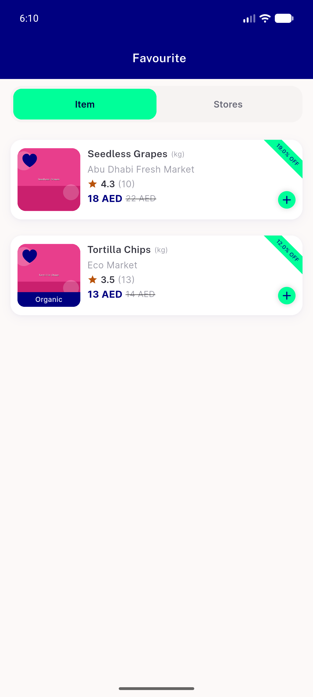

# QA Evidence — NEARS-1402

**PASS - 4 empty-state DLS wrappers verified live (UserApp, EN+AR/RTL, emulator-5556+5560)**

**12 screenshot(s).** Click any thumbnail for full resolution.

<table>
<tr>
<td align="center" width="33%"> ac1 emptycart ar</td>
<td align="center" width="33%"> ac1 emptysearch ar</td>
<td align="center" width="33%"> ac1 emptysearch en</td>
</tr>
<tr>
<td align="center" width="33%"> ac2 notloggedin chat ar</td>
<td align="center" width="33%"> ac2 notloggedin notification ar</td>
<td align="center" width="33%"> ac2 notloggedin refer ar</td>
</tr>
<tr>
<td align="center" width="33%"> ac3 nointernet ar</td>
<td align="center" width="33%"> ac3 nointernet location en</td>
<td align="center" width="33%"> ac3 nointernet retrying ar</td>
</tr>
<tr>
<td align="center" width="33%"> regression address list en</td>
<td align="center" width="33%"> regression cart populated en</td>
<td align="center" width="33%"> regression fav populated en</td>
</tr>
</table>

---
*From `nears/docs/qa-evidence/NEARS-1402/` · public-repo scrub policy (no live secrets; verified clean).*
