# QA Evidence — NEARS-1403

**PASS — NItemCard rewire: image/name/price/discount/unit/rating/organic/brand/CLOSED/CR-1/add-cart/favourite/RTL all verified live (light); dark deferred**

**15 screenshot(s).** Click any thumbnail for full resolution.

<table>
<tr>
<td align="center" width="33%"><a href="01-home-arabic-boot.png">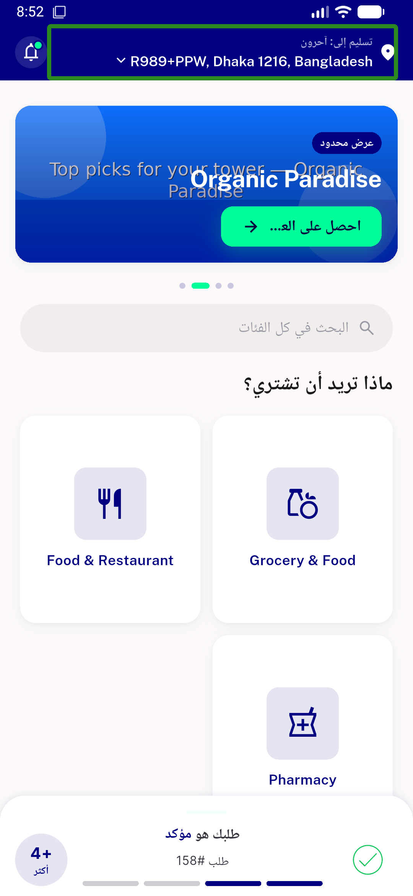</a> home arabic boot</td>
<td align="center" width="33%"><a href="02-grocery-module-cards-ar.png">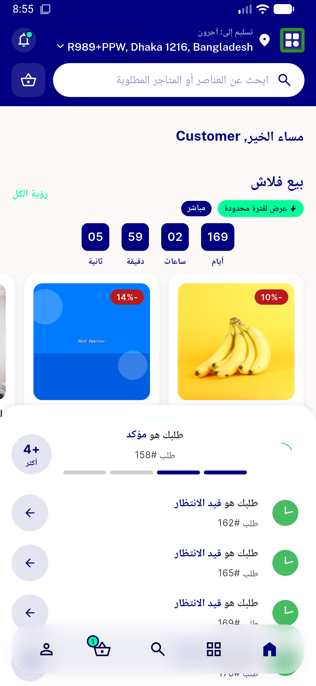</a> grocery module cards ar</td>
<td align="center" width="33%"> store instore rail en</td>
</tr>
<tr>
<td align="center" width="33%"> store addtocart stepper</td>
<td align="center" width="33%"><a href="05-after-fav-tap.png">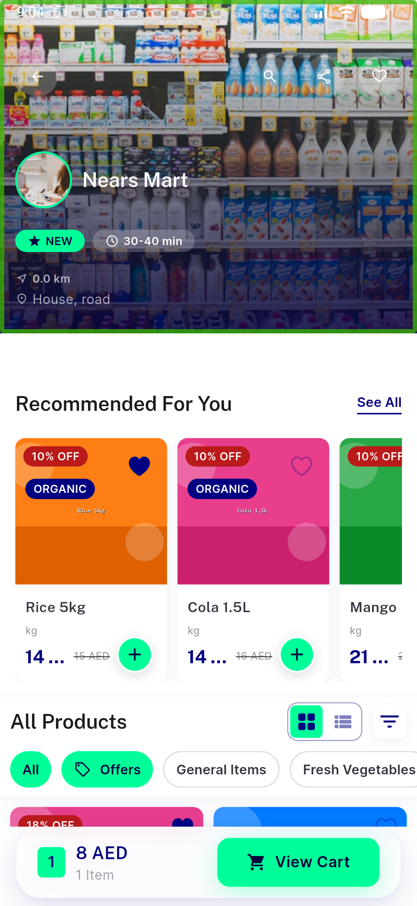</a> after fav tap</td>
<td align="center" width="33%"><a href="06-seeall-grid.png">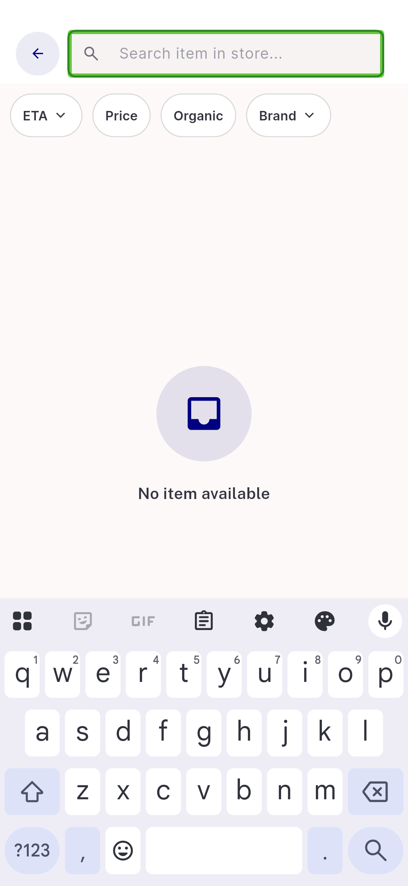</a> seeall grid</td>
</tr>
<tr>
<td align="center" width="33%"><a href="07-home-recommended-rail.png">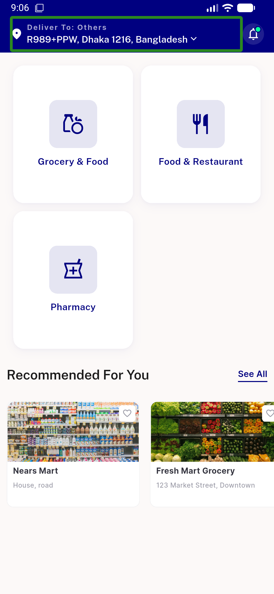</a> home recommended rail</td>
<td align="center" width="33%"><a href="08-most-popular-rail-callsite1.png">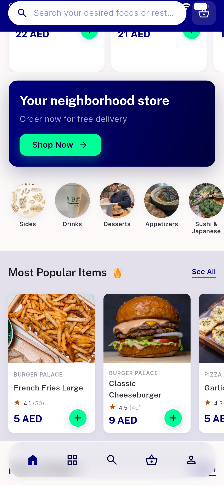</a> most popular rail callsite1</td>
<td align="center" width="33%"><a href="09-seeall-grid-callsite2.png">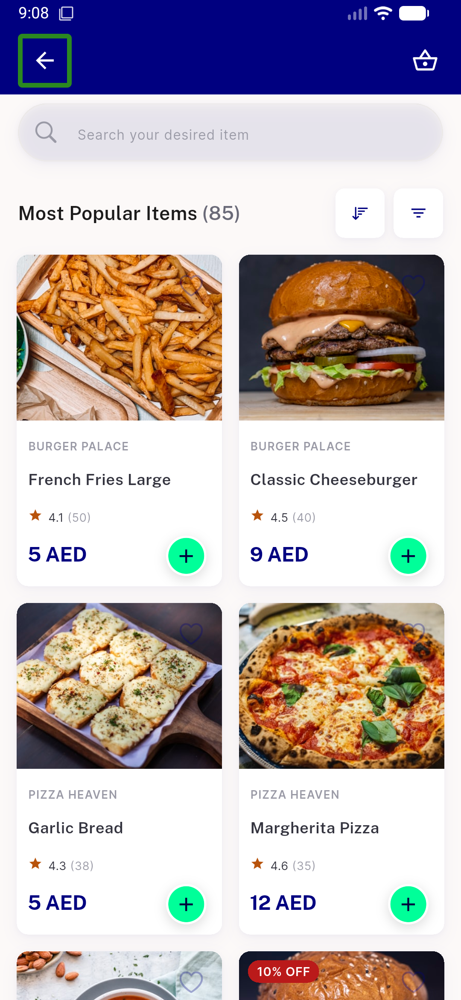</a> seeall grid callsite2</td>
</tr>
<tr>
<td align="center" width="33%"><a href="10-closed-store-organic-paradise.png">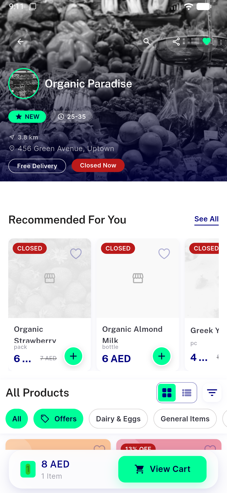</a> closed store organic paradise</td>
<td align="center" width="33%"><a href="11-closed-store-allproducts-grid.png">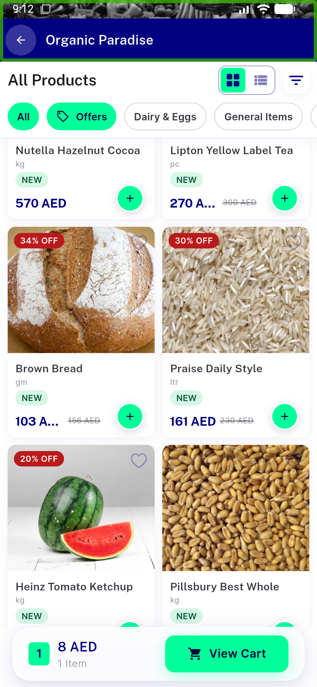</a> closed store allproducts grid</td>
<td align="center" width="33%"><a href="12-rtl-instore-rail.png">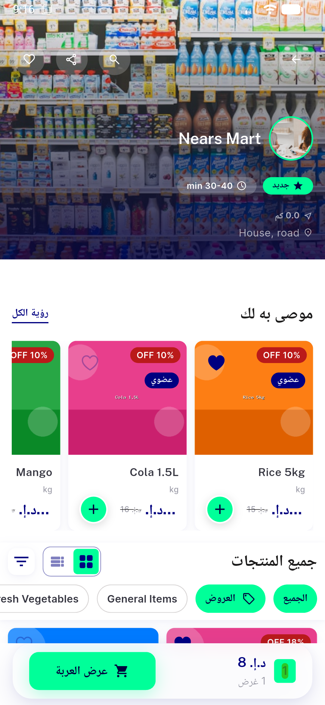</a> rtl instore rail</td>
</tr>
<tr>
<td align="center" width="33%"><a href="13-fav-tap-result.png">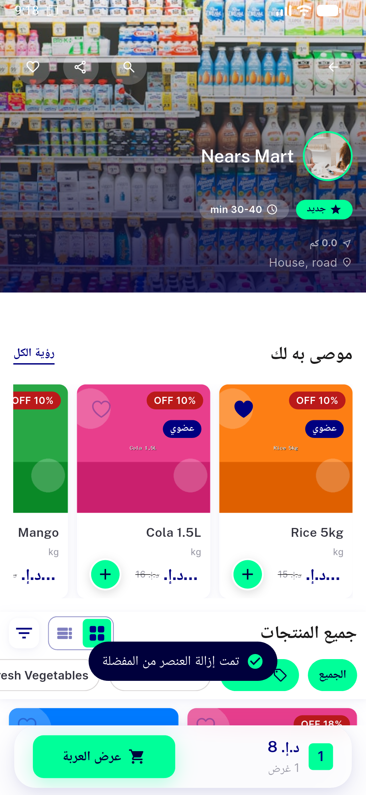</a> fav tap result</td>
<td align="center" width="33%"><a href="14-menu-for-logout.png">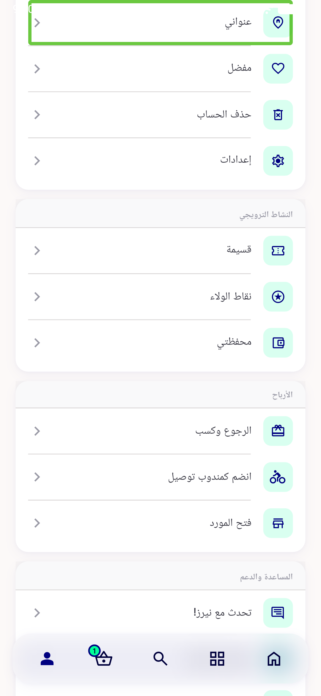</a> menu for logout</td>
<td align="center" width="33%"><a href="15-notloggedin-snackbar.png">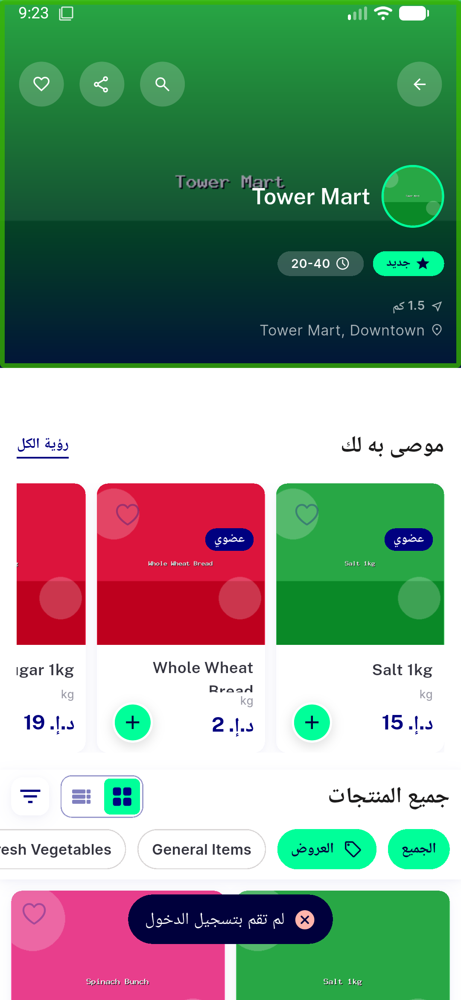</a> notloggedin snackbar</td>
</tr>
</table>

---
*From `nears/docs/qa-evidence/NEARS-1403/` · public-repo scrub policy (no live secrets; verified clean).*
