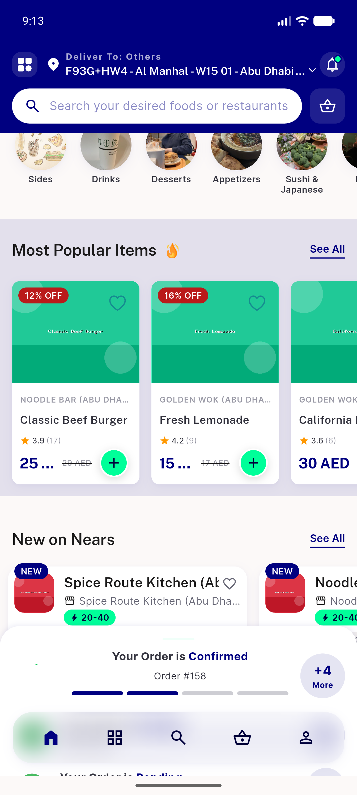
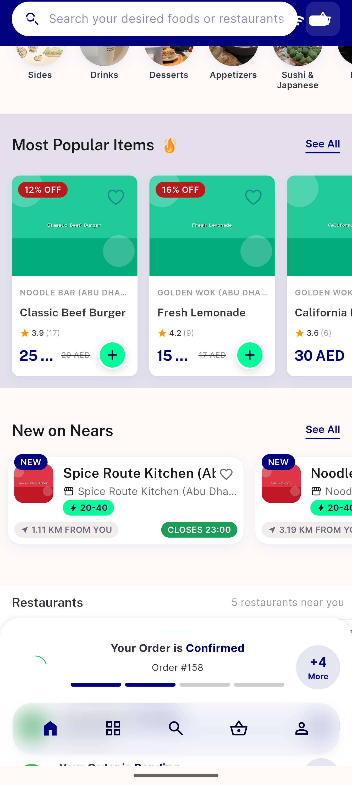
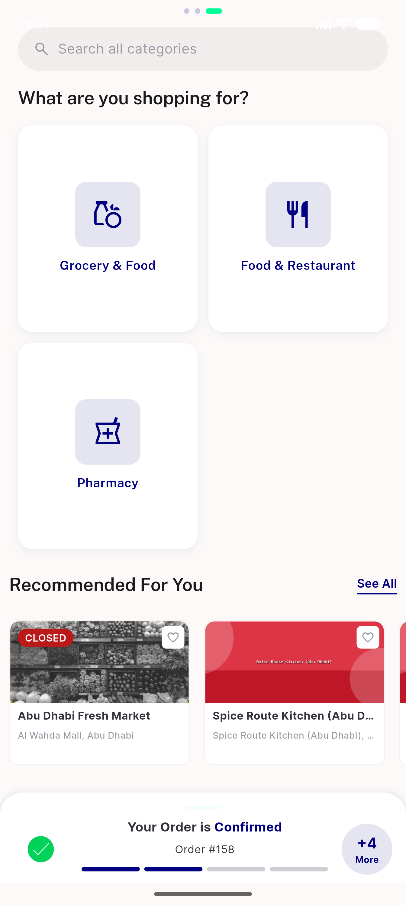
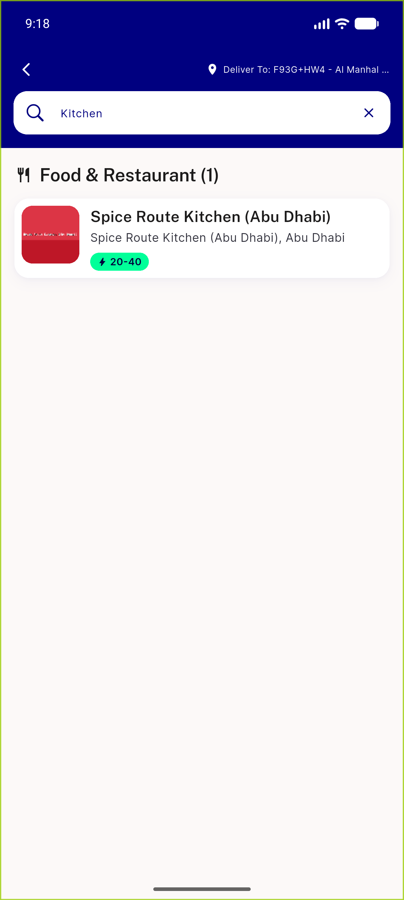
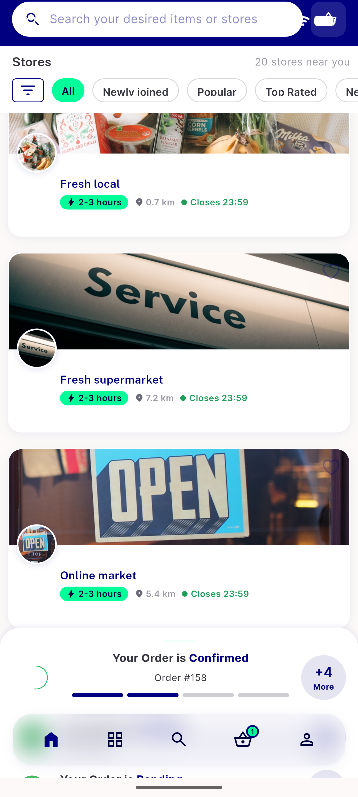
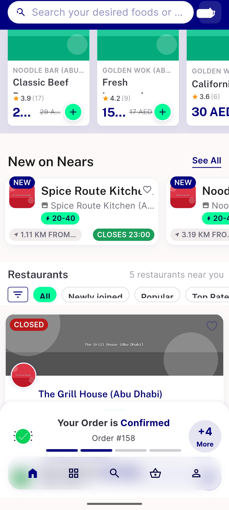
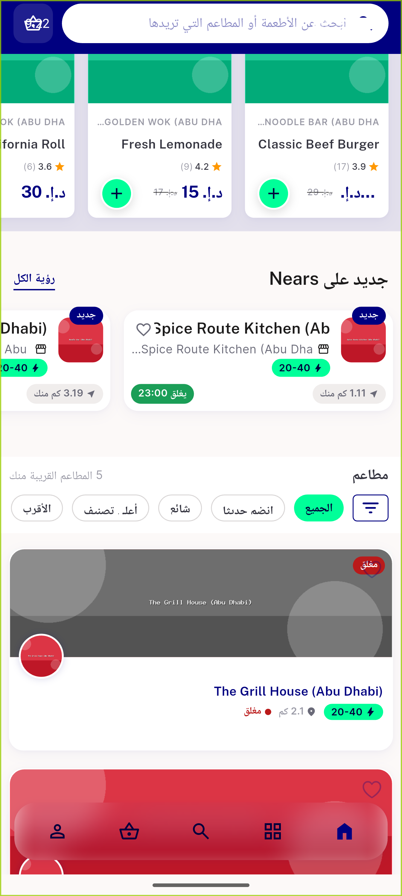

# QA Evidence — NEARS-1404

**PASS — NStoreCard rewire: tile/stacked/all-stores/search verified LTR+RTL+textScale1.3, no overflow, closed-grayscale, fav-persist**

**7 screenshot(s).** Click any thumbnail for full resolution.

<table>
<tr>
<td align="center" width="33%"> new on nears tile</td>
<td align="center" width="33%"> 01b new on nears tile full</td>
<td align="center" width="33%"> recommended stacked closed</td>
</tr>
<tr>
<td align="center" width="33%"> search store result</td>
<td align="center" width="33%"> allstores default</td>
<td align="center" width="33%"> tile textscale 1.3</td>
</tr>
<tr>
<td align="center" width="33%"> rtl arabic tile</td>
</tr>
</table>

---
*From `nears/docs/qa-evidence/NEARS-1404/` · public-repo scrub policy (no live secrets; verified clean).*
