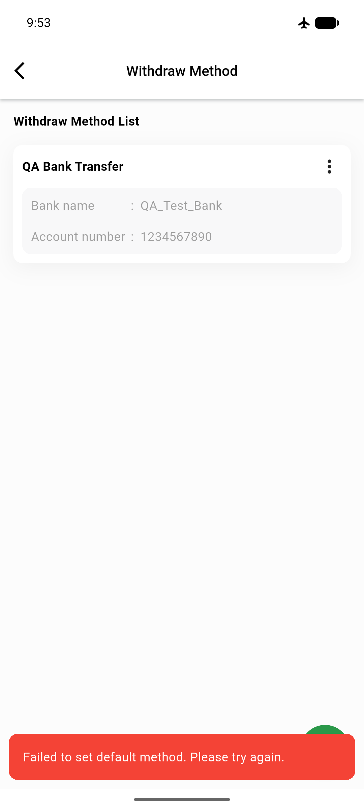

# QA Evidence — NEARS-1406

**PASS — NEARS-1406 stuck-loader fix verified (DeliveryApp, emulator-5554): failure path dismisses loader + shows error toast, success path unchanged**

**1 screenshot(s).** Click any thumbnail for full resolution.

<table>
<tr>
<td align="center" width="33%"> ac1 failure toast no loader</td>
</tr>
</table>

---
*From `nears/docs/qa-evidence/NEARS-1406/` · public-repo scrub policy (no live secrets; verified clean).*
