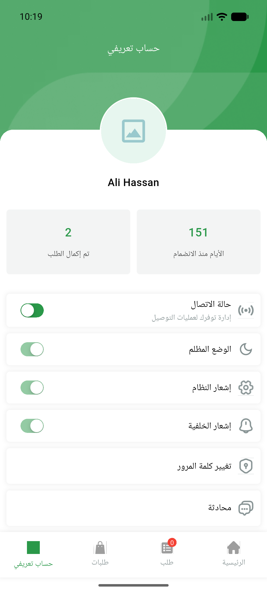
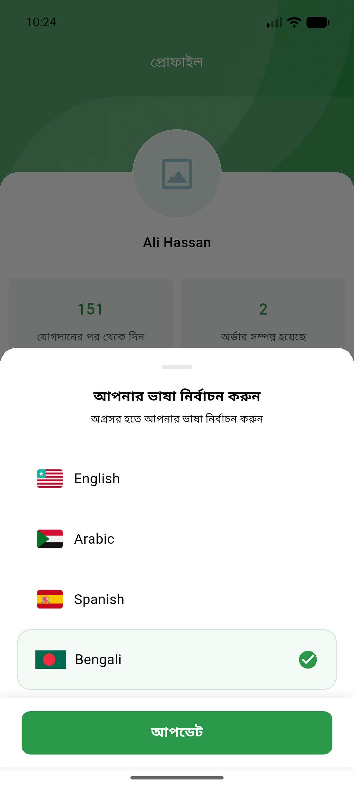
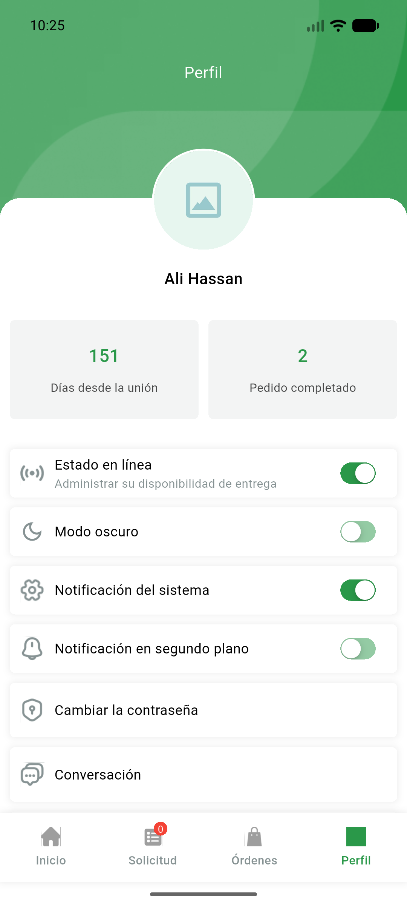

# QA Evidence — NEARS-1407

**PASS — i18n return-date keys resolve non-raw in en/ar/bn/es (live)**

**3 screenshot(s).** Click any thumbnail for full resolution.

<table>
<tr>
<td align="center" width="33%"> ar profile</td>
<td align="center" width="33%"> bn profile</td>
<td align="center" width="33%"> es profile</td>
</tr>
</table>

---
*From `nears/docs/qa-evidence/NEARS-1407/` · public-repo scrub policy (no live secrets; verified clean).*
