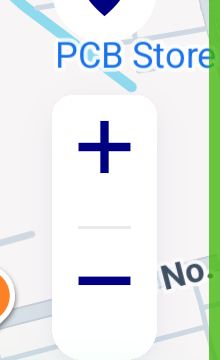
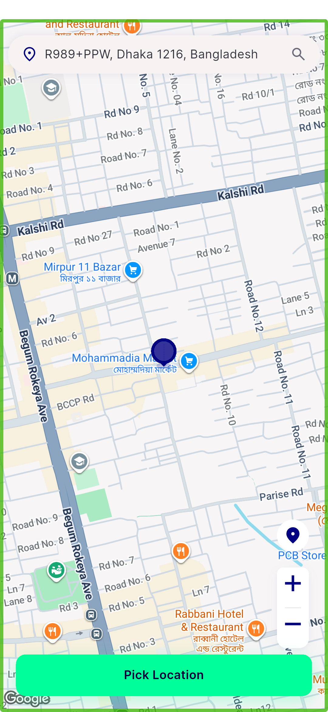
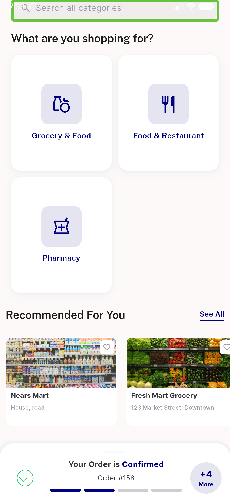
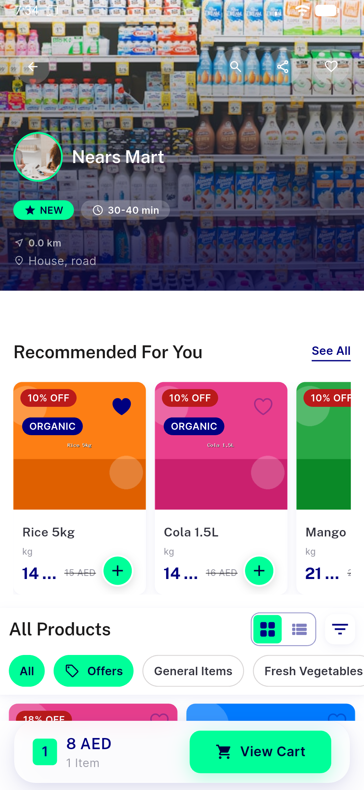
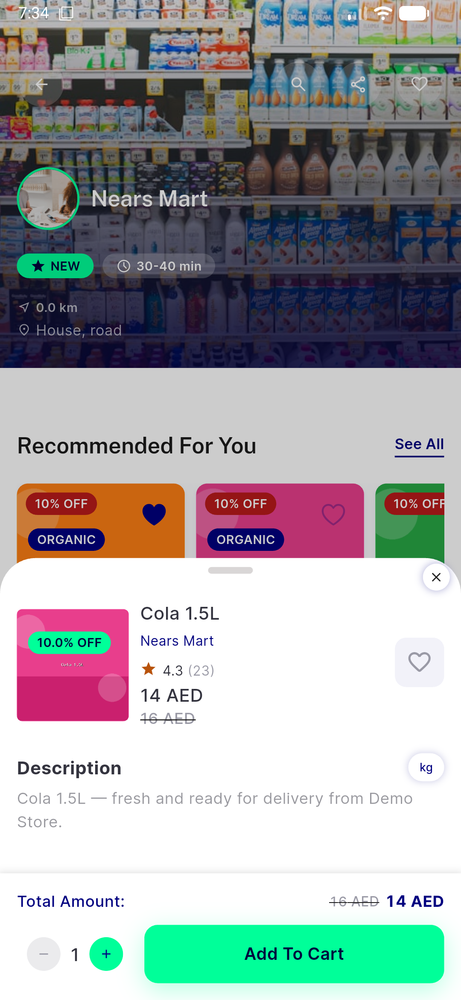
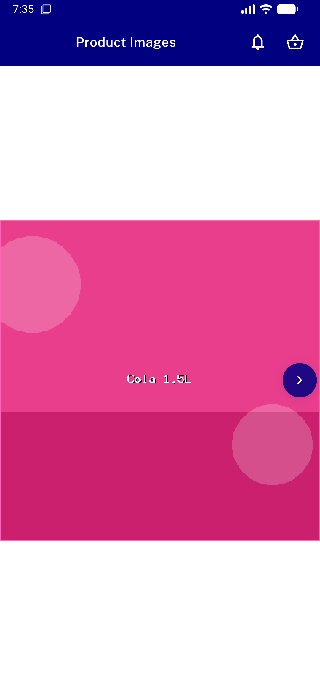
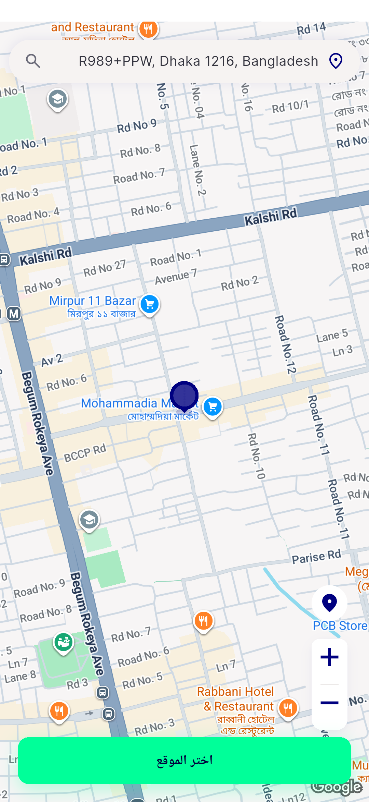

# QA Evidence — NEARS-1410

**PASS — NIconButton square shape (pick_map zoom) + circle-consumer regression clean, sha 65fbd137, emulator-5558**

**8 screenshot(s).** Click any thumbnail for full resolution.

<table>
<tr>
<td align="center" width="33%"> pickmap baseline</td>
<td align="center" width="33%"> zoompill crop</td>
<td align="center" width="33%"> after zoomin</td>
</tr>
<tr>
<td align="center" width="33%"> home productcards</td>
<td align="center" width="33%"> store items</td>
<td align="center" width="33%"> item detail stepper</td>
</tr>
<tr>
<td align="center" width="33%"> image viewer</td>
<td align="center" width="33%"> pickmap rtl arabic</td>
</tr>
</table>

---
*From `nears/docs/qa-evidence/NEARS-1410/` · public-repo scrub policy (no live secrets; verified clean).*
