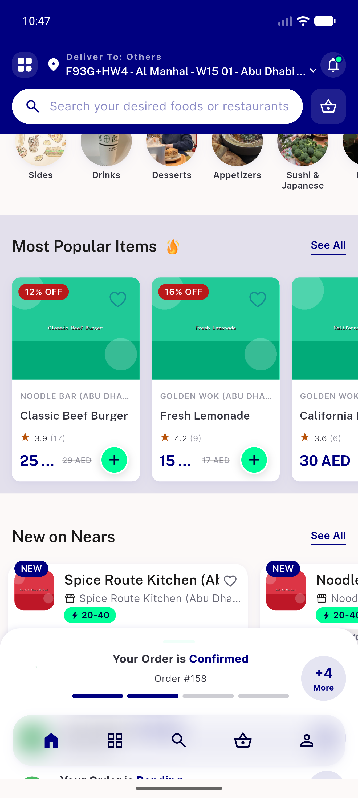
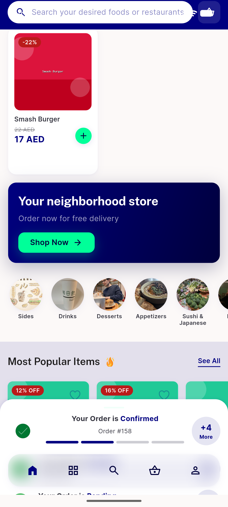

# QA Evidence — NEARS-1416

**PASS — NEARS-1416 itemrepo null-guard: 4 clean home-load cycles, popular+discounted 200, 0 _TypeError**

**2 screenshot(s).** Click any thumbnail for full resolution.

<table>
<tr>
<td align="center" width="33%"> ac2 module home discounts rails</td>
<td align="center" width="33%"> ac2 module home popular rail</td>
</tr>
</table>

---
*From `nears/docs/qa-evidence/NEARS-1416/` · public-repo scrub policy (no live secrets; verified clean).*
