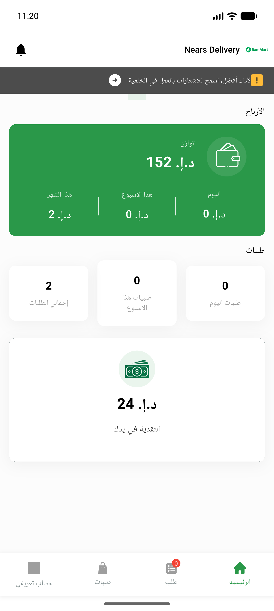

# QA Evidence — NEARS-1447

**FAIL — update-fcm-token still 403 [FAIL] on every logout (fix guards 401 path only)**

**2 screenshot(s).** Click any thumbnail for full resolution.

<table>
<tr>
<td align="center" width="33%"> dashboard logged in</td>
<td align="center" width="33%"> signin after logout</td>
</tr>
</table>

### Other artifacts
- [`bug-logout-fcm-403.log`](bug-logout-fcm-403.log)

---
*From `nears/docs/qa-evidence/NEARS-1447/` · public-repo scrub policy (no live secrets; verified clean).*
