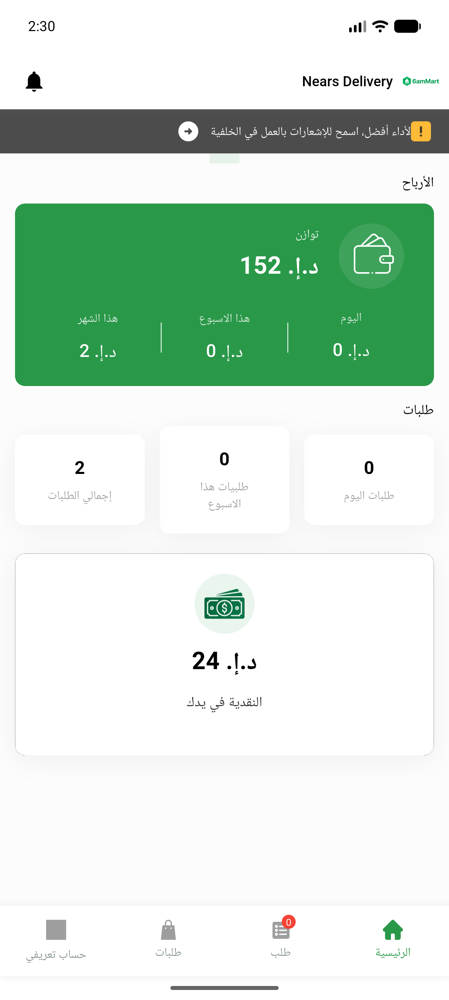

# QA Evidence — NEARS-1447

**PASS — logout fires zero update-fcm-token (re-scoped fix verified), login re-registers 200, 4 cycles clean**

**4 screenshot(s).** Click any thumbnail for full resolution.

<table>
<tr>
<td align="center" width="33%"> dashboard logged in</td>
<td align="center" width="33%"> signin after logout</td>
<td align="center" width="33%"> login succeeded dashboard</td>
</tr>
<tr>
<td align="center" width="33%"> signin after logout</td>
</tr>
</table>

### Other artifacts
- [`bug-logout-fcm-403.log`](bug-logout-fcm-403.log)
- [`bug-logout-profile-poll-throw.log`](bug-logout-profile-poll-throw.log)
- [`progress.md`](progress.md)

---
*From `nears/docs/qa-evidence/NEARS-1447/` · public-repo scrub policy (no live secrets; verified clean).*
