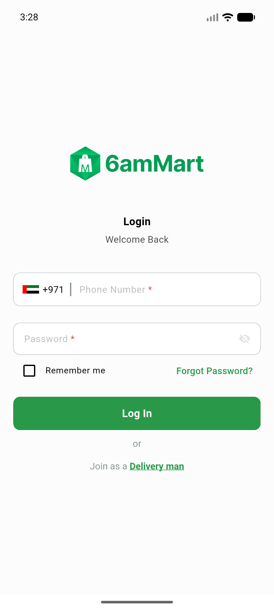
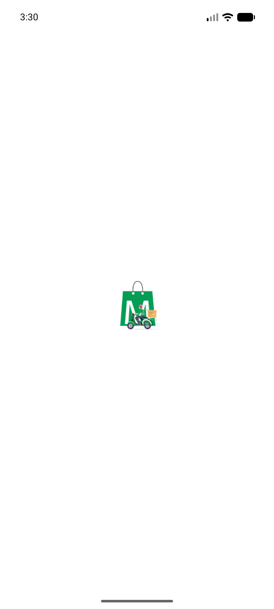
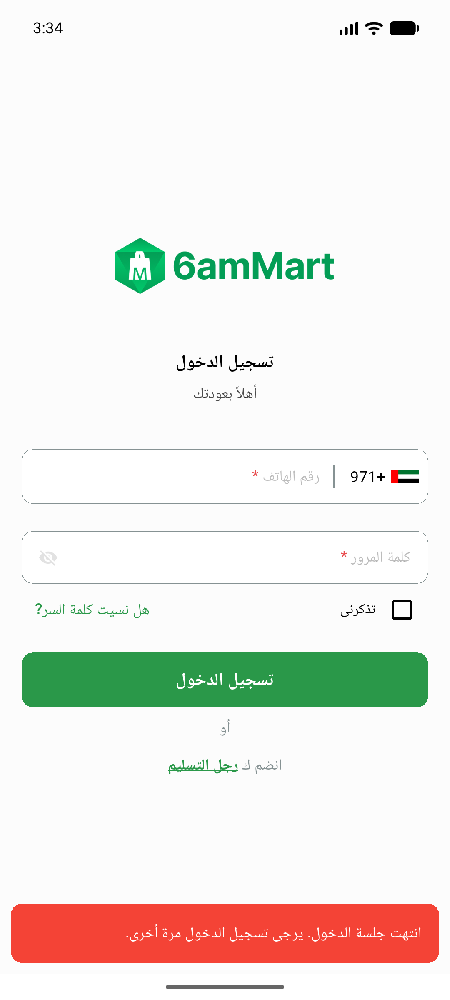
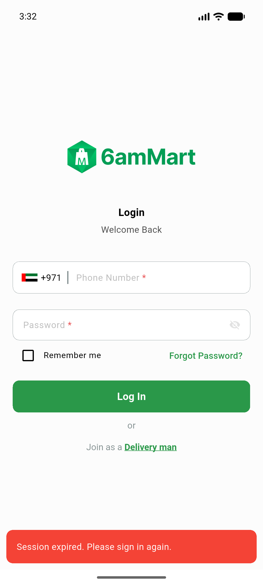

# QA Evidence — NEARS-1448

**PASS — boot-crash guard verified: tampered token → no crash, purged, PII-safe [FAIL], one-shot toast (EN+AR RTL); regressions clean**

**4 screenshot(s).** Click any thumbnail for full resolution.

<table>
<tr>
<td align="center" width="33%"> ac2 signin landing after corrupt coldstart</td>
<td align="center" width="33%"> ac2 splash no crash</td>
<td align="center" width="33%"> toast session expired ar rtl</td>
</tr>
<tr>
<td align="center" width="33%"> toast session expired en</td>
</tr>
</table>

### Other artifacts
- [`ac3-fail-log-excerpt.log`](ac3-fail-log-excerpt.log)

---
*From `nears/docs/qa-evidence/NEARS-1448/` · public-repo scrub policy (no live secrets; verified clean).*
