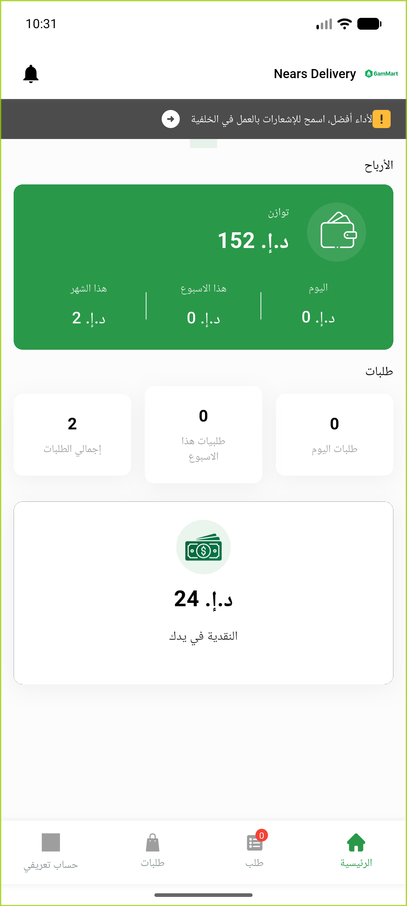

# QA Evidence — NEARS-1450

**BLOCKED — parcel-return flow unreachable live (no assigned parcel order in after-pickup/set_return_date=0 state); fix code-path confirmed + backstop green**

**1 screenshot(s).** Click any thumbnail for full resolution.

<table>
<tr>
<td align="center" width="33%"> deliveryapp home loggedin no parcel order</td>
</tr>
</table>

---
*From `nears/docs/qa-evidence/NEARS-1450/` · public-repo scrub policy (no live secrets; verified clean).*
